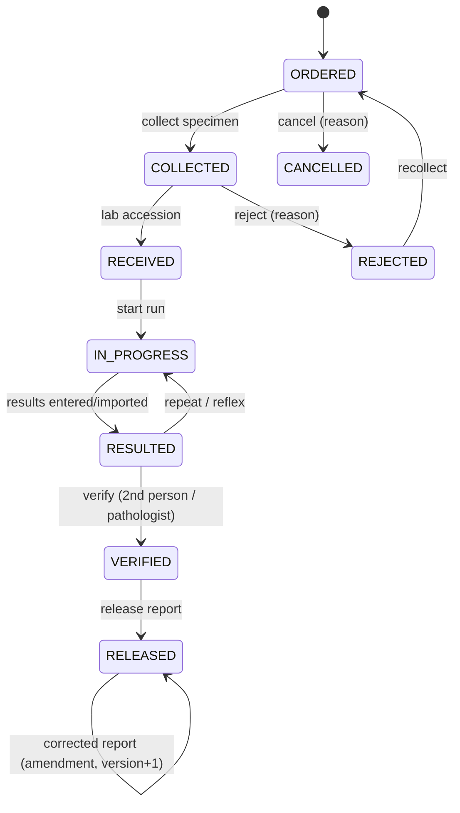
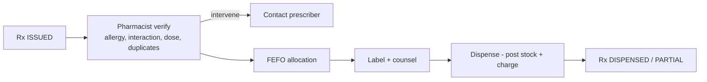

# Multi-Tenant Clinic Platform — Functional Specification

**Version:** 1.0 (draft) · **Date:** 2026-09-30
**Companion docs:** [architecture.md](architecture.md) · [frontend.md](frontend.md) · [todo.md](todo.md)

This document defines **what** the system does: roles, data, every CRUD, every transactional workflow, every report, and every background job.

## Contents

1. Conventions & legend
2. Roles & permissions (incl. the canonical permission catalogue, §2.3)
3. Global business rules
4. M1 Platform Console (Superadmin)
5. M2 Tenant Administration
6. M3 Patients
7. M4 Clinical (scheduling, visits, orders)
8. M5 Laboratory
9. M6 Pharmacy
10. M7 Central Supply
11. M8 Billing & Cashiering
12. M9 Compliance & Audit
13. M10 Notifications
14. Background job catalog (JOB-01…JOB-50)
15. Report catalog (RPT-*)
16. Non-functional requirements
17. Acceptance scenarios
18. Endpoint-level API map (CRUD → HTTP)
19. Data dictionary for the high-risk tables
19A. Data dictionary — `tenant_modules` (entitlements)
20. Open questions & decisions pending sign-off
Appendix A — PhilHealth Konsulta EPR field list (Q-16 sign-off draft)

---

## 1. Conventions & Legend

- **Priority:** `P0` = MVP/go-live blocker · `P1` = needed for GA · `P2` = later.
- **CRUD legend:** `C` create · `R` read/list/search · `U` update · `D` delete. Because this is a clinical/financial system, **D never means hard delete** unless stated: `Archive` (soft-delete, `deleted_at`), `Void` (posted document reversed with reason), `Deactivate` (users), or `—` (not allowed).
- **Standard columns** on every tenant table: `id`, `tenant_id`, `created_at/by`, `updated_at/by`, `row_version`; archivable masters add `deleted_at`; branch-scoped tables add `branch_id`. These are not repeated below.
- **Permission naming:** `module.resource.action` (e.g., `lab.result.verify`).
- **Document numbers:** generated per tenant/branch/period from `number_sequences` (e.g., `PO-2026-000123`).
- **Every list endpoint** supports search, filter, sort, pagination; every screen has a matching CSV/XLSX export where noted in §15.

---

## 2. Roles & Permissions

### 2.1 Actors

| Role (system template) | Scope | Who |
|---|---|---|
| `SUPERADMIN` | Platform | Platform owner; creates tenants & tenant admins; can enter any clinic (audited) |
| `PLATFORM_SUPPORT` *(optional)* | Platform | Read-only tenant metadata; no PHI |
| `TENANT_ADMIN` | Tenant | Administers the company: branches, users, roles, settings, master data |
| `BRANCH_MANAGER` | Branch(es) | Operational oversight, approvals, reports |
| `DOCTOR` | Branch(es) | Physician/practitioner: consults, prescribes, orders, signs |
| `NURSE` | Branch(es) | Triage, vitals, procedures, in-clinic administration, supply usage |
| `ENCODER` | Branch(es) | Front desk: registration, appointments, queue, encoding orders/results (non-verifying) |
| `CASHIER` | Branch(es) | Invoices, payments, shifts |
| `PHARMACIST` | Branch(es) | Verify, dispense (incl. controlled), pharmacy stock |
| `PHARMACY_ASSISTANT` | Branch(es) | Prepare orders, OTC sales (non-controlled), stock counts |
| `PHLEBOTOMIST` | Branch(es) | Specimen collection |
| `MEDTECH` | Branch(es) | Receive specimens, run tests, enter results |
| `LAB_MANAGER` | Branch(es) | Lab config, QC, verify, amend, reagent stock |
| `PATHOLOGIST` | Branch(es) | Final verification/sign-off, interpretive comments |
| `SUPPLY_OFFICER` | Branch(es) | Central store custodian: receiving, issuing, counts, disposal |
| `PURCHASER` | Tenant/Branch | PR/PO, suppliers |
| `AUDITOR` | Tenant | Read-only incl. audit logs (no PHI content unless granted) |
| `DPO` | Tenant | Privacy: consents, DSRs, breach register, access logs |

Tenant admins may clone/modify roles (permission sets) per tenant; system templates are re-seeded only for new tenants.

### 2.2 Module access matrix (default template)

`F` full CRUD+transitions · `R` read · `C/R/U` no delete · `A` approvals · `—` none

| Role | Platform | Tenant Admin | Patients | Clinical | Lab | Pharmacy | Supply | Billing | Compliance | Reports |
|---|---|---|---|---|---|---|---|---|---|---|
| SUPERADMIN | F | F (via enter-clinic) | via enter-clinic | via enter-clinic | via enter-clinic | via enter-clinic | via enter-clinic | via enter-clinic | R | Platform + clinic |
| TENANT_ADMIN | — | F | C/R/U | R | R | R | R | R | R | All (tenant) |
| BRANCH_MANAGER | — | R (own branch) | C/R/U | R, A | R, A | R, A | R, A | R, A | R | Branch |
| DOCTOR | — | — | R, U(clinical) | F (own) | order, view | prescribe | — | — | — | Clinical |
| NURSE | — | — | R | C/R/U | collect | R | requisition, consumption | — | — | Clinical |
| ENCODER | — | — | C/R/U | appointments, queue | order, encode results (no verify) | — | — | charge capture | — | Basic |
| CASHIER | — | — | R (demographics) | — | — | — | — | F | — | Billing |
| PHARMACIST | — | — | R | R | — | F (+controlled) | requisition, receive | sales | — | Pharmacy |
| PHARMACY_ASSISTANT | — | — | R | R (Rx) | — | prepare, OTC | counts | — | — | — |
| PHLEBOTOMIST | — | — | R | R | collect | — | — | — | — | — |
| MEDTECH | — | — | R | R | C/R/U results | — | reagent requisition | — | — | Lab |
| LAB_MANAGER | — | — | R | R | F (+verify, QC) | — | R, requisition | — | — | Lab |
| PATHOLOGIST | — | — | R | R | verify, amend | — | — | — | — | Lab |
| SUPPLY_OFFICER | — | — | — | — | — | — | F | — | — | Supply |
| PURCHASER | — | — | — | — | — | — | PR/PO/suppliers | — | — | Supply |
| AUDITOR | — | R | — | — | — | — | — | — | R (audit) | All (no PHI) |
| DPO | — | R | R (access log) | — | — | — | — | — | F | Compliance |

Permission names follow `<module>.<resource>.<action>` in lower_snake_case. The authoritative catalogue is §2.3; the endpoint map in §18 uses only these names, plus the session-scoped `self` / `owner` / `any` markers.

### 2.3 Permission catalogue (canonical, seeded per tenant)

Seeded with the system role templates in §2.1 and re-seeded only for new tenants (§2.2). Wildcards in the table are notation for a family; the actual grants are explicit rows, so a role diff is always readable. `reports.<module>.view` covers RPT-PLT/RPT-PAT/RPT-CLN/RPT-LAB/RPT-PHM/RPT-SUP/RPT-BIL/RPT-CMP.

| Group | Permissions |
|---|---|
| `platform.*` | `platform.tenant.{read,create,update,suspend,export,offboard}` · `platform.admin.{read,create,reset}` · `platform.user.read` · `platform.module.{read,update,preflight}` · `platform.plan.{read,create,update,change}` · `platform.flag.write` · `platform.announcement.{read,create,update}` · `platform.settings.{read,write}` · `platform.security.read` · `platform.job.read` · `platform.report.view` · `platform.breakglass.{enter,read}` |
| `admin.*` | `admin.branch.{read,create,update,delete}` · `admin.user.{read,create,update,deactivate,reset}` · `admin.role.{read,create,update,delete}` · `admin.module.read` (tenant sees its own entitlements read-only) · `admin.practitioner.{read,create,update,delete}` · `admin.service_unit.{read,create,update,delete}` · `admin.service.{read,create,update,delete}` · `admin.price.{read,create,update,delete}` · `admin.discount.{read,create,update,delete}` · `admin.payment_method.{read,create,update,delete}` · `admin.schedule.{read,update}` · `admin.template.{read,create,update}` · `admin.settings.{read,update}` · `admin.apikey.{read,create,update,delete}` |
| `patient.*` | `patient.record.{create,read,update,merge,restricted_read,read_sensitive}` · `patient.document.{read,create,delete}` |
| `clinical.*` | `clinical.schedule.{read,update}` · `clinical.appointment.{read,create,update,cancel,no_show}` · `clinical.queue.{read,call,skip,recall,complete}` · `clinical.visit.{read,create,update,start,ready,close,cancel}` · `clinical.vitals.{read,create,update}` · `clinical.note.{read,create,update,sign,amend}` · `clinical.diagnosis.{read,create,update,delete}` · `clinical.procedure.{read,create,update,delete}` · `clinical.supply.{read,create,void}` · `clinical.certificate.{read,create,void}` · `clinical.referral.{read,create,update,delete}` · `clinical.immunization.{read,create,delete}` · `clinical.problem.{read,create,update,resolve}` · `clinical.rx.{read,create,update,sign,cancel}` · `clinical.order_set.{read,create,update,delete}` · `clinical.template.{read,create,update,delete}` |
| `lab.*` | `lab.config.{read,create,update,delete}` · `lab.order.{read,create,update,cancel}` · `lab.specimen.{read,collect,receive,reject}` · `lab.result.{read,enter,verify,amend,view_confidential}` · `lab.critical.{read,ack}` · `lab.report.{read,release}` · `lab.qc.{read,create,update,accept,reject}` · `lab.sendout.{read,create,update}` · `lab.interface.{read,write}` · `lab.tat.read` |
| `pharmacy.*` | `pharmacy.rx.{read,verify,intervene}` · `pharmacy.dispense.{read,create,update,post,void}` · `pharmacy.sale.{read,create,post}` · `pharmacy.return.{read,create,post}` · `pharmacy.product.{read,create,update,delete}` · `pharmacy.price.{read,create,update,delete}` · `pharmacy.controlled.{read,write,witness,dispense,report}` · `pharmacy.stock.read` · `pharmacy.admin.create` · `pharmacy.report.view` |
| `supply.*` | `supply.item.{read,create,update,delete}` · `supply.supplier.{read,create,update,delete}` · `supply.location.{read,create,update,delete}` · `supply.pr.{read,create,update,submit,approve,reject,cancel,convert}` · `supply.po.{read,create,update,submit,approve,reject,send,close,cancel}` · `supply.grn.{read,create,update,post,void}` · `supply.invoice.{read,create,update,match}` · `supply.return.{read,create,post,close}` · `supply.req.{read,create,update,submit,approve,reject,cancel,receive}` · `supply.issue.{read,create,update,post}` · `supply.transfer.{read,create,post,receive}` · `supply.adjust.{read,create,submit,approve,reject,post,void}` · `supply.count.{read,create,update,recount,submit,approve,post}` · `supply.dispose.{read,create,post,witness,certificate}` · `supply.recall.{read,create,quarantine,close}` · `supply.batch.{quarantine,release}` · `supply.stock.read` · `supply.consumption.create` · `supply.period.{lock,unlock}` · `supply.report.view` |
| `billing.*` | `billing.invoice.{read,create,update,void}` · `billing.charge.create` · `billing.payment.{read,create,void}` · `billing.credit.{read,create,approve}` · `billing.shift.{read,open,close}` · `billing.discount.{read,create,revoke}` |
| `compliance.*` | `compliance.audit.read` · `compliance.access.read` · `compliance.consent.{read,create,update,write}` · `compliance.dsr.{read,create,verify,start,complete,reject,extend}` · `compliance.breach.{read,create,update,assess,notify,close}` · `compliance.retention.{read,create,update,enforce}` · `compliance.hold.{read,create,release}` · `compliance.access_review.{read,create,decide}` |
| Cross-cutting | `reference.read` · `reports.<module>.{view,export}` · `files.{read,write}` · `jobs.{read,cancel}` · `notifications.{read,send}` |

**Conventions.** `*` in a request column means "any action in this family". `self` marks session-scoped endpoints that authorise against the caller's own records rather than a grant. `owner` marks jobs/files the caller launched. `any` marks authenticated access. None of these three are catalogue entries. **Coarse aliases** kept for readability in §2.2 (`pharmacy.rx.dispense`, `billing.void`, `compliance.*`) resolve to the grants above; they are not separately seeded.

---

## 3. Global Business Rules

| ID | Rule |
|---|---|
| G-01 | **Tenant isolation:** no user or job can read/write another tenant's data (enforced by RLS + app layers). Superadmin access to clinic data only via audited *enter-clinic*. |
| G-02 | Users belong to exactly one tenant; access to branches by assignment. Branch-scoped records are visible only to users assigned to that branch (tenant admins see all branches). |
| G-03 | Posted documents (GRN, issue, dispense, invoice, payment, adjustment, verified lab result, signed note) are **immutable**; corrections use void/reversal/amendment with reason, actor and timestamp. |
| G-04 | Stock never goes negative; every stock change is a ledger movement linked to a source document. |
| G-05 | Expired, quarantined, recalled batches cannot be issued, dispensed, or consumed. |
| G-06 | Optimistic concurrency via `row_version`; conflicting edits return HTTP 412. |
| G-07 | All writes and all PHI reads are audited (audit_log / phi_access_log). |
| G-08 | Time stored in UTC; rendered in tenant timezone (default `Asia/Manila`); schedules evaluated in tenant timezone. |
| G-09 | Currency PHP (tenant-configurable); quantities in base UOM; decimals configurable per item. |
| G-10 | Dangerous/controlled drugs: no refills; special-prescription data captured; register entry on every movement; witness required on dispense/disposal/waste. Legal periods/forms are configuration. |
| G-11 | Segregation of duties configurable (entry≠verify, PO create≠approve, adjustment request≠approve). |
| G-12 | Soft-deleted masters remain referenced by historical records and are hidden from pickers. |
| G-13 | Patient data changes keep history (versioned demographics); merges are logged and reversible within a window. |
| G-14 | Every approval/verification/void/refund/controlled action requires step-up authentication. |
| G-15 | Suspended tenants: read-only for admins (export allowed); clinical users blocked; jobs paused except export/retention. |
| G-16 | **Entitlements are not feature flags.** A feature flag may never gate a module: hiding or disabling UI is presentation only, and no route's access depends on a flag. A module is granted only by a `tenant_modules` entitlement row (plan change, provisioning, or explicit superadmin action) — never inline from a payment webhook. Entitlement evaluation is server-side and **fails closed**: if the entitlement set cannot be read, the request is refused (503) rather than treated as entitled. |
| G-17 | **Degraded mode is explicit.** When a dependency is unavailable the API returns `503 UPSTREAM_UNAVAILABLE` with a machine code; it never silently falls back to cached, stale, or permissive data. Cache-served reads are bounded by a stated TTL and a stale value is never served past it. |

---

## 4. M1 — Platform Console (Superadmin)

### 4.1 Entities

| Table | Key columns |
|---|---|
| `platform_users` | email, name, password_hash, mfa_secret, role (`SUPERADMIN`/`PLATFORM_SUPPORT`), status, last_login_at |
| `tenants` | name, legal_name, slug (unique), status (`PROVISIONING/ACTIVE/SUSPENDED/OFFBOARDING/PURGED`), timezone, locale, country, plan_id, branding (logo_file_id, primary_color), dpo_name/email, data_region/db_shard, trial_ends_at, suspended_reason |
| `tenant_modules` | tenant_id, module, status (`TRIAL`/`ENABLED`/`DRAINING`/`DISABLED`), enabled_at, enabled_by_platform_user_id, disabled_at, disabled_reason, forced, seed_status, seed_error, expires_at (trial), limits (JSONB, module-specific caps), row_version |
| `tenant_directory` | id, slug, status, db_shard (no RLS; non-PHI) |
| `subscription_plans` | code, name, price, limits (branches, users, storage_gb, patients), features (JSON), status |
| `tenant_subscriptions` | tenant_id, plan_id, period_start/end, status, auto_renew |
| `tenant_feature_flags` | tenant_id, flag, enabled, config |
| `breakglass_sessions` | platform_user_id, tenant_id, reason, started_at, expires_at, ended_at, actions_count |
| `platform_announcements` | title, body, audience, starts_at, ends_at |
| `system_settings` | key, value (global defaults: password policy, retention defaults) |
| Global reference (no `tenant_id`, read-only to tenants) | `icd10_codes`, `psgc_locations`, `uom_templates`, `drug_schedule_templates`, `role_templates`, `permissions`, `lab_test_templates`, `loinc_subset` |

### 4.2 CRUD

| Entity | C | R | U | D | Notes |
|---|---|---|---|---|---|
| Tenant | ✔ wizard | ✔ | ✔ profile/plan/limits/flags | Suspend / Reactivate / Offboard | No hard delete; `PURGED` by JOB-05 only |
| Tenant admin (tenant user with `TENANT_ADMIN`) | ✔ invite (initial + additional) | ✔ across tenants | ✔ reset password, reset MFA, change email | Deactivate | Email invite with one-time activation link |
| Tenant users (any role) | — (tenant admin does) | ✔ directory across tenants | ✔ unlock/reset | Deactivate | Superadmin sees “all individual admins, encoders, and others” |
| Branches (all tenants) | — | ✔ | — | — | Read across tenants; edits via enter-clinic |
| Platform user | ✔ | ✔ | ✔ | Deactivate | MFA mandatory |
| Subscription plan | ✔ | ✔ | ✔ | Retire | Plans in use cannot be removed |
| Feature flags | ✔ | ✔ | ✔ | ✔ (reset to default) | Per tenant |
| Announcements | ✔ | ✔ | ✔ | Archive | Shown in tenant app |
| Break-glass session | ✔ (enter clinic) | ✔ | End / extend | — | Reason required; immutable once ended |
| Tenant module entitlements | ✔ (at create, and change later) | ✔ | ✔ (enable / drain / disable) | — (revoke = disable) | Ticked per module at creation; no hard delete — data is retained |
| System settings | ✔ | ✔ | ✔ | — | Audited |

### 4.3 Transactional workflows

**PLT-T1 Provision tenant** (`POST /platform/tenants`) — saga, idempotent (JOB-03):
1. Validate slug (`[a-z0-9-]{3,40}`, reserved list), plan, timezone, first admin email, and the requested **module set** (see PLT-T7 for module rules and validation).
2. Insert `tenants` (`PROVISIONING`) + `tenant_directory`.
3. Seed **only what the entitled modules need**, tracking progress per module: roles & permissions from templates; default branch; number sequences; UOM templates; document templates; consent template v1; retention defaults; then, per module — *Supply*: stock locations (central store, quarantine, waste, in-transit), item categories, supplier, UOM conversions; *Pharmacy*: pharmacy + in-transit stock locations, generic catalogue sample, price rules; *Laboratory*: laboratory stock location, lab sections, specimen types, starter test catalogue with default ranges, report template v1; *Clinical*: service catalog, operating hours, appointment slots; *Billing*: payment methods, discount types, opening price list; *Compliance*: default retention policies. Modules not ticked are seeded as `seed_status='SKIPPED'`.
4. Create first `TENANT_ADMIN` (status `INVITED`), send activation email.
5. Set status `ACTIVE` only when every entitled module reports `seed_status='SEEDED'` (a module that fails seeds to `FAILED` with `seed_error`, the tenant still activates, and the module stays locked until retried); audit + outbox event. Failure ⇒ compensate (mark `PROVISIONING_FAILED`, retryable).

**PLT-T2 Suspend / reactivate** — reason required; sessions revoked; jobs paused; banner/notice to tenant admins.
**PLT-T3 Change plan** — validates limits (users/branches) before downgrade; effective date; audit.
**PLT-T4 Offboard** — export (JOB-04) → `OFFBOARDING` read-only retention hold (configurable days) → purge (JOB-05) with signed confirmation.
**PLT-T5 Enter clinic (break-glass)** — pick tenant → reason (min 15 chars) → step-up MFA → session created (default 60 min) → tenant-scoped token with `acting_as_platform` → red banner → all actions audited → end/expiry auto-revokes token. Tenant admins notified (default on).
**PLT-T6 Create/reset tenant admin** — invite, resend, revoke invite, force reset, reset MFA (logged + notifies tenant DPO).

**PLT-T7 Module entitlements — tick modules at creation, change them later**

A tenant does not get the whole platform. At creation the superadmin ticks the modules the clinic will actually use, and every request, screen, job, report, and seed is scoped to that set.

*Selectable modules* (the platform console, M1, is never selectable; it is not a tenant module):

| Key | Module | Depends on | Notes |
|---|---|---|---|
| `admin` | Tenant administration (M2) | — | users, roles, branches, settings, masters — **always on**; it is the module that administers the others |
| `patients` | Patients & records (M3) | — | **always on**; foundational for clinical identity |
| `clinical` | Clinical: scheduling, visits, orders, prescriptions (M4) | `patients` | |
| `supply` | Central supply & inventory (M7) | — | independent of patients; a warehouse-only tenant is valid |
| `laboratory` | Laboratory (M5) | `patients` | soft-depends on `supply` (reagent consumption) |
| `pharmacy` | Pharmacy (M6) | `patients` | soft-depends on `supply` (stock from central store) |
| `billing` | Billing & cashiering (M8) | `clinical` | soft-depends on `pharmacy` and `laboratory` (dispense/lab charges) |
| `compliance` | Compliance, audit, consent, DSR (M9) | — | strongly recommended for every tenant; not forced |
| `notifications` | Notifications (M10) | — | |
| `reports` | Reports & scheduled exports | at least one of `clinical`, `laboratory`, `pharmacy`, `supply`, `billing` | the report catalog is filtered to entitled modules |

*Rules*
- `admin` and `patients` are always on; `M1`/platform is never a tenant module.
- Selecting a module with a hard dependency auto-ticks the dependency in the wizard; the API rejects the payload if a dependency is missing (`MODULE_DEPENDENCY_MISSING`).
- Soft dependencies produce a warning, never a block.
- The requested set must be a subset of the tenant plan's allowed modules; anything outside returns `PLAN_MODULE_NOT_ALLOWED` (§18.1 `/platform/tenants` and the module endpoints).
- **Four states, not two.** `TRIAL` (on, with `expires_at`), `ENABLED`, `DRAINING` (read-only: existing records browsable and printable, no new writes), `DISABLED` (no route, no job, no report; data retained and read-only via export/DSR only).
- **Disable is a two-step flow.** `POST …/preflight` returns what is still open (open visits, results entered but not verified, released-but-unamended reports, draft dispensations, unposted GRNs/issues, open PRs/POs, open shifts, running jobs, pending exports). The superadmin then chooses **drain** (waits for the list to empty) or **force-disable** with a typed reason. Force-disable is audited as a distinct action; a disable attempted with open work and no `force` is refused with `409 MODULE_HAS_OPEN_WORK`, and the forced action appears in the tenant's transparency list (RPT-PLT-09).
- **Re-enable is instant and lossless** because nothing was deleted: data, history, postings, and audit entries return with the module. Only an explicit, separately-permissioned "purge module data" operation (not in v1) would remove anything.
- Enabling a module later **does not** auto-grant its permissions to existing roles; the tenant admin maps them in the role matrix, and the UI shows a "new permissions to review" badge. Disabling leaves the grants in place (inert) so re-enable is clean; "prune grants" is an explicit separate action.
- Entitlements are cached in the session token (`modules: [...]`, `modules_version`), re-read on refresh; a change invalidates other users' active sessions within `modules_cache_ttl` (default 60 s) or immediately for the acting superadmin.
- The tenant **admin** sees the module set read-only in `/administration/settings` with a "request a module" contact action; only the platform can change it.
- Break-glass sessions carry the tenant's module set too: a platform user entering a clinic reaches only its entitled modules, and each attempt in a non-entitled module is audited as a denial.

### 4.4 Rules
- Only `SUPERADMIN` may create tenants/tenant admins; `PLATFORM_SUPPORT` cannot enter a clinic.
- Break-glass cannot be used to read another tenant concurrently (one active session per platform user).
- Limits from plan enforced at user/branch/storage creation with clear error codes.
- **Module guard runs before the permission guard.** A route whose module is not entitled returns `403 MODULE_NOT_ENTITLED` regardless of the caller's permissions; a non-entitled module's jobs are never enqueued and its reports are absent from the catalog. Entitlements are never a substitute for RBAC — a permission inside an entitled module is still required.

---

## 5. M2 — Tenant Administration

### 5.1 Entities

| Table | Key columns |
|---|---|
| `branches` | code, name, address (PSGC), phone, email, timezone override, operating_hours, status, service profile & licence registry → `branch_services` / `branch_licences` (§19.8) |
| `users` | email, username, name, phone, password_hash, mfa_secret, status (`INVITED/ACTIVE/LOCKED/DEACTIVATED`), last_login_at, password_changed_at, locale |
| `user_branch_assignments` | user_id, branch_id, is_default |
| `roles` | name, description, is_system, template_code |
| `role_permissions` | role_id, permission_code |
| `user_roles` | user_id, role_id, branch_id (nullable = tenant-wide) |
| `practitioner_profiles` | user_id, prc_license_no, license_expiry, specialty, s2_license_no, s2_expiry, ptr_no, signature_file_id, title/suffix |
| `service_units` (rooms/stations) | branch_id, name, type (consult, procedure, triage, lab, pharmacy) |
| `tenant_settings` | key/value (password policy, MFA policy, SoD flags, shelf-life rule, approval thresholds, critical-value policy, break-glass notify, retention) |
| `number_sequences` | branch_id, doc_type, period, prefix, last_value |
| `document_templates` | type (letterhead, lab_report, rx, certificate, receipt), body/layout, version |
| `discount_types` | code, name, pct/amount, requires_id, legal_basis |
| `payment_methods` | code, name, type (cash, card, e-wallet, bank) |
| `service_catalog` | code, name, category (consult, procedure, lab, other), default_price, is_active |
| `price_lists` / `price_list_items` | name, effective_from/to; item/service price |
| `holidays` / `operating_hours` | date/label; weekday hours |
| `notification_templates` | event, channel, locale, subject, body |
| `api_keys` | name, hash, scopes, last_used_at, expires_at |
| `files` | storage_key, mime, size, sha256, owner_type/id, scan_status |

### 5.2 CRUD

| Entity | C | R | U | D | Notes |
|---|---|---|---|---|---|
| Branch | ✔ | ✔ | ✔ | Archive (no active stock/users) | Creating a branch seeds its stock locations and number sequences; service profile + licence registry per §19.8 (profile drives what is seeded and which licences are expected; licences are remind-only, Q-18) |
| User | ✔ invite | ✔ | ✔ profile/roles/branches | Deactivate (revokes sessions) | Email unique per tenant |
| Role | ✔ (clone) | ✔ | ✔ permissions | Archive (unassigned only) | System roles protected from delete |
| Practitioner profile | ✔ | ✔ | ✔ | — | License-expiry reminders (JOB-13) |
| Service unit | ✔ | ✔ | ✔ | Archive | |
| Tenant settings | — | ✔ | ✔ | — | Audited, versioned |
| Document templates | ✔ | ✔ | ✔ (versioned) | Archive | |
| Discount types | ✔ | ✔ | ✔ | Archive | |
| Payment methods | ✔ | ✔ | ✔ | Archive | |
| Service catalog & price lists | ✔ | ✔ | ✔ | Archive | Price changes effective-dated |
| Holidays / hours | ✔ | ✔ | ✔ | ✔ | |
| Notification templates | ✔ | ✔ | ✔ | Archive | |
| API keys | ✔ (shown once) | ✔ (masked) | Rotate | Revoke | |
| Files | ✔ | ✔ | — | Archive | |

### 5.3 Transactional workflows
- **ADM-T1 Invite user:** create (`INVITED`) → email link (24–72 h) → set password + MFA → `ACTIVE`.
- **ADM-T2 Password reset / MFA reset:** self-service via email; admin-initiated with audit.
- **ADM-T3 Role/branch reassignment:** takes effect on next token refresh; active sessions can be force-revoked.
- **ADM-T4 Deactivate user:** revoke sessions/API keys, reassign open tasks (open POs, requisitions, pending verifications).
- **ADM-T5 User access recertification:** quarterly campaign (DPO/Admin reviews each user's roles; attest/revoke).
- **ADM-T6 Settings change:** validated, versioned, audited; critical settings (SoD, critical-value policy) require step-up.

---

## 6. M3 — Patients

### 6.1 Entities

| Table | Key columns |
|---|---|
| `patients` | patient_no (per tenant), last_name, first_name, middle_name, suffix, sex, birth_date, civil_status, nationality, religion, occupation, mobile, email, address (PSGC region/province/city/barangay, street), philhealth_no, senior_id, pwd_id, blood_type, photo_file_id, status (`ACTIVE/INACTIVE/DECEASED/MERGED`), restricted (bool), restricted_reason, merged_into_id |
| `patient_identifiers` | type (national ID, passport, employee no.), value (encrypted), issuer |
| `patient_contacts` | relationship, name, phone, is_guardian, is_emergency |
| `patient_consents` | template_version, purposes[], signed_at, signature_file_id, witness, channel, withdrawn_at |
| `patient_allergies` | substance, drug_class, reaction, severity, status, verified_by |
| `patient_documents` | file_id, category, title, uploaded_by |
| `patient_merge_log` | source_id, target_id, merged_by, reason, snapshot (JSON), unmerged_at |
| `patient_flags` | type (VIP, staff, fall-risk, infectious), note |

### 6.2 CRUD

| Entity | C | R | U | D | Notes |
|---|---|---|---|---|---|
| Patient | ✔ (dup-check) | ✔ search (name, DOB, mobile, patient_no, barcode) | ✔ (versioned) | Deactivate / mark deceased | No hard delete; erasure via DSR anonymization (§12) |
| Identifiers | ✔ | ✔ masked | ✔ | Archive | Encrypted at rest |
| Contacts | ✔ | ✔ | ✔ | ✔ | |
| Consents | ✔ | ✔ | — (new version) | Withdraw | |
| Allergies | ✔ | ✔ | ✔ | Mark inactive | Drives Rx/dispense alerts |
| Documents | ✔ | ✔ | ✔ metadata | Archive | Access logged |
| Flags | ✔ | ✔ | ✔ | ✔ | |

### 6.3 Transactional workflows
- **PAT-T1 Register patient (P0):** capture demographics → **duplicate check** (trigram on name + DOB + mobile) shows candidates → consent capture (must exist before clinical data entry) → assign patient_no + printable ID card/QR → audit.
- **PAT-T2 Merge duplicates (P1):** select survivor/source → preview conflicts → merge moves visits/orders/invoices to survivor → source `MERGED` → snapshot stored → **unmerge allowed within 30 days** if no new activity on merged record.
- **PAT-T3 Restricted-record access (P1):** restricted patients require permission + reason per access; logged to `phi_access_log`.
- **PAT-T4 Consent renewal:** when template version changes or purpose added, prompt at next visit.
- **PAT-T5 Data subject request** — see §12.

---

## 7. M4 — Clinical

### 7.1 Entities

| Table | Key columns |
|---|---|
| `practitioner_schedules` | practitioner_id, branch_id, weekday, start/end, slot_minutes, valid_from/to; exceptions (leave) |
| `appointments` | patient_id, practitioner_id, branch_id, service_id, starts_at, ends_at, status (`BOOKED/CONFIRMED/CHECKED_IN/IN_CONSULT/COMPLETED/CANCELLED/NO_SHOW`), channel, notes, reminder_sent_at |
| `queue_tickets` | branch_id, ticket_no, patient_id, priority, service_unit_id, status (`WAITING/CALLED/SERVING/DONE/SKIPPED`), called_at |
| `visits` | visit_no, patient_id, branch_id, appointment_id, type (`OPD/WALK_IN/FOLLOW_UP/PROCEDURE`), status (`OPEN/IN_PROGRESS/READY_FOR_BILLING/CLOSED/CANCELLED`), chief_complaint, practitioner_id, opened_at, closed_at |
| `vitals` | visit_id, recorded_at, bp_sys/dia, hr, rr, temp, spo2, weight, height, bmi (calc), pain_score, recorded_by |
| `clinical_notes` | visit_id, type (SOAP/progress/procedure), subjective, objective, assessment, plan, status (`DRAFT/SIGNED/AMENDED`), signed_by/at, version, amends_id |
| `visit_diagnoses` | visit_id, icd10_code, type (primary/secondary), certainty |
| `problem_list` | patient_id, icd10_code, onset, status |
| `visit_procedures` | visit_id, service_id, performed_by, notes, performed_at |
| `immunizations` | patient_id, vaccine, dose_no, lot (→ stock batch if from stock), site, given_at, given_by |
| `prescriptions` | rx_no, visit_id, patient_id, prescriber_id, status (`DRAFT/ISSUED/PARTIALLY_DISPENSED/DISPENSED/EXPIRED/CANCELLED`), valid_until, is_controlled, special_rx_no, notes |
| `prescription_items` | rx_id, drug_product_id, generic_name, strength, form, route, sig (dose, frequency, duration), qty_prescribed, dispense_as_written, qty_dispensed |
| `lab_orders` | see §8 (created from visit) |
| `medical_certificates` | visit_id, type (fit-to-work, sick leave, clearance), findings, from/to dates, issued_by, doc_no, file_id |
| `referrals` | visit_id, to_facility/practitioner, reason, urgency, status, file_id |
| `visit_supply_usage` | visit_id, item_id, batch_id (auto via FEFO), qty, location_id, posted_movement_id |
| `order_sets` | name, items (lab tests, drugs, services) — templates |
| `clinical_templates` | note templates/macros (per practitioner/tenant) |

### 7.2 CRUD

| Entity | C | R | U | D | Notes |
|---|---|---|---|---|---|
| Schedules & exceptions | ✔ | ✔ | ✔ | ✔ | Overlap validation |
| Appointment | ✔ | ✔ | ✔ reschedule | Cancel (reason) | Double-booking prevented by exclusion constraint |
| Queue ticket | ✔ | ✔ | ✔ status | — | |
| Visit | ✔ | ✔ | ✔ while open | Cancel (reason) | Closed visits immutable |
| Vitals | ✔ | ✔ | ✔ (correction logged) | Void | |
| Clinical note | ✔ | ✔ | ✔ while DRAFT | — (amend via addendum) | Signing locks |
| Diagnoses / problems | ✔ | ✔ | ✔ | Remove (draft) / Resolve | ICD-10 picker |
| Procedures | ✔ | ✔ | ✔ | Void | Posts charge |
| Immunizations | ✔ | ✔ | ✔ | Void | |
| Prescription | ✔ | ✔ | ✔ while DRAFT | Cancel (reason) | Issued Rx immutable |
| Medical certificate | ✔ | ✔ | ✔ while draft | Void (reason) | Numbered; PDF with signature |
| Referral | ✔ | ✔ | ✔ | Cancel | |
| Visit supply usage | ✔ | ✔ | ✔ while visit open | Void (reverses movement) | |
| Order sets / templates | ✔ | ✔ | ✔ | Archive | |

### 7.3 Transactional workflows
- **CLN-T1 Book / reschedule / cancel appointment (P0):** availability from schedules − existing − leave/holidays; reminders (JOB-23); no-show auto-mark (JOB-24); cancel policy window configurable.
- **CLN-T2 Check-in & queue (P0):** check-in creates visit (`OPEN`) and queue ticket; call/skip/recall; display-board view.
- **CLN-T3 Triage (P0):** nurse records vitals → abnormal flags (age-specific rules) → priority escalation.
- **CLN-T4 Consultation (P0):** note (SOAP) → diagnoses (ICD-10) → orders (lab, Rx, procedures, supplies, certificate, referral) → **Sign**. Signing locks the note; later changes by **addendum** only.
- **CLN-T5 Prescribe (P0):** choose drug (formulary, stock-aware), sig builder, auto checks (allergy, duplicate therapy, interaction, max dose) with override reasons; controlled drug ⇒ special-Rx fields required (quantity in words and figures, **“no refill”** enforced); **Issue** → appears in pharmacy queue; printable/QR.
- **CLN-T6 Order lab (P0):** select tests/panels → priority (routine/STAT) → clinical info → submit → lab queue; charge captured.
- **CLN-T7 Record supplies used (P1):** nurse scans item → FEFO batch consumed from the clinic-room location (`CONSUMPTION` movement) → charge if billable.
- **CLN-T8 Issue certificate / referral (P1).**
- **CLN-T9 Close visit:** validates all orders have charges/outcomes; status `READY_FOR_BILLING` → `CLOSED` after payment or authorized credit. Stale visits auto-closed by JOB-25 with flag.
- **CLN-T10 Prescription expiry:** Issued Rx expire after `valid_until` (JOB-26).

---

## 8. M5 — Laboratory

### 8.1 Configuration entities

| Table | Key columns |
|---|---|
| `lab_sections` | name (hematology, chemistry, urinalysis, microbiology, serology…), branch_id |
| `specimen_types` | code, name (blood-serum, EDTA blood, urine, stool, swab), container_type, volume_ml, handling, stability_hours |
| `lab_tests` | code, name, section_id, loinc_code, specimen_type_id, method, tat_routine_min, tat_stat_min, price_service_id, is_panel, is_confidential, requires_fasting, instructions, is_active |
| `lab_panel_items` | panel_id, test_id, sort |
| `lab_analytes` | test_id, code, name, unit, result_type (`NUMERIC/TEXT/CODED/CALCULATED`), decimals, formula, coded_values, loinc_code, sort |
| `lab_reference_ranges` | analyte_id, sex, age_min_days, age_max_days, low, high, critical_low, critical_high, text_range, effective_from |
| `lab_delta_rules` | analyte_id, window_days, max_abs_change, max_pct_change |
| `lab_test_reagents` (BOM) | test_id, item_id, qty_per_test (base UOM) |
| `lab_instruments` | name, model, section_id, serial_no, interface_type (manual/HL7/ASTM), calibration_due |
| `lab_qc_materials` / `lab_qc_lots` | analyte, level, lot no., expiry, target_mean, sd |
| `lab_report_templates` | layout per section/test |
| `lab_interface_mappings` | instrument_code ↔ analyte/test code |

### 8.2 Transactional entities

| Table | Key columns |
|---|---|
| `lab_orders` | order_no, patient_id, visit_id, ordered_by, priority, clinical_info, status, ordered_at, source (visit/walk-in/send-in) |
| `lab_order_items` | order_id, test_id, status (`ORDERED/COLLECTED/RECEIVED/IN_PROGRESS/RESULTED/VERIFIED/RELEASED/CANCELLED/REJECTED`), charge_line_id, reagents_consumed_at |
| `specimens` | accession_no (barcode), order_id, specimen_type_id, collected_by/at, received_by/at, condition (ok/hemolyzed/insufficient/clotted/mislabeled), rejected_reason, storage_location |
| `specimen_events` | specimen_id, event (collected, received, aliquoted, stored, discarded, rejected), by, at, note — chain of custody |
| `lab_results` | order_item_id, analyte_id, value_num/text/coded, unit, flag (`N/L/H/LL/HH/A`), ref_range_text, delta_flag, status (`ENTERED/VERIFIED/AMENDED`), entered_by/at, verified_by/at, instrument_id, version |
| `lab_result_amendments` | result_id, old_value, new_value, reason, amended_by, notified_to, at |
| `lab_critical_notifications` | result_id, detected_at, notified_to (person/role), notified_by, method, read_back_confirmed, acknowledged_at, escalated_at |
| `lab_reports` | order_id, version, file_id, sha256, issued_at, issued_by, status (`PRELIMINARY/FINAL/CORRECTED`) |
| `lab_qc_runs` / `lab_qc_results` | instrument, analyte, level, value, z-score, rule_violations (Westgard), status (accept/reject), run_by/at, corrective_action |
| `lab_send_outs` | order_item_id, reference_lab, sent_at, tracking, result_received_at |

### 8.3 CRUD

| Entity | C | R | U | D | Notes |
|---|---|---|---|---|---|
| Lab sections, specimen types | ✔ | ✔ | ✔ | Archive | |
| Test / panel / analytes / ranges / delta rules | ✔ | ✔ | ✔ (effective-dated ranges) | Archive | Changing ranges never alters verified results |
| Test↔reagent BOM | ✔ | ✔ | ✔ | ✔ | |
| Instruments, interface mappings | ✔ | ✔ | ✔ | Archive | |
| QC materials/lots | ✔ | ✔ | ✔ | Archive | |
| Lab order | ✔ | ✔ | ✔ while `ORDERED` | Cancel (reason) | Walk-in orders allowed (encoder) |
| Specimen | ✔ collect | ✔ | ✔ condition | Reject (reason) | Barcode label print |
| Results | ✔ enter | ✔ | ✔ before verify | — (amend after verify) | Confidential tests masked |
| Amendments | ✔ | ✔ | — | — | Immutable |
| Critical notifications | ✔ auto | ✔ | ✔ acknowledge | — | |
| Reports | ✔ generate | ✔ | — | — | Versioned; corrected reports retain history |
| QC runs | ✔ | ✔ | ✔ corrective action | Void | |
| Send-outs | ✔ | ✔ | ✔ | Cancel | |

### 8.4 Order → Result lifecycle

### 8.5 Transactional workflows & rules
- **LAB-T1 Place order (P0):** from visit or walk-in; panel expands to tests; STAT flagged; fasting/instructions shown; charge posted (configurable at order or at collection).
- **LAB-T2 Collect specimen (P0):** scan patient ID → print labels (accession barcode, patient, test, tube) → record collector/time/site → partial collection allowed. Mislabel protection: two identifiers checked.
- **LAB-T3 Receive / accession (P0):** scan accession → verify condition → accept or **reject** with reason (auto-notifies orderer, creates recollect task).
- **LAB-T4 Enter results (P0):** worklist by section/instrument; numeric validation (decimals, plausibility limits), auto-flag vs age/sex range, **delta check**, calculated analytes; manual entry or instrument import; reagent consumption posted once per order item via BOM (`CONSUMPTION` from laboratory location, FEFO); cancellation reverses.
- **LAB-T5 QC gate (P1):** if tenant enables, patient results for an analyte/instrument cannot be verified unless QC for the day is accepted (hard or soft block); Westgard rules evaluated (1-2s warn, 1-3s, 2-2s, R-4s, 4-1s, 10x); Levey-Jennings chart.
- **LAB-T6 Verify (P0):** by different user than enterer (configurable); pathologist required for configurable tests; verification unlocks release.
- **LAB-T7 Critical value (P0):** result with `LL/HH` → immediate in-app+SMS alert to responsible clinician and lab supervisor; notifier must record *who was notified, when, method, read-back*; unacknowledged alerts escalate (JOB-41).
- **LAB-T8 Release report (P0):** PDF with letterhead, patient, specimen info, results, reference ranges, flags, comments, signatures and PRC numbers; release to visit/patient portal/print; version + SHA-256.
- **LAB-T9 Amend/correct (P0):** only after release; reason required; new report version marked **CORRECTED**; orderer notified; previous version retained.
- **LAB-T10 Repeat/reflex (P1):** repeat test on abnormal; reflex rules (e.g., abnormal urinalysis → culture).
- **LAB-T11 Send-out (P2).**
- **LAB-T12 Confidential tests:** flagged tests hidden in general views; access needs `lab.result.view_confidential`, reason, and is logged; report release restricted to ordering clinician/patient per policy.
- **LAB-T13 Instrument interface (P2):** HL7 v2/ASTM inbound; match by accession; unmatched to exceptions queue.
- **TAT tracking:** order→collect, collect→receive, receive→verify, total; overdue STAT escalations (JOB-42).

---

## 9. M6 — Pharmacy

### 9.1 Entities

| Table | Key columns |
|---|---|
| `generic_names` | name, atc_code |
| `drug_products` | item_id (→ `items`), generic_id, brand_name, strength, dosage_form, route, pack_size, fda_reg_no, rx_required (`OTC/RX/CONTROLLED`), controlled_schedule, storage (room/cold), is_formulary, high_alert, allergy_class |
| `drug_interactions` | generic_a, generic_b, severity, advice (global + tenant overrides) |
| `pharmacy_price_rules` | item_id, markup_pct or fixed price, effective_from |
| `dispenses` | dispense_no, rx_id (nullable for OTC), patient_id, pharmacist_id, status (`DRAFT/VERIFIED/READY/DISPENSED/RETURNED/VOID`), total, counselling_done, notes |
| `dispense_items` | dispense_id, prescription_item_id, item_id, qty, batch_id, unit_price, substituted_from_item_id, override_reason |
| `pharmacist_interventions` | rx_id, type, description, outcome, by |
| `pharmacy_sales` (OTC) | sale_no, patient_id (optional), items, status — posted as dispense without Rx |
| `patient_returns` | dispense_item_id, qty, reason, disposition (`RESTOCK/QUARANTINE/DISPOSE`) |
| `controlled_register` | drug item_id, batch_id, entry_type, qty_in/out, running_balance, patient_id, rx_id, special_rx_no, prescriber_s2_no, pharmacist_id, witness_id, at |
| `special_rx_records` | special_rx_serial (unique per tenant), prescriber_id, s2_license_no, patient_id, drug, qty_words, qty_numeric, date_issued, copy_status |
| `medication_administrations` | visit_id, drug_item_id, batch_id, dose, route, given_by, at (in-clinic administration; posts `CONSUMPTION`) |
| `pharmacy_stock_requests` | → uses Supply requisitions (§10) |

Stock itself lives in the unified inventory (`items`, `stock_*`, location type `PHARMACY`).

### 9.2 CRUD

| Entity | C | R | U | D | Notes |
|---|---|---|---|---|---|
| Generic names | ✔ | ✔ | ✔ | Archive | |
| Drug products | ✔ (also creates `items` row) | ✔ | ✔ | Archive (no stock) | FDA reg no. optional field |
| Interactions | ✔ | ✔ | ✔ | Archive | Tenant overrides of global set |
| Price rules | ✔ | ✔ | ✔ | Archive | |
| Dispense | ✔ | ✔ | ✔ while draft | Void (pre-posting) / Return | Posted = immutable |
| OTC sale | ✔ | ✔ | ✔ draft | Void | Controlled drugs blocked |
| Interventions | ✔ | ✔ | ✔ | — | |
| Patient return | ✔ | ✔ | — | — | |
| Controlled register | auto only | ✔ | — | — | **Append-only**; printable “Dangerous Drugs Book” |
| Special Rx record | ✔ | ✔ | ✔ before dispense | — | Unique serial |
| Medication administration | ✔ | ✔ | ✔ correction | Void | |

### 9.3 Transactional workflows

- **PHM-T1 Verify prescription (P0):** queue of issued Rx; checks: patient allergies, interactions, duplicate therapy, max daily dose, pediatric/geriatric flags, prescription validity, controlled-drug completeness. Pharmacist can *approve*, *intervene* (logged), or *reject* (reason to prescriber).
- **PHM-T2 Dispense (P0):** FEFO batch allocation (manual lot override logged) → quantity vs prescribed (partial fill allowed; remainder stays open until expiry) → generic substitution only if not DAW and patient consents → label printed (patient, drug, sig, batch, expiry, pharmacist) → counselling checkbox → **Post**: `DISPENSE` movements + balances + charge to invoice + Rx status update, all in one transaction.
- **PHM-T3 OTC / walk-in sale (P0):** scan/select items → FEFO → post `SALE` → invoice/payment.
- **PHM-T4 Controlled drug dispense (P0):** requires `pharmacy.controlled.dispense` + MFA step-up; validates special Rx serial (unique, not previously used, prescriber S2 license valid), patient ID captured, quantity in words = numerals, **no refill**, witness (second authorized user) co-signs; writes register entry with running balance; Rx cannot be reused.
- **PHM-T5 Patient return (P1):** only per policy (sealed, batch known, within N days) → `PATIENT_RETURN` to location (restock) or quarantine/dispose; credit note if paid.
- **PHM-T6 In-clinic administration (P1):** nurse/doctor administers from pharmacy/clinic stock → `CONSUMPTION` + MAR record + charge.
- **PHM-T7 Replenish pharmacy stock (P0):** create requisition to central store (§10 SUP-T3) or use par suggestion (JOB-30); receive & acknowledge.
- **PHM-T8 Expiry management (P0):** near-expiry dashboard (90/60/30 days); auto-quarantine expired (JOB-28); disposal via §10 SUP-T8; monthly expired-controlled-drug report (JOB-39).
- **PHM-T9 Controlled reconciliation (P0):** daily register vs on-hand (JOB-38); variance > 0 raises incident and blocks further dispensing of that drug until resolved by pharmacist-in-charge.
- **PHM-T10 Drug recall (P1):** §10 SUP-T9; lists patients dispensed from affected lots.

**Rules:** only pharmacists dispense prescription and controlled drugs; assistants prepare and sell OTC; every dispense stores batch/lot; pricing from price rules; senior/PWD discounts applied at billing with ID capture.

---

## 10. M7 — Central Supply

### 10.1 Entities

| Table | Key columns |
|---|---|
| `item_categories` | name, parent_id |
| `items` | code, name, item_type, category_id, base_uom_id, is_batch_tracked, is_expiry_tracked, storage_conditions, is_hazardous, gtin/barcode, standard_cost, min_shelf_life_days_on_receipt, is_active |
| `uoms` / `uom_conversions` | code, name; item_id, from_uom, to_uom, factor |
| `item_barcodes` | item_id, barcode, uom_id |
| `suppliers` | code, name, tin, address, terms_days, lead_time_days, rating, status; `supplier_contacts`; `supplier_items` (item, supplier sku, last_price, pack) |
| `stock_locations` | branch_id, type, name, parent_id, is_active (+ bins) |
| `location_item_params` | location_id, item_id, min_qty, max_qty, par_qty, reorder_point |
| `purchase_requests` / lines | pr_no, requester, location_id, status, needed_by, reason; item, qty, uom |
| `purchase_orders` / lines | po_no, supplier_id, branch_id, status, expected_date, terms, total, approved_by/at; item, qty_ordered, qty_received, unit_price, uom |
| `goods_receipts` / lines | grn_no, po_id (nullable), supplier_id, delivery_note_no, received_by/at, status (`DRAFT/POSTED/VOID`); item, qty, uom, lot_no, expiry_date, unit_cost, inspection_result (`ACCEPT/QUARANTINE/REJECT`), temperature_ok |
| `supplier_invoices` | invoice_no, po_id, grn_id, amount, match_status (`MATCHED/VARIANCE`) |
| `supplier_returns` / lines | rtv_no, supplier_id, reason, status, credit_note_ref |
| `requisitions` / lines | req_no, from_location_id (requester), to_location_id (supplier store), type (`ADHOC/PAR/STAT`), status, needed_by, approved_by; item, qty_requested, qty_approved, qty_issued, qty_received |
| `issues` / lines | issue_no, requisition_id, issued_by, status; item, batch_id, qty |
| `stock_transfers` | transfer_no, from_location, to_location, cross_branch, status |
| `stock_adjustments` / lines | adj_no, location_id, reason_code, status (`DRAFT/PENDING/POSTED/REJECTED`), requested_by, approved_by; item, batch_id, qty_delta |
| `physical_counts` / lines | count_no, location_id, type (full/cycle/spot), blind (bool), snapshot_at, status; item, batch_id, system_qty, counted_qty, recount_qty, variance |
| `disposals` / lines | disposal_no, reason (expired/damaged/recalled/contaminated), method, witness_ids, status; item, batch_id, qty, cost |
| `recalls` / `recall_batches` | recall_no, source (supplier/FDA/internal), reason, status; item, batch |
| `stock_batches`, `stock_balances`, `stock_movements`, `stock_reservations` | see architecture §8 |
| `consumption_logs` | location_id, item_id, batch_id, qty, ref_type (visit/lab/procedure/house), ref_id |
| `valuation_snapshots` | as_of, location_id, item_id, qty, value |

### 10.2 CRUD

| Entity | C | R | U | D | Notes |
|---|---|---|---|---|---|
| Item categories, UOMs, conversions, barcodes | ✔ | ✔ | ✔ | Archive | |
| Items | ✔ | ✔ | ✔ (type & base UOM locked once stock exists) | Archive | |
| Suppliers (+contacts, supplier items) | ✔ | ✔ | ✔ | Archive | |
| Stock locations | ✔ | ✔ | ✔ | Archive (zero stock) | |
| Location item params (min/max/par) | ✔ | ✔ | ✔ | ✔ | Bulk import |
| Purchase request | ✔ | ✔ | ✔ draft | Cancel | |
| Purchase order | ✔ | ✔ | ✔ draft | Cancel | Approved PO amended via revision |
| Goods receipt | ✔ | ✔ | ✔ draft | Void (reversal) | |
| Supplier invoice | ✔ | ✔ | ✔ | Void | 3-way match |
| Supplier return | ✔ | ✔ | ✔ draft | Cancel | |
| Requisition | ✔ | ✔ | ✔ draft | Cancel | |
| Issue | ✔ | ✔ | ✔ draft | Void (reversal) | |
| Transfer | ✔ | ✔ | ✔ draft | Cancel | |
| Adjustment | ✔ | ✔ | ✔ draft | Reject / Void | Approval required |
| Physical count | ✔ | ✔ | ✔ counts | Cancel draft | |
| Disposal | ✔ | ✔ | ✔ draft | Void | Witness required |
| Recall | ✔ | ✔ | ✔ status/actions | Close | |
| Batches | auto (GRN) | ✔ | ✔ status (quarantine/release) | — | |
| Stock movements | auto only | ✔ | — | — | Append-only |
| Consumption logs | ✔ | ✔ | — | Void | |

### 10.3 Transactional workflows

- **SUP-T1 Purchase request → purchase order (P0):** PR (Draft → Submitted → Approved/Rejected) → convert to PO (by supplier, price from `supplier_items`) → PO Draft → **Pending approval** (amount thresholds → approver chain) → Approved → Sent (PDF/email) → Partially Received → Received → Closed / Cancelled. Approved PO edits require revision + re-approval. Reorder suggestions (JOB-31) pre-fill PRs.
- **SUP-T2 Receive goods / GRN (P0):** against PO or direct (permission) → per line capture lot, expiry, qty, UOM, cost, inspection (accept / quarantine / reject), cold-chain temp → validate **min remaining shelf life** (tenant rule, override with reason) → over-receipt tolerance → **Post**: `GRN` movements into receiving location (or `QUARANTINE`), PO lines updated, cost set on batch, label/barcode print. Void creates reversal if stock still on hand.
- **SUP-T3 Requisition → issue → receive (P0):** department creates requisition (manual, from par list, or STAT) → approval (optional by amount/category) → supply officer **picks** (FEFO suggested) → **Issue** posts `ISSUE_OUT` from central store and `ISSUE_IN` to `IN_TRANSIT` → requester **acknowledges receipt** (full/partial/discrepancy) → `ISSUE_IN` to destination location. Unreceived after SLA escalates (JOB-35). Same-branch auto-receive can be enabled per tenant.
- **SUP-T4 Inter-location/inter-branch transfer (P1):** same mechanics as SUP-T3, initiated by source; cross-branch requires both branch approvals.
- **SUP-T5 Stock adjustment (P0):** reason codes (damage, loss, found, correction, sample, other) → Draft → Pending → **Approved & Posted** by a different user (SoD), value thresholds → `ADJ_GAIN/ADJ_LOSS` movements. Controlled drugs also write the register.
- **SUP-T6 Physical / cycle count (P0):** create sheet (full, cycle by ABC class, spot) → snapshot system qty (blind count hides it) → count entry (mobile scan) → auto-recount for variance above threshold → review → approval → `COUNT_VARIANCE` movements. Cycle counts scheduled (JOB-33).
- **SUP-T7 Return to supplier (P1):** Draft → Approved → Posted (`SUPPLIER_RETURN` movement) → Credit note received → Closed.
- **SUP-T8 Disposal / waste (P0):** expired/damaged/recalled batches → Draft → witness signoff (controlled drugs: two witnesses) → **Post** `DISPOSAL` from source to `WASTE` (or direct) → certificate PDF.
- **SUP-T9 Recall (P0):** create recall by item + lot(s) → system lists on-hand by location, issued/dispensed quantities and **patients/visits** (for drugs) → batches set `RECALLED` (auto-blocks use) → action checklist (quarantine, return, notify prescribers/patients) → close with evidence.
- **SUP-T10 Consumption posting (P0):** from visit supplies, lab BOM, pharmacy administration, or “house use” entries → FEFO → `CONSUMPTION`.
- **SUP-T11 Par replenishment (P1):** locations counted (scan/two-bin) → below par → requisition auto-drafted (JOB-30) up to max.
- **SUP-T12 Batch quarantine/release (P0):** QA hold (e.g., damaged packaging) → status change logged; release requires approver.
- **SUP-T13 Valuation & month-end (P1):** snapshot (JOB-37); period lock prevents backdated postings.

**Rules**
- SUP-R1 No negative stock; issue ≤ available (on-hand − reserved).
- SUP-R2 Base-UOM storage; all UOM conversions explicit and audited.
- SUP-R3 Expiry-tracked items require expiry on receipt; expiry < today + min shelf life blocks (override logged).
- SUP-R4 Lot numbers unique per (item, supplier, lot, expiry).
- SUP-R5 Posted documents immutable; period lock honored.
- SUP-R6 Purchasing thresholds and approvers configurable per tenant.

---

## 11. M8 — Billing & Cashiering (supporting)

### 11.1 Entities

| Table | Key columns |
|---|---|
| `invoices` | invoice_no, patient_id, visit_id, branch_id, status (`DRAFT/OPEN/PARTIAL/PAID/VOID`), subtotal, discount_total, tax_total, total, balance, issued_at |
| `invoice_lines` | invoice_id, source_type (service/lab/pharmacy/supply), source_id, description, qty, unit_price, discount_type_id, discount_amount, tax_code |
| `payments` | payment_no/OR no, invoice_id, method_id, amount, reference, received_by, shift_id, received_at, status |
| `payment_allocations` | payment_id, invoice_id, amount |
| `credit_notes` / refunds | cn_no, invoice_id, reason, amount, approved_by, status |
| `cashier_shifts` | cashier_id, opened_at, opening_cash, closed_at, counted_cash, variance, status |
| `discount_applications` | invoice_line_id, discount_type_id, id_number, id_type, verified_by |

### 11.2 CRUD

| Entity | C | R | U | D | Notes |
|---|---|---|---|---|---|
| Invoice | ✔ auto/manual | ✔ | ✔ draft | Void (reason, approval) | |
| Invoice lines | ✔ auto from charges | ✔ | ✔ draft | Remove draft | |
| Payment | ✔ | ✔ | — | Void (reason, approval) | |
| Credit note/refund | ✔ | ✔ | — | Cancel draft | |
| Cashier shift | ✔ open | ✔ | close | — | |
| Discount application | ✔ | ✔ | — | Revoke before payment | ID number captured |

### 11.3 Workflows
- **BIL-T1 Charge capture:** services, lab tests, dispensed drugs, procedures, supplies post charge lines to the visit's open invoice (created on demand).
- **BIL-T2 Discounts:** senior/PWD/promo/staff with required ID capture; rules and limits configurable (legal basis stored).
- **BIL-T3 Payment:** split tender, partial payments, running balance, receipt PDF/thermal.
- **BIL-T4 Void/refund:** reason + supervisor step-up; posts reversal; if tied to stock-moving lines, prompts return/restock decision.
- **BIL-T5 Shift open/close:** opening cash, blind close count, variance recorded.
- **BIL-T6 Daily close:** JOB-48 summarizes collections and locks the day.
- **Open question:** BIR-accredited receipting/invoicing (CAS/EIS) is a separate compliance track — see todo.md.

---

## 12. M9 — Compliance & Audit

### 12.1 Entities

| Table | Key columns |
|---|---|
| `audit_log` | occurred_at, actor_type, actor_id, acting_as_platform, breakglass_id, action, entity_type, entity_id, before, after, request_id, ip, user_agent, prev_hash, row_hash |
| `phi_access_log` | user_id, patient_id, resource_type/id, action, purpose, at, breakglass_id |
| `consent_templates` | version, title, body, purposes[], locale, effective_from |
| `data_subject_requests` | patient_id, type (access/correction/erasure/objection/portability), status (`RECEIVED/VERIFYING/IN_PROGRESS/COMPLETED/REJECTED`), due_at, handled_by, outcome_note |
| `breach_incidents` | detected_at, description, data_classes, affected_count, status (`DETECTED/ASSESSED/NOTIFIED/CLOSED`), notify_regulator_due_at, notified_at, corrective_actions |
| `retention_policies` | record_class, retention_years, action (archive/anonymize/delete), legal_basis |
| `legal_holds` | scope, reason, placed_by, released_at |
| `security_events` | type (login_fail, lockout, mfa_reset, role_change, rls_canary_fail), user/tenant, detail |
| `access_reviews` | campaign, reviewer, user_id, decision, decided_at |

### 12.2 CRUD

| Entity | C | R | U | D | Notes |
|---|---|---|---|---|---|
| Audit log, PHI access log, security events | auto | ✔ (DPO/auditor/admin) | — | — | Append-only; REVOKE UPDATE/DELETE |
| Consent templates | ✔ | ✔ | ✔ new version | Archive | |
| Data subject requests | ✔ | ✔ | ✔ workflow | — | |
| Breach incidents | ✔ | ✔ | ✔ | — | |
| Retention policies, legal holds | ✔ | ✔ | ✔ | Release | |
| Access reviews | ✔ | ✔ | ✔ decision | — | |

### 12.3 Workflows
- **CMP-T1 DSR handling:** intake → identity verification → collect data (export pack generated via RLS-scoped query) → respond within SLA (reminders JOB-16). Erasure = anonymize identifiers while preserving legally required clinical/financial records; blocked by legal hold.
- **CMP-T2 Breach response:** detect (manual or automated from security events) → assess severity → timers for regulator/data-subject notification (JOB-17) → notify → remediate → close with lessons learned.
- **CMP-T3 Access recertification:** see ADM-T5.
- **CMP-T4 Audit review:** saved queries per patient/user/entity; export for regulator requests.
- **CMP-T5 Retention review:** JOB-15 produces candidate list; DPO approves; actions logged.

---

## 13. M10 — Notifications

| Table | Key columns |
|---|---|
| `notifications` | user_id, type, title, body, link, severity, read_at |
| `notification_preferences` | user_id, event, channels, quiet_hours |
| `outbox` | event_type, payload, status, attempts, available_at |
| `delivery_log` | channel, recipient, provider_id, status, error, sent_at |

CRUD: notifications (auto create / read / mark read / dismiss), preferences (CRU), templates (see §5), delivery log (read-only).
Event catalog (examples): appointment reminder, result ready, **critical value**, specimen rejected, Rx ready, low stock, near-expiry, PO approval needed, requisition issued/overdue, count scheduled, license expiring, DSR due, breach clock, subscription expiring.

---

## 14. Background Job Catalog

Legend — **Type:** S = scheduled cron (per tenant timezone unless noted), E = event-driven, D = delayed. **Scope:** T = per tenant (fan-out), P = platform. All handlers are idempotent with retries (exponential backoff, max shown) and a dead-letter queue.

| ID | Job | Module | Type | Schedule / trigger | Scope | What it does | Retries |
|---|---|---|---|---|---|---|---|
| JOB-01 | `outbox.dispatch` | Core | S | every 5 s | P | Publishes outbox events to queues/notifications | ∞ |
| JOB-02 | `notification.send` | Core | E | on notification created | T | Sends email/SMS/push; logs delivery; honors quiet hours (critical bypasses) | 8 |
| JOB-03 | `tenant.provision` | Platform | E | tenant created; also on module enable | T | Seeds per entitled module (roles, branch, locations, masters, sequences, lab/pharmacy/supply starters) with per-module `seed_status`; invites admin; re-runnable for a single module | 5 |
| JOB-04 | `tenant.export` | Platform | E | request / offboard | T | Builds encrypted export through RLS-scoped queries | 3 |
| JOB-05 | `tenant.offboard.purge` | Platform | S | daily 02:00 | P→T | Purges tenants past retention hold; deletes objects; signed log | 3 |
| JOB-06 | `subscription.check` | Platform | S | daily 00:30 | P | Flags expiring/expired subscriptions; grace; suspends per policy; expires `TRIAL` module entitlements (trial → `DRAINING` → `DISABLED`, Q-14) | 3 |
| JOB-07 | `usage.metering` | Platform | S | daily 01:00 | P→T | Counts users, patients, rows, storage, API calls per tenant | 3 |
| JOB-08 | `audit.partition.maintain` | Core | S | monthly (day 25) | P | Creates next partitions for audit/ledger/notification tables | 5 |
| JOB-09 | `audit.archive` | Core | S | monthly | P | Moves old partitions to cold storage per retention | 3 |
| JOB-10 | `audit.integrity.verify` | Compliance | S | daily 03:00 | T | Verifies hash chain; raises security event on break | 3 |
| JOB-11 | `session.cleanup` | IAM | S | hourly | P | Deletes expired sessions/tokens/invites | 3 |
| JOB-12 | `user.inactive.deactivate` | IAM | S | daily | T | Deactivates users inactive > N days (tenant policy) after warning | 3 |
| JOB-13 | `credential.expiry.remind` | IAM | S | daily 07:00 | T | Reminds about password expiry and PRC/S2/PDEA license expiry (60/30/7 days); also branch licence expiries recorded in `branch_licences` (§19.8) — per record present, remind-only | 3 |
| JOB-14 | `backup.verify` | Ops | S | weekly | P | Restores latest backup to sandbox; runs integrity checks; reports | 2 |
| JOB-15 | `retention.enforce` | Compliance | S | monthly | T | Lists records past retention for DPO approval; anonymizes approved; honors legal holds | 3 |
| JOB-16 | `dsr.deadline.remind` | Compliance | S | daily | T | Reminds handlers of DSRs nearing SLA | 3 |
| JOB-17 | `breach.clock.remind` | Compliance | S | every 15 min | T | Escalates open breach incidents approaching notification deadline | 3 |
| JOB-18 | `rls.canary` | Security | S | hourly | P | Canary tenants A/B probe: A cannot read B; alerts on any leak | 1 |
| JOB-19 | `report.materialized.refresh` | Reports | S | nightly 02:30 | T | Refreshes materialized views for heavy reports | 3 |
| JOB-20 | `report.scheduled.deliver` | Reports | S | per user schedule | T | Generates and emails scheduled reports (PDF/XLSX) | 5 |
| JOB-21 | `report.export.generate` | Reports | E | export requested | T | Async large export to file; notifies user | 3 |
| JOB-22 | `patient.duplicate.detect` | Patients | S | nightly | T | Finds probable duplicate patients; queues for merge review | 3 |
| JOB-23 | `appointment.reminder` | Clinical | S | every 15 min | T | SMS/email reminders (24 h and 2 h before) | 5 |
| JOB-24 | `appointment.noshow.mark` | Clinical | S | hourly | T | Marks past un-checked-in appointments as NO_SHOW after grace | 3 |
| JOB-25 | `visit.stale.close` | Clinical | S | nightly 23:30 | T | Flags/closes visits open beyond policy; lists exceptions | 3 |
| JOB-26 | `rx.expire` | Clinical | S | daily | T | Expires issued prescriptions past `valid_until` | 3 |
| JOB-27 | `stock.expiry.scan` | Supply | S | daily 01:00 | T | Flags batches at 90/60/30 days; creates alerts; builds near-expiry worklist | 3 |
| JOB-28 | `stock.expiry.quarantine` | Supply | S | daily 00:05 | T | Sets expired batches to `EXPIRED` and moves availability to zero; notifies | 3 |
| JOB-29 | `stock.lowlevel.scan` | Supply | S | every 4 h | T | Detects below-min/out-of-stock; notifies custodians | 3 |
| JOB-30 | `par.replenishment.suggest` | Supply | S | daily 06:00 | T | Drafts requisitions for locations below par | 3 |
| JOB-31 | `po.reorder.suggest` | Supply | S | daily 06:30 | T | Drafts PRs from reorder points, usage and lead time | 3 |
| JOB-32 | `stock.balance.reconcile` | Supply | S | nightly 03:30 | T | Recomputes balances from ledger; mismatch ⇒ alert + hold | 2 |
| JOB-33 | `stock.count.remind` | Supply | S | weekly | T | Schedules/reminds cycle counts by ABC class | 3 |
| JOB-34 | `po.overdue.remind` | Supply | S | daily | T | Flags POs past expected date; notifies purchaser | 3 |
| JOB-35 | `requisition.sla.escalate` | Supply | S | every 30 min | T | Escalates unapproved/unissued/unreceived requisitions per SLA | 3 |
| JOB-36 | `supplier.scorecard.compute` | Supply | S | monthly | T | Lead time, fill rate, reject rate per supplier | 3 |
| JOB-37 | `valuation.snapshot` | Supply | S | daily 23:55 (+month-end lock) | T | Stores stock valuation per location/item | 3 |
| JOB-38 | `controlled.reconcile` | Pharmacy | S | daily 22:00 | T | Register running balance vs on-hand; variance ⇒ incident + block | 3 |
| JOB-39 | `controlled.report.generate` | Pharmacy | S | monthly / semi-annual | T | Builds controlled-drug and expired-controlled reports for regulatory submission | 3 |
| JOB-40 | `pharmacy.rx.pending.remind` | Pharmacy | S | every 15 min | T | Flags Rx awaiting verification/dispensing beyond target | 3 |
| JOB-41 | `lab.critical.escalate` | Lab | S | every 1 min | T | Escalates unacknowledged critical values (clinician → lab manager → branch manager) | 3 |
| JOB-42 | `lab.tat.monitor` | Lab | S | every 5 min | T | Detects STAT/routine orders exceeding TAT; alerts | 3 |
| JOB-43 | `lab.report.render` | Lab | E | result verified/released/amended | T | Renders PDF, stores with hash, triggers distribution | 5 |
| JOB-44 | `lab.qc.missing.remind` | Lab | S | daily at section start | T | Reminds when daily QC not recorded | 3 |
| JOB-45 | `lab.specimen.stale.flag` | Lab | S | hourly | T | Flags uncollected/unreceived/unprocessed specimens beyond stability | 3 |
| JOB-46 | `lab.instrument.calibration.remind` | Lab | S | daily | T | Calibration/maintenance due reminders | 3 |
| JOB-47 | `lab.interface.poll` | Lab | S | every 30 s (P2) | T | Retries/processes inbound HL7/ASTM messages; unmatched ⇒ exceptions | 10 |
| JOB-48 | `billing.daily.close` | Billing | S | nightly 23:59 | T | Summarizes collections, flags open shifts, locks day | 3 |
| JOB-49 | `billing.overdue.flag` | Billing | S | daily | T | Flags unpaid balances; reminders | 3 |
| JOB-50 | `billing.receipt.generate` | Billing | E | payment posted | T | Renders receipt PDF/thermal payload | 5 |

**Job rules:** payload always `{tenantId, branchId?, idempotencyKey, params}`; handlers run in `withTenant`; fan-out coordinators enumerate only active tenant IDs; per-tenant concurrency cap; all executions recorded in `job_runs` (visible in Platform Console); failures beyond retries land in DLQ with alerts.

---

## 15. Report Catalog

**Common behavior:** date range, branch filter (tenant-wide for admins), tenant timezone, sort, totals; output **screen, CSV, XLSX, PDF**; print-friendly; saved filters; schedulable (JOB-20); large exports async (JOB-21); every report runs under RLS (read replica with `clinic_report` role); PHI-bearing reports log to `phi_access_log`.

### 15.1 Platform (superadmin; aggregate only, no patient identifiers)

| ID | Report | Key filters / content |
|---|---|---|
| RPT-PLT-01 | Tenant registry & status | status, plan, created date, branches, users |
| RPT-PLT-02 | Tenant usage | users, patients, storage, API calls, jobs per tenant |
| RPT-PLT-03 | Subscriptions & renewals | expiring, expired, plan mix |
| RPT-PLT-04 | Cross-tenant user directory | tenant, role, status, last login, MFA |
| RPT-PLT-05 | Break-glass access log | tenant, superadmin, reason, duration, actions |
| RPT-PLT-06 | Platform audit log | actor, action, entity, date |
| RPT-PLT-07 | Job health | queue depth, failures, DLQ, schedule adherence |
| RPT-PLT-08 | Security events | failed logins, lockouts, MFA resets, RLS canary |
| RPT-PLT-09 | Module entitlement changes (transparency) | tenant, module, action (tick / enable / drain / disable), actor, reason, forced, date — visible to the tenant's admins and DPO |

### 15.2 Tenant administration

| ID | Report | Content |
|---|---|---|
| RPT-ADM-01 | User directory & roles | branch, role, status, MFA |
| RPT-ADM-02 | User activity | logins, actions by user/module |
| RPT-ADM-03 | Data-change audit | entity, before/after, actor |
| RPT-ADM-04 | License & credential expiry | PRC/S2/PDEA, passwords, branch licences (§19.8) — includes missing-but-expected licences (badge posture, Q-18) |
| RPT-ADM-05 | Settings change history | who changed what |

### 15.3 Clinical

| ID | Report | Content |
|---|---|---|
| RPT-CLN-01 | Daily census / patient log | visits by branch/day, status |
| RPT-CLN-02 | Visit volume trend | day/week/month, by service/practitioner |
| RPT-CLN-03 | New vs returning patients | counts, rates |
| RPT-CLN-04 | Top diagnoses (ICD-10) | by period, age group, sex |
| RPT-CLN-05 | Patient demographics | age/sex/location distribution |
| RPT-CLN-06 | Appointment utilization & no-show | slots used, cancellations, no-show rate |
| RPT-CLN-07 | Consultations by practitioner | counts, avg duration |
| RPT-CLN-08 | Referral log | destination, reason, status |
| RPT-CLN-09 | Medical certificate register | numbered, issuer, type |
| RPT-CLN-10 | Notifiable / communicable disease list | configured ICD-10 set, counts by week |
| RPT-CLN-11 | Immunization register | vaccine, lot, dose, patient |
| RPT-CLN-12 | Queue waiting time | wait by service/hour |

### 15.4 Laboratory

| ID | Report | Content |
|---|---|---|
| RPT-LAB-01 | Daily worklist / pending tests | by section, priority, age of order |
| RPT-LAB-02 | Test volume | by test/panel/section/period |
| RPT-LAB-03 | Turnaround time | median/90th percentile by test, priority, stage |
| RPT-LAB-04 | Critical value log | detected→notified→acknowledged times, who |
| RPT-LAB-05 | Rejected specimens | reasons, collector, trends |
| RPT-LAB-06 | Abnormal results summary | by test, flag rate |
| RPT-LAB-07 | Corrected/amended reports log | reason, before/after, notified |
| RPT-LAB-08 | QC summary & Levey-Jennings | per analyte/level, rule violations, corrective actions |
| RPT-LAB-09 | Reagent consumption vs tests | BOM expected vs actual, variance |
| RPT-LAB-10 | Lab revenue | by test/section/payer |
| RPT-LAB-11 | Patient cumulative results | trended analytes per patient |
| RPT-LAB-12 | Specimen chain-of-custody | full event trail per accession |
| RPT-LAB-13 | Workload by technologist | results entered/verified |
| RPT-LAB-14 | Send-out tracking | status, TAT |

### 15.5 Pharmacy

| ID | Report | Content |
|---|---|---|
| RPT-PHM-01 | Daily dispensing log | patient, drug, batch, qty, pharmacist |
| RPT-PHM-02 | Prescription record book | chronological Rx register (printable) |
| RPT-PHM-03 | **Dangerous Drugs Book / controlled register** | per drug, running balance, special-Rx refs, witness |
| RPT-PHM-04 | Controlled-drug periodic report | monthly/semi-annual submission format (configurable) |
| RPT-PHM-05 | Stock on hand by batch | location, expiry, cost |
| RPT-PHM-06 | Stock card (drug) | full ledger with running balance |
| RPT-PHM-07 | Near-expiry (90/60/30) & expired | value at risk, action status |
| RPT-PHM-08 | Low/out-of-stock | vs min/reorder |
| RPT-PHM-09 | Fast/slow moving & ABC/VEN | turnover, classification |
| RPT-PHM-10 | OTC & Rx sales summary | by drug, cashier, period |
| RPT-PHM-11 | Dispensing by prescriber | counts, top drugs |
| RPT-PHM-12 | Drug utilization by generic | volumes, costs |
| RPT-PHM-13 | Substitutions & interventions | counts, outcomes |
| RPT-PHM-14 | Returns & disposals | reasons, value |
| RPT-PHM-15 | Stock valuation | by location/category |
| RPT-PHM-16 | Controlled variance/incident log | discrepancies and resolutions |

### 15.6 Central supply

| ID | Report | Content |
|---|---|---|
| RPT-SUP-01 | Stock on hand | by location/category/item/batch |
| RPT-SUP-02 | Stock ledger / stock card | item or batch movement history |
| RPT-SUP-03 | Movement summary | receipts, issues, adjustments, consumption by period |
| RPT-SUP-04 | GRN register | by supplier/PO/date, rejects |
| RPT-SUP-05 | PO status & aging | open, partial, overdue, value |
| RPT-SUP-06 | Pending requisitions | by department, age, SLA breach |
| RPT-SUP-07 | Requisition fulfillment & turnaround | fill rate, request→issue→receive times |
| RPT-SUP-08 | Par-level compliance | below par, stock-outs by location |
| RPT-SUP-09 | Consumption by department/item | trends, cost |
| RPT-SUP-10 | Reorder report | suggested qty, lead time, supplier |
| RPT-SUP-11 | Dead/slow/excess stock | no movement N days, over max |
| RPT-SUP-12 | Expiry & disposal/waste | value, reasons |
| RPT-SUP-13 | Adjustments & variances | reason, approver, value |
| RPT-SUP-14 | Physical count sheets & variance | blind sheets; variance by item |
| RPT-SUP-15 | Supplier performance | lead time, fill rate, reject rate, price changes |
| RPT-SUP-16 | Recall trace | lots → locations → patients/visits |
| RPT-SUP-17 | Stock valuation & month-end | per location, snapshots |
| RPT-SUP-18 | Inter-location transfers | in-transit, discrepancies |

### 15.7 Billing

| ID | Report | Content |
|---|---|---|
| RPT-BIL-01 | Daily collections (Z-report) | by method, cashier, branch |
| RPT-BIL-02 | Revenue by service/department | clinical, lab, pharmacy, procedures |
| RPT-BIL-03 | Receivables / unpaid balances | aging |
| RPT-BIL-04 | Discounts given | senior/PWD/promo with ID refs |
| RPT-BIL-05 | Void/refund log | reason, approver |
| RPT-BIL-06 | Cashier shift report | opening, counted, variance |
| RPT-BIL-07 | Invoice register | numbering continuity |
| RPT-BIL-08 | Revenue vs cost (pharmacy/supply margin) | item-level margin |

### 15.8 Compliance

| ID | Report | Content |
|---|---|---|
| RPT-CMP-01 | PHI access log by patient | who viewed what/when/why |
| RPT-CMP-02 | PHI access by user | anomaly flags |
| RPT-CMP-03 | Consent status | missing/expired/withdrawn |
| RPT-CMP-04 | DSR register | SLA status |
| RPT-CMP-05 | Breach register | timeline, notifications |
| RPT-CMP-06 | Access recertification | campaign outcomes |
| RPT-CMP-07 | Restricted-record & confidential-result access | reasons |
| RPT-CMP-08 | Retention candidates & legal holds | pending actions |

**Dashboards** (role-based widgets; not reports): Admin (users, usage, alerts), Doctor (today's queue, pending results), Lab (pending by TAT, critical alerts), Pharmacy (Rx queue, near-expiry), Supply (low stock, open POs/requisitions), Cashier (shift totals), Superadmin (tenant health, jobs, security).

---

## 16. Non-Functional Requirements

| Area | Requirement |
|---|---|
| Sizing assumptions | 200 tenants, ≤ 300 concurrent users per large tenant, 2 M patients platform-wide, 50 M stock movements/yr (partitioned) |
| Performance | p95 < 300 ms CRUD, < 1 s search; reports < 10 s (p95) for 1-year range via replica/materialized views |
| Availability | 99.9 % monthly; RPO ≤ 5 min; RTO ≤ 1 h; documented degraded mode (see G-17) with per-dependency fail-closed behaviour |
| Degraded mode | Entitlement set unreadable ⇒ module writes/reads refused 503 (never fail-open). Report generation/queue backlog ⇒ accepted and queued, with visible lag. Notification/SMS/email/instrument failure ⇒ business write succeeds, channel retried, `UPSTREAM_UNAVAILABLE` surfaced on the channel only. Client offline ⇒ the documented offline write set only, queued locally and replayed idempotently. |
| Security | OWASP ASVS L2; MFA for privileged roles; encryption in transit/at rest; no PHI in logs |
| Privacy | DPA-aligned: consent, purpose logging, access logs, DSR, breach workflow, retention, processor agreement |
| Usability | Mobile-first; WCAG 2.1 AA; en + fil; ≤ 3 taps for primary actions on mobile |
| Browser/device | Latest 2 versions Chrome/Edge/Safari/Firefox; iOS Safari 16+, Android Chrome; barcode scan via camera |
| Data integrity | Immutable ledgers, optimistic locking, idempotent postings, nightly reconcile |
| Maintainability | Modular monolith, typed contracts, ≥ 80 % unit coverage on domain logic, isolation tests as release gate |
| Localization | PHP currency, PSGC addresses, `Asia/Manila` default, date formats per locale |
| Observability | Metrics/logs/traces with tenant labels; job and isolation dashboards |

---

## 17. Acceptance Scenarios (selected, Gherkin-style)

1. **Tenant isolation (P0):** *Given* tenants A and B with patients, *when* a user of A requests `GET /patients/{B-patient-id}`, *then* 404; listing returns only A rows; forging `tenant_id` in a POST body is ignored/rejected; a direct SQL test as `clinic_app` with A's context returns zero B rows.
2. **Forgotten context fails closed (P0):** *Given* a query executed without tenant context, *then* it returns zero rows and inserts fail `WITH CHECK`.
3. **Superadmin provisioning (P0):** *When* superadmin creates tenant “Acme Clinics” with admin email, *then* tenant is `ACTIVE`, seeded, the admin receives an invite, and superadmin sees the tenant and its admin in the directory.
4. **Enter clinic (P0):** *When* superadmin enters tenant A with a reason, *then* a time-boxed session exists, UI shows banner, every action carries `breakglass_id`, tenant admin is notified, and the token cannot read tenant B.
5. **FEFO (P0):** *Given* two batches (expiring Nov and Jan), *when* pharmacist dispenses 10 units, *then* stock is taken from the Nov batch first; expired/quarantined batches are never chosen.
6. **No oversell under concurrency (P0):** *Given* 5 units on hand, *when* two dispenses of 4 run simultaneously, *then* exactly one succeeds; the other gets `STOCK_INSUFFICIENT`.
7. **Controlled drug (P0):** *When* a controlled Rx is dispensed, *then* special-Rx serial, S2 license, quantity words/numerals, witness, and register entry are recorded; re-using the same Rx or serial is rejected; refill attempts are blocked.
8. **Receiving with shelf-life rule (P0):** *Given* min shelf life 180 days, *when* a GRN line expires in 90 days, *then* posting is blocked unless an authorized override reason is given.
9. **Requisition flow (P0):** *When* pharmacy requests 100 units, *then* the supply officer issues FEFO batches to in-transit and pharmacy acknowledgment moves stock into the pharmacy location; discrepancies are recorded.
10. **Lab critical value (P0):** *When* potassium result is flagged HH, *then* clinician and supervisor are alerted, a notification record with read-back is required, and unacknowledged alerts escalate after the configured minutes.
11. **Result integrity (P0):** *Given* a released report, *when* a value is corrected, *then* a new CORRECTED version is produced, previous kept, amendment logged with reason, and orderer notified.
12. **Immutable ledger (P0):** *When* any user/DB role attempts `UPDATE` or `DELETE` on `stock_movements`, *then* it is denied.
13. **Reconcile (P1):** *When* balance is tampered in a test, *then* JOB-32 detects mismatch, alerts, and holds the item.
14. **Audit chain (P1):** *When* an audit row is altered in a test DB, *then* JOB-10 reports a chain break.
15. **DSR (P1):** *When* a patient requests their data, *then* the request is tracked with a due date, the export contains only that patient's records, and the access is logged.
16. **Break-glass is auditable and time-boxed (P0):** *When* a superadmin enters tenant A, *then* every subsequent write carries `breakglass_id`, the session auto-expires at its deadline, and a notification reached the tenant admin.
17. **Encoder cannot verify (P0):** *Given* an `ENCODER` who entered a result, *then* `POST /lab/orders/{id}/items/{i}/verify` returns 403, and a second authorised user can verify.
18. **Provisioned tenant is usable (P0):** *When* JOB-03 completes, *then* roles, default branch, stock locations, number sequences, discount types and a starter lab catalogue exist, and no console screen shows an empty picker.
19. **Job fan-out is tenant-scoped (P0):** *When* `rls.canary` runs, *then* it probes as two tenants and raises a security event if either can see the other; *and* a job payload with a missing or foreign `tenantId` is rejected without executing.
20. **Period lock (P1):** *When* a posting is attempted with a document date inside a locked period, *then* it returns `PERIOD_LOCKED` and no ledger row is written.
21. **Export is asynchronous and scoped (P1):** *Given* a 500k-row report, *then* the request returns 202 with a job id, the file contains only the caller's tenant rows, and the download is logged.
22. **Offline queue is idempotent (P1):** *Given* a dispense recorded offline, *when* it syncs twice due to a network retry, *then* only one dispense and one stock movement exist.
23. **Module entitlement is enforced server-side (P0):** *Given* a tenant created with `admin`, `patients`, and `clinical` only, *when* any user (including a break-glass platform user) calls a laboratory, pharmacy, supply, or billing route, *then* the response is `403 MODULE_NOT_ENTITLED`, no data is returned, and the attempt is audited.
24. **Dependency and plan validation (P0):** *When* a create or module-update payload requests `laboratory` without `patients`, *then* it is rejected with `MODULE_DEPENDENCY_MISSING` and nothing is written; *and* a module outside the tenant plan returns `PLAN_MODULE_NOT_ALLOWED`.
25. **Disable is safe and reversible (P0):** *Given* a module with open work, *when* the superadmin disables it, *then* preflight lists the open work, a non-forced disable is refused, and after a forced disable the data is retained — re-enabling restores every prior record, posting, and audit entry with no data loss.
26. **Provisioning seeds only what is entitled (P0):** *When* a tenant is created with `supply` but not `laboratory`, *then* no laboratory locations, tests, or ranges exist, the lab route is absent from the tenant's session, and the tenant activates with no empty pickers in the modules it does have (extends AC-18).
27. **Entitlement evaluation fails closed (P0):** *Given* the entitlement store or its cache is unavailable, *when* any module route is called, *then* the response is `503 UPSTREAM_UNAVAILABLE` — never a grant — a stale `ENABLED` is not honoured past `modules_cache_ttl`, and an `entitlement_evaluation_failure` metric increments. *And* a malformed request body sent to a **non-entitled** module returns `403 MODULE_NOT_ENTITLED` rather than `422`, because the module guard runs before body validation and must not act as a validation oracle.
28. **Flags cannot grant, and payment is not access (P0):** *Given* a module disabled for a tenant, *when* a `tenant_feature_flags` entry is set to enable the corresponding UI, *then* the module route still returns `403 MODULE_NOT_ENTITLED` and the flag has no effect on access. *And* *when* a payment webhook is replayed or forged, *then* no `tenant_modules` row is written inline — a module becomes `ENABLED` only via plan change, provisioning, or an explicit superadmin action.

---

## 18. Endpoint-Level API Map

Base path `/api/v1`. Conventions:

- **`Idempotency-Key`** is **required** on every row marked 🔒 (any state transition or posting) and optional-but-recommended elsewhere. Reuse with a different body ⇒ `409 IDEMPOTENCY_CONFLICT`.
- **`If-Match: <row_version>`** is required on `PATCH`/`DELETE` for entities that are referenced by posted documents; a mismatch returns `412 STALE_ROW_VERSION` (never a silent overwrite).
- **List** endpoints all accept `?q=`, `?sort=`, `?page[size]=`, `?page[cursor]=`, plus resource-specific filters, and return `{ data, meta: { total?, nextCursor, hasMore } }`.
- **404** is returned for any id not visible under the caller's tenant — never 403, so ids are not an existence oracle.
- Permissions shown are the minimum; ABAC (branch scope, restricted patient, confidential result, controlled drug, SoD) applies on top.

### 18.1 Platform Console — `scope=platform` only

| Method | Path | Permission | Notes |
|---|---|---|---|
| `GET` | `/platform/tenants` | `platform.tenant.read` | filter status/plan/created range; cursor |
| `POST` | `/platform/tenants` | `platform.tenant.create` | 🔒 body includes `modules: string[]`; validates plan + dependencies; creates `PROVISIONING` + `tenant_modules` rows + enqueues JOB-03; returns 202 |
| `GET` | `/platform/tenants/{id}` | `platform.tenant.read` | metadata, subscription, usage, flags, module entitlements — **no PHI** |
| `PATCH` | `/platform/tenants/{id}` | `platform.tenant.update` | profile/branding/timezone/locale |
| `POST` | `/platform/tenants/{id}/suspend` | `platform.tenant.suspend` | 🔒 reason required; revokes sessions; pauses jobs |
| `POST` | `/platform/tenants/{id}/reactivate` | `platform.tenant.suspend` | 🔒 |
| `POST` | `/platform/tenants/{id}/provision` | `platform.tenant.create` | 🔒 re-run/ retry seeding, idempotent |
| `POST` | `/platform/tenants/{id}/plan` | `platform.plan.change` | 🔒 validates limits before downgrade |
| `POST` | `/platform/tenants/{id}/flags` | `platform.flag.write` | set feature flag |
| `POST` | `/platform/tenants/{id}/export` | `platform.tenant.export` | 🔒 → 202 + JOB-04 |
| `POST` | `/platform/tenants/{id}/offboard` | `platform.tenant.offboard` | 🔒 reason + confirmation phrase |
| `GET` | `/platform/tenants/{id}/modules` | `platform.module.read` | module, status, plan allowance, seed status, limits, trial expiry |
| `PUT` | `/platform/tenants/{id}/modules` | `platform.module.update` | 🔒 replace the entitled set at create-time-style; validates dependencies + plan; re-enables or drains only |
| `PATCH` | `/platform/tenants/{id}/modules/{module}` | `platform.module.update` | 🔒 `status`, `limits`, `expires_at`; never deletes data |
| `POST` | `/platform/tenants/{id}/modules/{module}/preflight` | `platform.module.preflight` | 🔒 dry run: returns open work that blocks a clean disable, per module |
| `POST` | `/platform/tenants/{id}/modules/{module}/drain` | `platform.module.update` | 🔒 → `DRAINING`; read-only until open work clears |
| `POST` | `/platform/tenants/{id}/modules/{module}/disable` | `platform.module.update` | 🔒 requires `force: true` + reason when preflight is non-empty; → `DISABLED` |
| `POST` | `/platform/tenants/{id}/modules/{module}/enable` | `platform.module.update` | 🔒 → `ENABLED`, runs any missing module seed, bumps `modules_version`, invalidates sessions |
| `POST` | `/platform/tenants/{id}/modules/{module}/reopen` | `platform.module.update` | 🔒 `DRAINING` → `ENABLED` |
| `GET` | `/platform/plans/{id}/modules` | `platform.plan.read` | allowed module set + per-module caps for the wizard |
| `GET` | `/platform/tenants/{id}/admins` | `platform.admin.read` | cross-tenant admin list |
| `POST` | `/platform/tenants/{id}/admins` | `platform.admin.create` | 🔒 creates `INVITED` user + `TENANT_ADMIN` role; sends invite |
| `POST` | `/platform/tenants/{id}/admins/{uid}/reset-password` | `platform.admin.reset` | 🔒 step-up; forces reset at next login |
| `POST` | `/platform/tenants/{id}/admins/{uid}/reset-mfa` | `platform.admin.reset` | 🔒 step-up; notifies tenant DPO |
| `GET` | `/platform/tenants/{id}/users` | `platform.user.read` | **metadata only** — no clinical data |
| `POST` | `/platform/tenants/{id}/users/{uid}/unlock` | `platform.user.read` | 🔒 clears lockout |
| `POST` | `/platform/tenants/{id}/enter` | `platform.breakglass.enter` | 🔒 reason ≥15 chars + step-up MFA; mints tenant-scoped token, returns `breakglass_id` + `expires_at` |
| `POST` | `/platform/breakglass/{id}/extend` | `platform.breakglass.enter` | 🔒 max total duration enforced |
| `POST` | `/platform/breakglass/{id}/end` | `platform.breakglass.enter` | 🔒 revokes token immediately |
| `GET` | `/platform/breakglass` | `platform.breakglass.read` | filter tenant/user/date |
| `GET`/`POST`/`PATCH` | `/platform/plans[/{id}]` | `platform.plan.*` | retire instead of delete |
| `GET` | `/platform/subscriptions` | `platform.plan.read` | expiring/expired |
| `GET`/`POST`/`PATCH` | `/platform/announcements[/{id}]` | `platform.announcement.*` | audience filter, date window |
| `GET`/`PATCH` | `/platform/system-settings` | `platform.settings.write` | 🔒 audited, versioned |
| `GET` | `/platform/security-events` | `platform.security.read` | includes `rls_canary_fail` |
| `GET` | `/platform/jobs` | `platform.job.read` | `job_runs` view: duration, retries, failures |
| `GET` | `/platform/reports/{reportId}` | `platform.report.view` | RPT-PLT-* only |

### 18.2 Auth, session, self-service

| Method | Path | Notes |
|---|---|---|
| `POST` | `/auth/login` | body `{slug, email, password, mfaCode?}`; sets refresh cookie; returns access token + session |
| `POST` | `/auth/refresh` | rotates refresh, **reuse detection** revokes the family |
| `POST` | `/auth/logout` | revokes session; clears cookie |
| `POST` | `/auth/mfa/verify` | during login when MFA required |
| `POST` | `/auth/mfa/enroll` · `/auth/mfa/confirm` · `/auth/mfa/recovery-codes` | TOTP lifecycle |
| `POST` | `/auth/password/forgot` · `/auth/password/reset` | generic response; rate-limited |
| `GET` | `/session` | user, tenant, branches, **entitled modules with status**, effective permissions, break-glass state, `modules_version` |
| `GET`/`PATCH` | `/me` | own profile |
| `POST` | `/me/password` | requires current password; revokes other sessions |
| `GET`/`PATCH` | `/me/preferences` | locale, theme, channels, quiet hours |
| `GET` | `/me/sessions` · `DELETE /me/sessions/{id}` | list and revoke own devices |

### 18.3 Tenant administration

| Method | Path | Permission | Notes |
|---|---|---|---|
| `GET`/`POST` | `/admin/branches` | `admin.branch.read` / `.create` | create seeds stock locations + number sequences |
| `GET`/`PATCH` | `/admin/branches/{id}` | `admin.branch.read` / `.update` | `DELETE` = archive; blocked if stock or active users |
| `GET`/`PUT` | `/admin/branches/{id}/services` | `admin.branch.read` / `.update` | service profile (§19.8); each declared service must be supported by an entitled module |
| `GET`/`POST`/`PATCH` | `/admin/branches/{id}/licences` | `admin.branch.read` / `.update` | licence registry (§19.8); drives JOB-13 reminders and compliance badges — never blocks operations (Q-18) |
| `GET`/`POST` | `/admin/users` | `admin.user.read` / `.create` | invite; email unique per tenant |
| `GET`/`PATCH` | `/admin/users/{id}` | `admin.user.read` / `.update` | profile, roles, branches |
| `POST` | `/admin/users/{id}/deactivate` | `admin.user.deactivate` | 🔒 revokes sessions + API keys, reassigns open work |
| `POST` | `/admin/users/{id}/reactivate` | `admin.user.deactivate` | 🔒 |
| `POST` | `/admin/users/{id}/unlock` · `/reset-mfa` · `/force-password-reset` | `admin.user.reset` | 🔒 |
| `GET`/`POST`/`PATCH` | `/admin/roles[/{id}]` | `admin.role.*` | clone from system template; archive if unassigned |
| `PUT` | `/admin/roles/{id}/permissions` | `admin.role.update` | 🔒 full replacement, audited |
| `GET`/`POST`/`PATCH` | `/admin/practitioners[/{id}]` | `admin.practitioner.*` | license numbers, signature file |
| `GET`/`POST`/`PATCH` | `/admin/service-units[/{id}]` | `admin.service_unit.*` | rooms/stations per branch |
| `GET`/`PATCH` | `/admin/settings` | `admin.settings.read` / `.update` | 🔒 for SoD, critical-value policy, break-glass notify |
| `GET` | `/admin/modules` | `admin.module.read` | read-only entitlements for the signed-in tenant (status, limits, trial expiry, "request a module" contact) |
| `GET`/`POST`/`PATCH` | `/admin/service-catalog[/{id}]` | `admin.service.*` | |
| `GET`/`POST`/`PATCH` | `/admin/price-lists[/{id}]` | `admin.price.*` | effective-dated; `/{id}/items` bulk upsert |
| `GET`/`POST`/`PATCH`/`DELETE` | `/admin/discount-types[/{id}]` | `admin.discount.*` | `DELETE` = archive |
| `GET`/`POST`/`PATCH`/`DELETE` | `/admin/payment-methods[/{id}]` | `admin.payment_method.*` | |
| `GET`/`POST`/`PATCH`/`DELETE` | `/admin/holidays[/{id}]` | `admin.schedule.*` | |
| `GET`/`PUT` | `/admin/operating-hours` | `admin.schedule.update` | per weekday per branch |
| `GET`/`POST`/`PATCH` | `/admin/document-templates[/{id}]` | `admin.template.*` | versioned; new version, never edit in place |
| `GET`/`POST`/`PATCH` | `/admin/notification-templates[/{id}]` | `admin.template.*` | per event/channel/locale |
| `GET`/`POST` | `/admin/api-keys` · `POST /admin/api-keys/{id}/rotate` · `DELETE /admin/api-keys/{id}` | `admin.apikey.*` | secret shown once |

### 18.4 Patients

| Method | Path | Permission | Notes |
|---|---|---|---|
| `GET` | `/patients` | `patient.record.read` | `q` matches name/DOB/mobile/patient_no; trigram + exact boost |
| `GET` | `/patients/duplicates` | `patient.record.merge` | from JOB-22 |
| `POST` | `/patients` | `patient.record.create` | dup-check result must be acknowledged; consent required unless `EMERGENCY` |
| `POST` | `/patients/check-duplicates` | `patient.record.read` | pre-save candidate list |
| `GET` | `/patients/{id}` | `patient.record.read` | writes `phi_access_log`; restricted ⇒ needs `patient.record.restricted_read` + reason |
| `PATCH` | `/patients/{id}` | `patient.record.update` | `If-Match`; every change versioned |
| `GET` | `/patients/{id}/history` | `patient.record.read` | demographic version timeline |
| `POST` | `/patients/{id}/merge` | `patient.record.merge` | 🔒 preview + confirm; snapshot; unmerge window 30 d |
| `POST` | `/patients/{id}/unmerge` | `patient.record.merge` | 🔒 blocked if new activity since merge |
| `GET`/`POST` | `/patients/{id}/contacts` | `patient.record.read` / `.update` | |
| `PATCH`/`DELETE` | `/patients/{id}/contacts/{cid}` | `patient.record.update` | |
| `GET`/`POST` | `/patients/{id}/identifiers` | `patient.record.read` / `.update` | values returned masked, decrypted only with `patient.record.read_sensitive` |
| `GET`/`POST` | `/patients/{id}/allergies` | `patient.record.read` / `.update` | `PATCH …/inactivate` instead of delete |
| `GET`/`POST` | `/patients/{id}/consents` | `compliance.consent.read` / `compliance.consent.create` | immutable; withdrawal via `withdrawn_at` |
| `GET`/`POST` | `/patients/{id}/documents` | `patient.document.*` | upload via presign flow |
| `GET` | `/patients/{id}/access-log` | `compliance.access.read` | who viewed this patient |
| `GET`/`POST` | `/patients/{id}/flags` | `patient.record.update` | |
| `POST` | `/patients/{id}/deactivate` · `/mark-deceased` | `patient.record.update` | 🔒 no hard delete |
| `GET` | `/patients/{id}/summary` | `patient.record.read` | one-call header: alerts, allergies, last visit, outstanding balances, pending results |

### 18.5 Clinical

| Method | Path | Permission | Notes |
|---|---|---|---|
| `GET`/`POST` | `/clinical/schedules` | `clinical.schedule.read` / `.update` | overlap validation; `?week=`/`?from&to` |
| `POST`/`PATCH`/`DELETE` | `/clinical/schedules/{id}[/exceptions]` | `clinical.schedule.update` | leaves/holidays block slots |
| `GET` | `/clinical/availability` | `clinical.appointment.read` | computed free slots for booking |
| `GET`/`POST` | `/clinical/appointments` | `clinical.appointment.read` / `.create` | conflict-checked; channel; reminder job |
| `GET`/`PATCH` | `/clinical/appointments/{id}` | `clinical.appointment.read` / `.update` | reschedule only while `BOOKED`/`CONFIRMED` |
| `POST` | `/clinical/appointments/{id}/confirm` · `/check-in` · `/cancel` · `/no-show` | `clinical.appointment.*` | 🔒 cancel needs reason |
| `GET` | `/clinical/queue?branch&date&status` | `clinical.queue.read` | live board |
| `POST` | `/clinical/queue` · `/call` · `/skip` · `/recall` · `/done` | `clinical.queue.*` | 🔒 on call/skip |
| `GET`/`POST` | `/clinical/visits` | `clinical.visit.read` / `.create` | `POST` from check-in or walk-in |
| `GET`/`PATCH` | `/clinical/visits/{id}` | `clinical.visit.read` / `.update` | closed visits are read-only |
| `POST` | `/clinical/visits/{id}/start` · `/ready-for-billing` · `/close` · `/cancel` | `clinical.visit.*` | 🔒 close validates orders/charges |
| `GET`/`POST` | `/clinical/visits/{id}/vitals` | `clinical.vitals.read` / `.create` | auto age-specific flags; correction = new version |
| `GET`/`POST`/`PATCH` | `/clinical/visits/{id}/notes` | `clinical.note.read` / `.create` / `.update` | draft only while unsigned |
| `POST` | `/clinical/notes/{id}/sign` · `/amend` | `clinical.note.sign` | 🔒 step-up; signing locks |
| `GET`/`POST` | `/clinical/visits/{id}/diagnoses` | `clinical.diagnosis.*` | ICD-10 picker with local search |
| `GET`/`POST` | `/clinical/visits/{id}/procedures` | `clinical.procedure.*` | posts charge |
| `GET`/`POST` | `/clinical/visits/{id}/supplies` | `clinical.supply.*` | 🔒 FEFO consumption |
| `POST` | `/clinical/visits/{id}/supplies/{lid}/void` | `clinical.supply.*` | 🔒 reversal movement |
| `GET`/`POST`/`PATCH` | `/clinical/visits/{id}/certificates` | `clinical.certificate.*` | numbered, signed PDF |
| `POST` | `/clinical/certificates/{id}/void` | `clinical.certificate.*` | 🔒 reason |
| `GET`/`POST` | `/clinical/visits/{id}/referrals` | `clinical.referral.*` | |
| `GET`/`POST` | `/clinical/immunizations` | `clinical.immunization.*` | optional stock consumption |
| `GET`/`POST` | `/clinical/problem-list` | `clinical.problem.*` | patient-level, resolve ≠ delete |
| `GET`/`POST`/`PATCH` | `/clinical/prescriptions[/{id}]` | `clinical.rx.read` / `.create` / `.update` | draft → issue |
| `POST` | `/clinical/prescriptions/{id}/issue` | `clinical.rx.sign` | 🔒 locks, prints, queues to pharmacy |
| `POST` | `/clinical/prescriptions/{id}/cancel` | `clinical.rx.sign` | 🔒 reason |
| `GET`/`POST`/`PATCH`/`DELETE` | `/clinical/order-sets[/{id}]` | `clinical.order_set.*` | lab tests + drugs + services |
| `GET`/`POST` | `/clinical/templates` | `clinical.template.*` | note macros |

### 18.6 Laboratory

**Configuration** (admin/lab-manager)

| Method | Path | Permission |
|---|---|---|
| `GET`/`POST`/`PATCH`/`DELETE` | `/lab/sections[/{id}]` | `lab.config.*` |
| `GET`/`POST`/`PATCH`/`DELETE` | `/lab/specimen-types[/{id}]` | `lab.config.*` |
| `GET`/`POST`/`PATCH`/`DELETE` | `/lab/tests[/{id}]` | `lab.config.*`; LOINC, TAT, `is_confidential`, `requires_fasting` |
| `GET`/`POST`/`PATCH`/`DELETE` | `/lab/tests/{id}/analytes[/{aid}]` | `lab.config.*` |
| `GET`/`POST` | `/lab/analytes/{id}/ranges` | `lab.config.*`; effective-dated; **never edits verified results** |
| `GET`/`POST`/`PATCH`/`DELETE` | `/lab/analytes/{id}/delta-rules[/{id}]` | `lab.config.*` |
| `GET`/`PUT` | `/lab/tests/{id}/reagents` | `lab.config.*`; BOM upsert (`item_id`, `qty_per_test`) |
| `GET`/`POST`/`PATCH`/`DELETE` | `/lab/instruments[/{id}]` | `lab.config.*`; `calibration_due` |
| `GET`/`POST`/`PATCH`/`DELETE` | `/lab/qc-materials[/{id}]` · `/lab/qc-lots[/{id}]` | `lab.qc.*` |
| `GET`/`PUT` | `/lab/interface-mappings` | `lab.interface.*` (P2) |
| `GET`/`POST` | `/lab/panels/{id}/items` | `lab.config.*` |
| `GET`/`POST`/`PATCH`/`DELETE` | `/lab/report-templates[/{id}]` | `lab.config.*` |

**Work**

| Method | Path | Permission | Notes |
|---|---|---|---|
| `GET` | `/lab/worklist?section&priority&status&age` | `lab.order.read` | the lab's home screen |
| `GET`/`POST` | `/lab/orders` | `lab.order.read` / `.create` | from visit or walk-in; expands panels; captures charge |
| `GET`/`PATCH` | `/lab/orders/{id}` | `lab.order.read` / `.update` | only while `ORDERED` |
| `POST` | `/lab/orders/{id}/cancel` | `lab.order.create` | 🔒 reason; reverses reagent consumption if posted |
| `POST` | `/lab/orders/{id}/items/{iid}/collect` | `lab.specimen.collect` | 🔒 prints labels; partial collection allowed |
| `POST` | `/lab/orders/{id}/items/{iid}/receive` | `lab.specimen.receive` | 🔒 accepts or rejects (reason) → recollect task |
| `POST` | `/lab/orders/{id}/items/{iid}/start` | `lab.result.enter` | |
| `GET` | `/lab/orders/{id}/items/{iid}/results` | `lab.result.read` | confidential tests need `lab.result.view_confidential` + reason |
| `POST` | `/lab/orders/{id}/items/{iid}/results` | `lab.result.enter` | 🔒 validation, flags, delta, calculated analytes |
| `POST` | `/lab/results/{rid}/verify` | `lab.result.verify` | 🔒 entry≠verify; QC gate; pathologist if configured |
| `POST` | `/lab/results/{rid}/amend` | `lab.result.amend` | 🔒 reason; new CORRECTED report; notifies orderer |
| `GET` | `/lab/results/{rid}/amendments` | `lab.result.read` | immutable history |
| `GET` | `/lab/critical-alerts` · `POST /lab/critical-alerts/{id}/acknowledge` | `lab.result.read` / `lab.critical.ack` | 🔒 requires who/how/read-back |
| `POST` | `/lab/orders/{id}/report` | `lab.report.release` | 🔒 → 202 (JOB-43) → PDF with SHA-256 |
| `GET` | `/lab/orders/{id}/reports` · `/lab/reports/{rid}/download` | `lab.report.read` | versioned; logs PHI access |
| `GET`/`POST` | `/lab/qc-runs[/{id}]` · `POST /lab/qc-runs/{id}/results` · `/accept` · `/reject` | `lab.qc.*` | Westgard rules, Levey–Jennings |
| `GET`/`POST`/`PATCH` | `/lab/send-outs[/{id}]` | `lab.sendout.*` | `POST …/result-received` attaches a corrected report |
| `GET` | `/lab/specimens?accession&status` | `lab.specimen.read` | |
| `GET` | `/lab/specimens/{id}/events` | `lab.specimen.read` | full chain of custody |
| `GET` | `/lab/interface/messages` · `POST /lab/interface/messages` (HMAC) | `lab.interface.*` | unmatched → exceptions queue (P2) |
| `GET` | `/lab/tat` | `lab.report.read` | live TAT by stage |

### 18.7 Pharmacy

| Method | Path | Permission | Notes |
|---|---|---|---|
| `GET`/`POST`/`PATCH`/`DELETE` | `/pharmacy/generics[/{id}]` | `pharmacy.product.*` | ATC |
| `GET`/`POST`/`PATCH`/`DELETE` | `/pharmacy/products[/{id}]` | `pharmacy.product.*` | create also creates the `items` row; `rx_required`, schedule, storage, high-alert |
| `GET`/`POST`/`PATCH`/`DELETE` | `/pharmacy/interactions[/{id}]` | `pharmacy.product.*` | tenant overrides of global set |
| `GET`/`POST`/`PATCH` | `/pharmacy/price-rules[/{id}]` | `pharmacy.price.*` | effective-dated |
| `GET` | `/pharmacy/queue?status` | `pharmacy.rx.read` | issued Rx awaiting verification |
| `GET` | `/pharmacy/prescriptions/{id}/checks` | `pharmacy.rx.verify` | returns allergy / interaction / duplicate / max-dose findings with severity |
| `POST` | `/pharmacy/prescriptions/{id}/verify` | `pharmacy.rx.verify` | 🔒 approve / intervene / reject (reason → prescriber) |
| `POST` | `/pharmacy/prescriptions/{id}/intervention` | `pharmacy.rx.verify` | 🔒 type, description, outcome |
| `GET`/`POST` | `/pharmacy/dispenses` | `pharmacy.rx.read` / `pharmacy.dispense.create` | `rx_id` optional for OTC |
| `GET`/`PATCH` | `/pharmacy/dispenses/{id}` | `pharmacy.dispense.read` / `.update` | draft only |
| `POST` | `/pharmacy/dispenses/{id}/allocate` | `pharmacy.dispense.create` | 🔒 FEFO suggestion per line; manual lot override needs reason |
| `POST` | `/pharmacy/dispenses/{id}/post` | `pharmacy.dispense.create` | 🔒 movements + balances + charge + Rx status, one transaction |
| `POST` | `/pharmacy/dispenses/{id}/void` | `pharmacy.dispense.void` | 🔒 reason + step-up; reversal movements |
| `GET`/`POST` | `/pharmacy/sales` (OTC) | `pharmacy.sale.create` | 🔒 controlled items rejected server-side |
| `POST` | `/pharmacy/sales/{id}/post` | `pharmacy.sale.create` | 🔒 |
| `GET`/`POST` | `/pharmacy/returns` | `pharmacy.return.*` | disposition `RESTOCK`/`QUARANTINE`/`DISPOSE`; credit note if paid |
| `GET` | `/pharmacy/controlled-register?drug&from&to` | `pharmacy.controlled.read` | append-only; printable Dangerous Drugs Book |
| `GET` | `/pharmacy/controlled-register/balance/{itemId}` | `pharmacy.controlled.read` | current running balance + variance state |
| `GET`/`POST` | `/pharmacy/special-rx[/{id}]` | `pharmacy.controlled.write` | serial unique per tenant, single-use |
| `POST` | `/pharmacy/controlled/witness` | `pharmacy.controlled.witness` | second authorised user co-signs |
| `GET`/`POST` | `/pharmacy/administrations` | `pharmacy.admin.create` | in-clinic administration + `CONSUMPTION` |
| `GET` | `/pharmacy/stock?item&location&nearExpiry` | `pharmacy.stock.read` | by batch, with valuation |
| `GET` | `/pharmacy/reports/{reportId}` | `pharmacy.report.view` | RPT-PHM-* |

### 18.8 Central Supply

| Method | Path | Permission | Notes |
|---|---|---|---|
| `GET`/`POST`/`PATCH`/`DELETE` | `/supply/categories[/{id}]` | `supply.item.*` | |
| `GET`/`POST`/`PATCH`/`DELETE` | `/supply/items[/{id}]` | `supply.item.*` | type, base UOM, batch/expiry flags, hazard, min shelf life |
| `GET`/`POST`/`PATCH`/`DELETE` | `/supply/uoms[/{id}]` · `/supply/uoms/{id}/conversions` | `supply.item.*` | factors audited |
| `GET`/`POST`/`PATCH`/`DELETE` | `/supply/barcodes[/{id}]` | `supply.item.*` | GS1; one per item+UOM |
| `GET`/`POST`/`PATCH`/`DELETE` | `/supply/suppliers[/{id}]` | `supply.supplier.*` | contacts, terms, lead time |
| `GET`/`PUT` | `/supply/suppliers/{id}/items` | `supply.supplier.*` | catalogue, last price, pack |
| `GET`/`POST`/`PATCH`/`DELETE` | `/supply/locations[/{id}]` | `supply.location.*` | archive blocked unless zero stock |
| `GET`/`PUT` | `/supply/locations/{id}/params` | `supply.location.*` | min/max/par/reorder per item; bulk import via CSV |
| `GET`/`POST` | `/supply/purchase-requests[/{id}]` | `supply.pr.read` / `.create` | |
| `PATCH` | `/supply/purchase-requests/{id}` | `supply.pr.update` | draft only |
| `POST` | `/supply/purchase-requests/{id}/submit` · `/approve` · `/reject` · `/convert-to-po` | `supply.pr.*` | 🔒 approve; 🔒 convert groups by supplier |
| `POST` | `/supply/purchase-requests/{id}/cancel` | `supply.pr.create` | 🔒 reason |
| `GET`/`POST` | `/supply/purchase-orders[/{id}]` | `supply.po.read` / `.create` | |
| `PATCH` | `/supply/purchase-orders/{id}` | `supply.po.update` | draft only; approved ⇒ revision + re-approval |
| `POST` | `/supply/purchase-orders/{id}/submit` · `/approve` · `/reject` · `/send` · `/close` · `/cancel` | `supply.po.*` | 🔒 all; SoD: creator ≠ approver |
| `GET`/`POST` | `/supply/goods-receipts[/{id}]` | `supply.grn.read` / `.create` | against PO or direct |
| `POST` | `/supply/goods-receipts/{id}/lines` · `PATCH …/lines/{lid}` | `supply.grn.update` | lot, expiry, qty, UOM, cost, inspection, cold-chain temp |
| `POST` | `/supply/goods-receipts/{id}/post` | `supply.grn.post` | 🔒 `GRN` movements; batch created; PO updated; shelf-life rule enforced (override needs reason) |
| `POST` | `/supply/goods-receipts/{id}/void` | `supply.grn.void` | 🔒 reason; reversal if stock remains |
| `GET`/`POST`/`PATCH` | `/supply/supplier-invoices[/{id}]` · `POST …/match` | `supply.invoice.*` | 3-way match (PO/GRN/invoice) → `MATCHED`/`VARIANCE` |
| `GET`/`POST` | `/supply/returns[/{id}]` · `POST /{id}/post` · `/{id}/close` | `supply.return.*` | 🔒 post |
| `GET`/`POST` | `/supply/requisitions[/{id}]` | `supply.req.read` / `.create` | from par list, manual, or STAT |
| `POST` | `/supply/requisitions/{id}/submit` · `/approve` · `/reject` · `/cancel` | `supply.req.*` | 🔒 approve, threshold-based |
| `GET`/`POST` | `/supply/requisitions/{id}/issues` | `supply.issue.create` | pick list; FEFO suggested per line |
| `PATCH` | `/supply/issues/{id}/lines/{lid}` | `supply.issue.update` | batch + qty override (reason) |
| `POST` | `/supply/issues/{id}/post` | `supply.issue.post` | 🔒 `ISSUE_OUT` → `IN_TRANSIT` |
| `POST` | `/supply/requisitions/{id}/acknowledge` | `supply.req.receive` | 🔒 full/partial/discrepancy → `ISSUE_IN` to destination |
| `GET`/`POST` | `/supply/transfers[/{id}]` · `POST /{id}/post` · `/{id}/receive` | `supply.transfer.*` | cross-branch needs both approvals |
| `GET`/`POST` | `/supply/adjustments[/{id}]` | `supply.adjust.read` / `.create` | reason code mandatory |
| `POST` | `/supply/adjustments/{id}/submit` · `/approve` · `/reject` · `/post` · `/void` | `supply.adjust.*` | 🔒 approve+post; SoD enforced; value thresholds |
| `GET`/`POST` | `/supply/counts[/{id}]` | `supply.count.read` / `.create` | full / cycle (ABC) / spot; `blind` flag |
| `GET` | `/supply/counts/{id}/lines` | `supply.count.read` | system qty hidden when blind |
| `POST` | `/supply/counts/{id}/lines` · `POST /{id}/recount` · `/{id}/submit` · `/{id}/approve` · `/{id}/post` | `supply.count.*` | 🔒 post → `COUNT_VARIANCE` movements |
| `GET`/`POST` | `/supply/disposals[/{id}]` · `POST /{id}/witness` · `/{id}/post` · `/{id}/certificate` | `supply.dispose.*` | 🔒 witnesses (two for controlled drugs) |
| `GET`/`POST` | `/supply/recalls[/{id}]` | `supply.recall.*` | |
| `GET` | `/supply/recalls/{id}/trace` | `supply.recall.read` | lots → locations → qty → **patients/visits dispensed** |
| `POST` | `/supply/recalls/{id}/quarantine` · `/{id}/close` | `supply.recall.*` | 🔒 close requires evidence checklist |
| `POST` | `/supply/batches/{id}/quarantine` · `/release` | `supply.batch.*` | 🔒 release needs approver |
| `GET` | `/supply/stock?item&location&status&nearExpiry` | `supply.stock.read` | by batch + valuation |
| `GET` | `/supply/stock/{itemId}/ledger` | `supply.stock.read` | movement history, cursor-paginated |
| `GET` | `/supply/stock/movements` | `supply.stock.read` | read-only ledger; `UPDATE`/`DELETE` denied at DB level |
| `POST` | `/supply/consumption` | `supply.consumption.create` | 🔒 house use / procedure / lab reagent FEFO |
| `GET` | `/supply/valuation?asOf&location` | `supply.stock.read` | snapshot |
| `POST` | `/supply/periods/{period}/lock` · `/unlock` | `supply.period.lock` | 🔒 step-up |
| `GET` | `/supply/suggestions/reorder` · `/supply/suggestions/par` | `supply.pr.read` | JOB-31 / JOB-30 output |
| `GET` | `/supply/reports/{reportId}` | `supply.report.view` | RPT-SUP-* |

### 18.9 Billing & cashiering

| Method | Path | Permission | Notes |
|---|---|---|---|
| `GET` | `/billing/invoices[/{id}]` | `billing.invoice.read` | includes lines, discounts, balance |
| `POST` | `/billing/invoices` | `billing.invoice.create` | manual invoice; visit invoices auto-created |
| `PATCH` | `/billing/invoices/{id}` | `billing.invoice.update` | draft only |
| `POST` | `/billing/invoices/{id}/void` | `billing.invoice.void` | 🔒 reason + step-up; prompts restock decision for stock lines |
| `GET`/`POST` | `/billing/charges` | `billing.invoice.read` / `billing.charge.create` | captured by lab/Rx/procedure modules |
| `GET`/`POST` | `/billing/payments` | `billing.payment.read` / `.create` | split tender; allocations |
| `GET` | `/billing/payments/{id}/receipt` | `billing.payment.read` | 🔒 triggers JOB-50 PDF/thermal |
| `POST` | `/billing/payments/{id}/void` | `billing.payment.void` | 🔒 reason + step-up |
| `GET`/`POST` | `/billing/credit-notes[/{id}]` · `POST /{id}/approve` | `billing.credit.*` | 🔒 approve |
| `POST` | `/billing/shifts/open` · `/close` | `billing.shift.*` | 🔒 close = blind count + variance |
| `GET` | `/billing/shifts` · `/billing/shifts/{id}` | `billing.shift.read` | |
| `GET`/`POST` | `/billing/discounts` | `billing.discount.*` | ID capture; `requires_id` enforced |
| `POST` | `/billing/discounts/{id}/revoke` | `billing.discount.revoke` | before payment only |
| `GET` | `/billing/daily-close?date` | `billing.shift.read` | JOB-48 output |

### 18.10 Compliance, notifications, files, reports, jobs

| Method | Path | Permission | Notes |
|---|---|---|---|
| `GET` | `/compliance/audit` | `compliance.audit.read` | filter actor/entity/date/action; cursor |
| `GET` | `/compliance/audit/{id}` | `compliance.audit.read` | before/after diff, hash chain position |
| `GET` | `/compliance/phi-access` | `compliance.access.read` | by patient, by user, anomaly flags |
| `GET`/`POST` | `/compliance/consent-templates[/{id}]` | `compliance.consent.*` | new version, never edit in place |
| `GET`/`POST` | `/compliance/consent-templates/{id}/publish` | `compliance.consent.write` | 🔒 |
| `GET`/`POST` | `/compliance/dsr[/{id}]` | `compliance.dsr.*` | |
| `POST` | `/compliance/dsr/{id}/verify-identity` · `/start` · `/complete` · `/reject` · `/extend` | `compliance.dsr.*` | 🔒 complete; export pack built asynchronously with the `JOB-04 tenant.export` pattern; SLA reminders by `JOB-16` |
| `GET`/`POST` | `/compliance/breaches[/{id}]` | `compliance.breach.*` | timers for regulator/data-subject notice |
| `POST` | `/compliance/breaches/{id}/assess` · `/notify` · `/close` | `compliance.breach.*` | 🔒 |
| `GET`/`POST` | `/compliance/retention-policies[/{id}]` | `compliance.retention.*` | |
| `GET`/`POST` | `/compliance/legal-holds[/{id}]` · `POST /{id}/release` | `compliance.hold.*` | 🔒 release |
| `GET` | `/compliance/retention/candidates` | `compliance.retention.read` | JOB-15 output; approve in bulk |
| `GET`/`POST` | `/compliance/access-reviews[/{id}]` · `POST /{id}/decide` | `compliance.access_review.*` | quarterly campaign |
| `GET` | `/notifications` · `POST /{id}/read` · `POST /read-all` | self | |
| `GET`/`PUT` | `/me/preferences` | self | channels, quiet hours, per-event |
| `GET` | `/files/{id}/download-url` | per resource | pre-signed ≤ 60 s; logs PHI access |
| `POST` | `/files/presign` · `POST /files/{id}/complete` | per resource | scan job gates availability |
| `GET` | `/reports/catalog` | any | report metadata + required filters + permitted fields |
| `POST` | `/reports/{id}/run` | `reports.<module>.view` | returns rows inline if < 2 000, else 202 + job |
| `POST` | `/reports/{id}/export` | `reports.<module>.export` | 🔒 async; `format` = `csv`/`xlsx`/`pdf` |
| `GET`/`POST` | `/me/report-schedules[/{id}]` | `reports.<module>.view` | JOB-20 delivery; recipients, format, cron |
| `GET` | `/jobs/{id}` | owner or `platform.job.read` | status, progress, result file |
| `POST` | `/jobs/{id}/cancel` | owner | only if not started |
| `GET` | `/reference/icd10` · `/reference/psgc` · `/reference/loinc` · `/reference/drug-schedules` | `reference.read` | read-only, cached client-side |

---

## 19. Data Dictionary — High-Risk Tables

Full column lists for all tables are in §4–§13. These are the tables where a wrong type, wrong nullability, or missing constraint creates a clinical, financial, or isolation defect, so they are specified exactly.

### 19.1 `stock_batches`

| Column | Type | Null | Notes |
|---|---|---|---|
| `id` | `uuid` | no | `uuidv7()`; time-ordered for index locality |
| `tenant_id` | `uuid` | no | RLS key |
| `item_id` | `uuid` | no | FK `(tenant_id, item_id)` → `items` |
| `lot_no` | `text` | no | required when `items.is_batch_tracked` |
| `expiry_date` | `date` | no | required when `items.is_expiry_tracked`; compared against tenant-local *today* |
| `supplier_id` | `uuid` | yes | from GRN |
| `unit_cost` | `numeric(14,4)` | no | specific identification; frozen after first movement |
| `status` | `text` | no | `AVAILABLE` / `QUARANTINED` / `EXPIRED` / `RECALLED` / `DEPLETED` |
| `quarantine_reason` | `text` | yes | required when `QUARANTINED` |
| `received_at` | `timestamptz` | no | FEFO tie-breaker |
| — | — | — | `UNIQUE (tenant_id, item_id, lot_no, expiry_date, supplier_id)`; `CHECK (expiry_date >= (created_at at time zone tenant_tz)::date)` is **not** used (backdated GRNs are legal) — shelf life is enforced in the service layer instead |

### 19.2 `stock_movements` (append-only, partitioned monthly)

| Column | Type | Null | Notes |
|---|---|---|---|
| `id` | `uuid` | no | |
| `tenant_id` | `uuid` | no | |
| `occurred_at` | `timestamptz` | no | partition key; set from tenant-local document date, may be backdated within the open period |
| `location_id` | `uuid` | no | the location stock **leaves** (+) or **arrives at** (−) |
| `item_id` / `batch_id` | `uuid` | no / yes | `batch_id` null only for non-batch-tracked items |
| `qty` | `numeric(14,3)` | no | **signed**, base UOM, `CHECK (qty <> 0)` |
| `unit_cost` | `numeric(14,4)` | yes | for valuation and margin |
| `movement_type` | `text` | no | 15-value `CHECK` list (architecture §8.1) |
| `ref_type` / `ref_id` | `text` / `uuid` | yes | required for all types except `ADJ_*` and `COUNT_VARIANCE` |
| `reversal_of` | `uuid` | yes | only for `REVERSAL`; must reference a non-reversal movement |
| `reason_code` / `reason_note` | `text` | yes | required for `ADJ_*`, `COUNT_VARIANCE`, `DISPOSAL`, override events |
| `posted_by` | `uuid` | no | |
| `request_id` | `uuid` | no | ties movement to the HTTP request or job run |
| `prev_hash` / `row_hash` | `bytea` | yes | per-tenant chain, verified by JOB-10 |

### 19.3 `stock_balances`

| Column | Type | Null | Notes |
|---|---|---|---|
| `tenant_id`, `location_id`, `batch_id` | `uuid` | no | composite PK |
| `qty_on_hand` | `numeric(14,3)` | no | `>= 0`; maintained only in the same transaction as the movement |
| `qty_reserved` | `numeric(14,3)` | no | `>= 0` and `<= qty_on_hand` |
| `last_movement_at` | `timestamptz` | yes | denormalised for staleness detection |
| `hold_until` | `timestamptz` | yes | set by JOB-32 on mismatch; FEFO excludes held locations |

### 19.4 `lab_results`

| Column | Type | Null | Notes |
|---|---|---|---|
| `id` | `uuid` | no | |
| `tenant_id`, `order_item_id`, `analyte_id` | `uuid` | no | |
| `value_num` | `numeric` | conditional | exactly one of `value_num` / `value_text` / `value_coded` is set (`CHECK` with `num_nonnulls(...) = 1`) |
| `value_text` | `text` | conditional | for `TEXT` analytes and free-text morphology |
| `value_coded` | `text` | conditional | coded analyte values from the analyte's answer list |
| `unit` | `text` | yes | copied from the analyte at entry time so later catalogue edits do not rewrite history |
| `flag` | `text` | no | `N` / `L` / `H` / `LL` / `HH` / `A` (abnormal) — stored, not recomputed on read |
| `ref_range_text` | `text` | yes | the range **as applied at entry time** |
| `delta_flag` | `text` | yes | `null` / `WITHIN` / `EXCEEDED` |
| `status` | `text` | no | `ENTERED` / `VERIFIED` / `AMENDED` |
| `instrument_id` | `uuid` | yes | manual entry leaves null |
| `entered_by` / `entered_at` | `uuid` / `timestamptz` | no | |
| `verified_by` / `verified_at` | `uuid` / `timestamptz` | yes | must differ from `entered_by` when SoD enabled |
| `version` | `int` | no | amendment chain |
| — | — | — | Trigger forbids `UPDATE`/`DELETE` once `status <> 'ENTERED'`; corrections create a new row plus a `lab_result_amendments` row |

### 19.5 `dispenses` and `dispense_items`

| Column | Type | Null | Notes |
|---|---|---|---|
| `dispenses.dispense_no` | `text` | no | gapless per tenant/branch/period |
| `dispenses.rx_id` | `uuid` | yes | null for OTC sales |
| `dispenses.patient_id` | `uuid` | no | required even for OTC (walk-in identified as `WALK_IN` where policy allows) |
| `dispenses.pharmacist_id` | `uuid` | yes | required before `DISPENSED`; must be a user with `pharmacy.rx.*` |
| `dispenses.status` | `text` | no | `DRAFT` / `VERIFIED` / `READY` / `DISPENSED` / `RETURNED` / `VOID` |
| `dispenses.is_controlled` | `boolean` | no | derived; true forces special-Rx + witness |
| `dispense_items.prescription_item_id` | `uuid` | yes | null for OTC; enables partial-fill accounting |
| `dispense_items.item_id` / `batch_id` | `uuid` | no | `batch_id` **required** for expiry-tracked items |
| `dispense_items.qty` | `numeric(14,3)` | no | base UOM |
| `dispense_items.substituted_from_item_id` | `uuid` | yes | generic substitution; requires `substitution_reason` |
| `dispense_items.override_reason` | `text` | yes | manual FEFO override, price override, DAW override |
| — | — | — | `UNIQUE (tenant_id, dispense_id, item_id, batch_id)` prevents accidental double lines |

### 19.6 `audit_log` (append-only, monthly partitions)

| Column | Type | Null | Notes |
|---|---|---|---|
| `id` | `bigint` | no | identity, partitioned |
| `tenant_id` | `uuid` | yes | null only for platform-scope events |
| `occurred_at` | `timestamptz` | no | |
| `actor_type` | `text` | no | `USER` / `PLATFORM_USER` / `SERVICE_ACCOUNT` / `JOB` |
| `actor_id` | `uuid` | yes | |
| `acting_as_platform` | `boolean` | no | true whenever `breakglass_id` is set |
| `breakglass_id` | `uuid` | yes | the session the action belongs to |
| `action` | `text` | no | `entity.verb` (e.g. `lab.result.verify`) |
| `entity_type` / `entity_id` | `text` / `uuid` | no | |
| `before` / `after` | `jsonb` | yes | PHI fields masked where the auditor does not need them |
| `request_id` / `ip` / `user_agent` | `uuid` / `inet` / `text` | yes | |
| `prev_hash` / `row_hash` | `bytea` | no | per-tenant chain; `REVOKE UPDATE, DELETE` from all runtime roles |

### 19.7 `tenants` and `breakglass_sessions`
| Column | Type | Null | Notes |
|---|---|---|---|
| `tenants.slug` | `text` | no | `UNIQUE`, `[a-z0-9-]{3,40}`, reserved-word list; the subdomain key |
| `tenants.status` | `text` | no | `PROVISIONING` / `PROVISIONING_FAILED` / `ACTIVE` / `SUSPENDED` / `OFFBOARDING` / `PURGED` |
| `tenants.timezone` | `text` | no | IANA name; default `Asia/Manila`; drives cron evaluation and "today" for expiry |
| `tenants.db_shard` | `text` | no | default `main`; the promotion path for a dedicated database (architecture §18) |
| `breakglass_sessions.reason` | `text` | no | `CHECK (length(reason) >= 15)` |
| `breakglass_sessions.started_at` / `expires_at` | `timestamptz` | no | `expires_at <= started_at + interval '8 hours'` hard ceiling |
| `breakglass_sessions.ended_at` | `timestamptz` | yes | set on manual end or expiry sweep (JOB-11) |
| `breakglass_sessions.actions_count` | `int` | no | incremented per audited action; visible to the tenant admin |
| — | — | — | one **active** session per platform user (partial unique index on `platform_user_id` where `ended_at IS NULL`) |

### 19.8 `branch_services` and `branch_licences` — branch service profile & licence registry

A branch declares what it operates (`branch_services`) and holds its own permit/licence records (`branch_licences`). Together they drive what `tenant.provision` (JOB-03) seeds for the branch, which licences `credential.expiry.remind` (JOB-13) reminds about, which branch-scoped job behaviours apply (e.g. lab TAT/QC only where an embedded laboratory exists), and the compliance badges in RPT-ADM-04 (§15.2). They are master data, **not gates**: a missing record degrades to a badge, never a refusal (Q-18; build plan Phase 1.7).

`branch_services` — one row per service the branch operates:

| Column | Type | Null | Notes |
|---|---|---|---|
| `id` | `uuid` | no | `uuidv7()` |
| `tenant_id` | `uuid` | no | RLS key |
| `branch_id` | `uuid` | no | FK `(tenant_id, branch_id)` → `branches` |
| `service_type` | `text` | no | `CHECK` list: `CONSULTATION` / `PROCEDURE_ROOM` / `EMBEDDED_LABORATORY` / `PHARMACY_DISPENSING` / `AMBULATORY_SURGICAL` / `BIRTHING` / `DIALYSIS` |
| `is_active` | `boolean` | no | deactivate, never delete — licence expectations and job behaviour must stay explicable after a change |
| — | — | — | `UNIQUE (tenant_id, branch_id, service_type)`; every declared service must be supported by an entitled tenant module (an `EMBEDDED_LABORATORY` row is refused while `laboratory` is not entitled — `MODULE_DEPENDENCY_MISSING` semantics, §18.3); a branch with **no** declared service is valid (e.g. a central-store branch in a supply-only tenant) |

`branch_licences` — one row per permit/licence the branch actually holds:

| Column | Type | Null | Notes |
|---|---|---|---|
| `id` | `uuid` | no | |
| `tenant_id` | `uuid` | no | RLS key |
| `branch_id` | `uuid` | no | FK `(tenant_id, branch_id)` → `branches` |
| `licence_type` | `text` | no | `CHECK` list: `LOCAL_BUSINESS_PERMIT` / `DOH_LTO` / `FDA_DRUGSTORE_LTO` |
| `licence_no` | `text` | no | as printed by the issuing authority |
| `issuing_authority` | `text` | yes | LGU, DOH CHD, FDA — free text, not a lookup (authorities multiply) |
| `issued_at` | `date` | yes | |
| `expires_at` | `date` | yes | null only where no expiry is stated; JOB-13 reminders (60/30/7 days, §14) apply when set |
| `document_file_id` | `uuid` | yes | scanned permit via the files service (§5.1 `files`); download is `files.read` and audit-visible |
| — | — | — | `UNIQUE (tenant_id, branch_id, licence_type)` — renewals update the row in place and are audited (licence data is master data, not an append-only document); the table records licences that **exist** — absence is meaningful (below), so there is no placeholder row and no soft-delete |

**Expected-licence mapping** (reference data, seeded and tenant-editable — not hard-coded; defaults pending Q-18):

| Declared service | Licence expected beyond `LOCAL_BUSINESS_PERMIT` |
|---|---|
| `EMBEDDED_LABORATORY` · `AMBULATORY_SURGICAL` · `BIRTHING` · `DIALYSIS` | `DOH_LTO` |
| `PHARMACY_DISPENSING` | `FDA_DRUGSTORE_LTO` |
| `CONSULTATION` · `PROCEDURE_ROOM` · none declared | — (business permit alone is a valid configuration) |

**Enforcement posture: the platform surfaces, it does not police.** A branch whose expected licence has no row gets a compliance badge in the admin UI and a line in RPT-ADM-04; no API path, job, or posting checks licence data before operating. This mirrors JOB-13's remind-only design and keeps a consultation-only private clinic running on a local business permit a first-class configuration (DOH licensure attaches to facility categories — labs, ambulatory surgical, birthing, dialysis — not to consultation itself; AO 2012-0012). The single `license_no` column on `branches` (§5.1) is superseded by this registry.

---

## 19A. Data Dictionary — `tenant_modules`

`tenant_modules` is tenant-scoped like every other tenant table, but it is also read on the hot path (session build, module guard, job dispatch), so it is small, one row per module, and cached by `modules_version`.

| Column | Type | Null | Notes |
|---|---|---|---|
| `id` | `uuid` | no | |
| `tenant_id` | `uuid` | no | RLS key; composite FK to `tenants` |
| `module` | `text` | no | one of the 10 keys in §4.3 PLT-T7; `CHECK (module IN ('admin','patients','clinical','supply','laboratory','pharmacy','billing','compliance','notifications','reports'))` |
| `status` | `text` | no | `TRIAL` / `ENABLED` / `DRAINING` / `DISABLED`; `CHECK` list |
| `seed_status` | `text` | no | `PENDING` / `SEEDED` / `FAILED` / `SKIPPED`; `SKIPPED` is the normal value for a module the plan or wizard never enabled |
| `seed_error` | `text` | yes | set when `seed_status='FAILED'`; the module stays locked until JOB-03 is retried for that module |
| `seeded_at` | `timestamptz` | yes | |
| `enabled_at` | `timestamptz` | yes | |
| `enabled_by_platform_user_id` | `uuid` | yes | null for modules ticked at creation — creation is itself the authorisation |
| `disabled_at` | `timestamptz` | yes | |
| `disabled_reason` | `text` | yes | required whenever `status='DISABLED'` |
| `forced` | `boolean` | no | true when disabled despite a non-empty preflight; drives the transparency report |
| `expires_at` | `timestamptz` | yes | set for `TRIAL`; `JOB-06 subscription.check` flips an expired trial to `DRAINING`, then `DISABLED` with reason `trial_expired` |
| `limits` | `jsonb` | no | module-specific caps (e.g. `{"lab_tests": 500}`); `{}` means plan limits apply |
| `row_version` | `int` | no | optimistic concurrency for entitlement edits |
| — | — | — | `PRIMARY KEY (tenant_id, module)`; no soft-delete column (entitlement is a status, not a tombstone) |

**Reads on the hot path.** The session builder loads all rows for the tenant in one query, embeds them in the access token as `modules: [{module, status}]` plus `modules_version`, and the API caches the set for `modules_cache_ttl` (default 60 s). Any entitlement write bumps `tenants.modules_version`, which invalidates the cache cluster-wide and forces a refresh for sessions that carry an older version. A `DRAINING` module satisfies reads and rejects writes with `403 MODULE_READ_ONLY`.

---

## 20. Open Questions & Decisions Pending Sign-Off

These are deliberately not hard-coded. Each has a default, an owner, and a decision deadline so the system can ship while counsel/DPO input is pending.

| # | Question | Default shipped | Owner | Needed by |
|---|---|---|---|---|
| Q-1 | Exact Data Privacy Act retention periods per record class (clinical, financial, controlled-drug register) | Conservative defaults in `retention_policies`, editable per tenant; nothing auto-deleted until a tenant enables enforcement | Counsel + tenant DPO | Before first paying tenant |
| Q-2 | Regulator / data-subject breach notification deadline | Configurable timer, default 72 h, reminder cadence 15 min | Counsel | Before GA |
| Q-3 | Dangerous-drug periodic report format and submission channel (DDB/PDEA) | Configurable report layout (RPT-PHM-04) + XLSX/PDF export; submission is manual | Compliance officer | Before first tenant dispenses controlled drugs |
| Q-4 | Special-Rx serial format and whether one serial may cover multiple items | Serial unique per tenant, one item per record (conservative) | Pharmacist-in-charge | Before controlled dispensing goes live |
| Q-5 | Whether encounter/prescription-level PHI may be viewed by non-clinical staff (e.g. cashier sees diagnosis) | Cashier sees demographics + charges only; diagnosis requires `clinical.diagnosis.read` | Tenant admin + DPO | Phase 1 |
| Q-6 | Quantisation/rounding of result values vs analyte decimals | `numeric` with per-analyte scale; no silent rounding, display rounds only | Lab manager | Phase 1 |
| Q-7 | Whether a specimen rejected for stability may be recollected under the same order or requires a new order | Same order, new specimen, `REJECTED → ORDERED` transition with a new collection task | Lab manager | Phase 1 |
| Q-8 | Provincial BIR e-invoicing / receipt accreditation (CAS/EIS) | Out of scope for v1; receipts are numbered and printable but not accredited | Finance + counsel | Post-GA |
| Q-9 | Data residency region and cross-border transfer policy | Single region chosen with counsel; `tenants.data_region` supports sharding later | Legal + platform | Before prod |
| Q-10 | Whether tenant admins may see which platform users have entered their clinic (transparency) | Yes — break-glass list visible to tenant admins and DPO (RPT-PLT-05) | Product + legal | Before GA |
| Q-11 | Emergency/unconscious patient registration without consent | Allowed with `EMERGENCY` reason and later consent capture prompt | Counsel | Phase 1 |
| Q-12 | Whether offline writes are permitted for controlled-drug dispensing | **Not** permitted — controlled dispensing requires a live connection and server-side witness | Pharmacist-in-charge + DPO | Before offline mode ships |
| Q-13 | Whether a tenant admin may change module entitlements themselves, or only request them from the platform | Read-only view + "request a module" contact; only `SUPERADMIN` changes the set | Product + commercial | Before first paying tenant |
| Q-14 | Whether a `TRIAL` module that expires should hard-disable or fall back to read-only | Falls back to `DRAINING` (read-only) for 14 days, then `DISABLED`; never a silent hard cut | Product + sales | Before trials ship |
| Q-15 | Whether a plan downgrade that would remove an entitled module is blocked or auto-drains the module | Blocked with an explicit "disable the module first" path; no automatic data-facing change | Commercial + support | Before self-serve plan changes |
| Q-16 | PhilHealth Konsulta/YAKAP data set and submission mechanics (post-eKonsulta certified-EMR path; exact EPR fields, tally format, submission channel) | v1 captures the EPR data elements in the draft field list (**Appendix A**) and produces manual daily tallies; no electronic transmit | Platform + accredited Konsulta provider | Before first tenant bills PhilHealth |
| Q-17 | Private-practice commercial model: per-doctor consult fees, follow-up windows, payer-type defaults, and whether PF/revenue-share data is tenant-visible | Per-practitioner fee config on; PF share recorded but internal-only (never printed/exported to patients) | Product + tenant admin pilot group | Before first paid consultation goes live |
| Q-18 | Branch service-profile rules: which profiles require which licence records, and whether profile changes need platform review for licensed facility categories | Profiles are tenant-editable; licences optional with compliance badges; no platform review in v1 | Compliance officer + counsel | Before first multi-branch tenant |

> This document is an engineering specification, not legal or clinical advice. Every row in §20 must be signed off by qualified counsel and the tenant's Data Protection Officer / pharmacist-in-charge / lab manager before the corresponding capability is enabled for real patients.

---

## Appendix A — PhilHealth Konsulta EPR field list (Q-16 sign-off draft)

**Status: DRAFT for sign-off — not authoritative.** Sources: PhilHealth Circular 2020-0021 (Konsulta providers "shall maintain a PhilHealth-certified electronic health information system"), PC 2024-0013 (Konsulta enhancement / COBP), PC 2024-0022 (Comprehensive Outpatient Benefit / Konsulta+), and the announced retirement of the eKonsulta portal (2026-12-31), after which submissions run through a certified EMR. The exact field list, cardinality, and transmission format **must be confirmed with an accredited Konsulta provider and the current circulars** before Phase 7's tally ships (Q-16 owner). Nothing here is a claim of certification.

**Design rule: the EPR data set is assembled, never re-keyed.** Every field below is sourced from data the platform already captures in its own workflow — patient record (§6), visit/vitals/notes (§7), lab orders and results (§8), billing (§11). The Konsulta view is a projection with a submission-ready shape; if a field cannot be assembled from existing domain data, that is a defect in the domain model, not a reason to add a parallel Konsulta data store.

### A.1 Member & beneficiary identification (captured on the patient record — Phase 2)

| Field | Notes / source |
|---|---|
| PhilHealth PIN | 12-digit; validated format only — membership truth lives with PhilHealth |
| Membership category | employed / self-employed / OFW / senior pensioner / lifetime / sponsored-indigent / dependent |
| Category effective dates | sponsorship and employment change; history kept |
| PCP registration status | whether this clinic is the member's registered Konsulta provider: `REGISTERED_HERE` / `REGISTERED_ELSEWHERE` / `NOT_REGISTERED`; registration date; facility accreditation no. |
| Dependents / beneficiaries | relationship to member; own PIN or linkage to the member record; eligibility period |
| Member demographics | name, DOB, sex, address (PSGC), contact — already on `patients` (§6.1); the Konsulta view maps, never duplicates |

### A.2 Encounter / consultation (assembled from the visit — Phase 3)

| Field | Notes / source |
|---|---|
| Encounter date & time | `visits.opened_at` (§7.1) |
| Encounter type | new/initial consult vs follow-up; the free-follow-up window (Q-17) marks it |
| Mode of consultation | face-to-face / telemedicine — whether telehealth encounters are in scope for a tenant is a sign-off item (A.5) |
| Reason for visit / chief complaint | `visits.chief_complaint` |
| Attending physician | `visits.practitioner_id` + the physician's PhilHealth accreditation no. on `practitioner_profiles` (new field, Phase 3, Q-17) |
| Diagnoses (ICD-10) | `visit_diagnoses` (§7.1) |
| Disposition | consulted & managed / referred out / advised follow-up |
| Consent basis | the DPA processor/controller basis for transmitting member data to PhilHealth is a sign-off item (A.5) |

### A.3 Services & laboratory rendered (assembled from orders and charges — Phases 3/6/7)

| Field | Notes / source |
|---|---|
| Health risk screening & vitals | `vitals` (§7.1) with auto-flags |
| Consultation & case management | the signed clinical note (§7.2) |
| Covered laboratory tests rendered | CBC, urinalysis, fecalysis, fasting blood sugar, lipid profile, chest X-ray, ECG — the *covered set* is tenant-configurable reference data (changes with circulars, never hard-coded); rendered tests come from `lab_orders` (§8.2) with charge/zero-balance status from billing (§11) |
| Medicines provided from the formulary | dispenses (§9) where covered by the package |
| Referrals out | `referrals` (§7.1) |

### A.4 Daily tally — per facility, per physician (Phase 7, manual submission v1)

| Field | Notes |
|---|---|
| Facility identifiers | clinic name, PhilHealth accreditation no., TIN |
| Physician identifiers | name, PRC no., PhilHealth accreditation no. |
| Reporting date (tenant timezone) | G-08 |
| Encounter counts | total, new (first-ever with this PCP), repeat |
| Member mix | registered-here vs walk-in/other-PCP encounters |
| Service & lab renderings | counts per covered service (A.3 set) |
| Encounters with anomalies | missing PIN, unregistered member, closed/voided invoice after tally — surfaced as exceptions, not silently dropped |
| Output | XLSX/PDF via the report export path (§15, JOB-21); the transmission format and channel are exactly what Q-16 sign-off must settle |

### A.5 Open items for Q-16 sign-off

1. Authoritative field list & cardinality against the circular current at go-live (PC 2024-0022 or successor)
2. Telemedicine encounters: in scope, and captured how?
3. Post-eKonsulta certified-EMR path: vendor/certification timeline, whether the platform pursues certification or integrates with a certified intermediary
4. eClaims interplay: which outpatient encounters go as package/capitation vs fee-for-service claims (eClaims exists in §18 context but is not built in v1)
5. Privacy basis for the transmit (platform as Processor; consent/purpose recording; §15 obligations)
6. Whether the covered-lab set is per-tenant or global reference data

> This appendix describes data the platform assembles for the tenant's own PhilHealth workflow. It does not assert certification, and no electronic transmission is built in v1.
