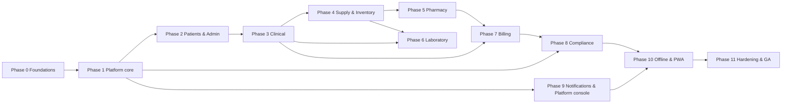

# Multi-Tenant Clinic Platform — Build Plan (todo.md)

**Version:** 1.1 (draft) · **Date:** 2026-10-01 · Changelog: v1.1 adds the Philippine OPD practice fit — PhilHealth (Konsulta/YAKAP, eClaims, Q-16), PIDSR/RA 11332 case reporting, DOH LTO licence reminders, and the post-GA backlog
**Companion docs:** [architecture.md](architecture.md) · [specification.md](specification.md) · [frontend.md](frontend.md)

This is the execution order for the platform described in the other three documents. Each phase has a scope, a task list, an **exit gate** that must pass before the next phase starts, and the acceptance scenarios (specification §17) it discharges. Tasks are ordered within a phase by dependency; the ones on the critical path are marked ⛔.

**Companion identifiers.** `JOB-01…JOB-50` = [specification §14](specification.md) · `RPT-*` = [specification §15](specification.md) · `AC-#` = [specification §17](specification.md) · 🔒 = idempotency/transaction-protected endpoint ([specification §18](specification.md)) · `ADR-#` = [architecture §3](architecture.md).

postgres credentials: user:kpagarigan2, password:P@ssw0rd, host:localhost, port:5432

---

## Contents

- [How to use this plan](#how-to-use-this-plan)
- [Ground rules](#ground-rules-invariants-that-must-hold-in-every-phase)
- [Dependency graph](#dependency-graph)
- [Phase 0 — Foundations](#phase-0--foundations)
- [Phase 1 — Platform core](#phase-1--platform-core-tenancy-auth-rbac-audit-jobs)
- [Phase 2 — Patients & configuration](#phase-2--patients-registration-and-tenant-configuration)
- [Phase 3 — Clinical](#phase-3--clinical-scheduling-visits-orders-prescriptions)
- [Phase 4 — Supply & inventory core](#phase-4--supply--inventory-core)
- [Phase 5 — Pharmacy](#phase-5--pharmacy)
- [Phase 6 — Laboratory](#phase-6--laboratory)
- [Phase 7 — Billing & cashiering](#phase-7--billing--cashiering)
- [Phase 8 — Compliance](#phase-8--compliance-audit-consent-dsr-retention)
- [Phase 9 — Notifications, files, reports, platform console](#phase-9--notifications-files-reports-platform-console-completion)
- [Phase 10 — Offline & PWA](#phase-10--offline--pwa)
- [Phase 11 — Hardening & GA](#phase-11--hardening-security-and-ga)
- [Appendix A — Job tracker](#appendix-a--background-job-implementation-tracker)
- [Appendix A2 — Cross-cutting infrastructure ownership](#appendix-a2--cross-cutting-infrastructure-ownership)
- [Appendix B — Acceptance → phase map](#appendix-b--acceptance-scenario--phase-map)
- [Appendix C — Risk register](#appendix-c--risk-register-delivery-risks-not-product-risks)
- [Appendix D — Release readiness](#appendix-d--release-readiness-checklist-per-release)

---

## How to use this plan

- Ticking a box means the task is **merged, tested, and demonstrated** — not "written".
- A phase cannot be declared done by code alone: its **exit gate** checklist must be ticked, including the tenancy-isolation tests and the audit evidence.
- Work that can be parallelised is marked with `‖`. Two engineers can take two `‖` tasks in the same phase.
- Anything blocked by an open question in [specification §20](specification.md) is marked 🔺 and must be signed off before the dependent task starts, not after.
- When a task is discovered mid-phase that is not listed, add it here with a note rather than silently expanding scope.

---

## Ground rules (invariants that must hold in every phase)

These are not tasks; they are the properties that every pull request must preserve. Any change that weakens one is an architecture change (new ADR), not a bug fix.

1. **Tenant isolation is proven, not assumed.** Every new table has `tenant_id`, RLS enabled *and forced*, composite tenant foreign keys, and a test that asserts a second tenant cannot read or write it. CI fails without the test.
2. **No bypass role in the app path.** The API connects as a non-`BYPASSRLS` role; `SET LOCAL app.current_tenant` only, inside a transaction.
3. **Every 🔒 endpoint is one transaction** and accepts an `Idempotency-Key`.
4. **Every state change is audited** with actor, tenant, before/after (masked), request id, and break-glass flag.
5. **No PHI leaves the tenant boundary** — no cross-tenant queries, no platform-scope PHI, no PHI in logs, analytics, or error reports.
6. **Money and stock are never computed client-side** and never trusted from the client.
7. **Destructive and clinical-history actions are append-only**: archive, void, cancel, amend, reverse.
8. **Reference data is versioned**, and changing it never rewrites history (ranges, templates, price lists).
9. **Background jobs are schema-validated, tenant-scoped, idempotent, and observable** (status, attempts, DLQ).
10. **Open questions block, they do not accumulate.** A 🔺 task cannot start until its question is signed off.

---

## Dependency graph

**Critical path:** P0 → P1 → P2 → P3 → P4 → P5/P6 → P7 → P11. Compliance (P8) and Notifications/Platform (P9) branch off earlier and can run in parallel from P1.

---

## Phase 0 — Foundations

**Goal:** a repository where a vertical slice can be built safely. **Size:** L. **Depends on:** nothing.

### 0.1 Repository and toolchain
- [x] pnpm workspace: `apps/api`, `apps/worker`, `apps/web`, `packages/{ui,contracts,domain,jobs,db,test-utils,eslint-config}` *(built: apps/api, apps/web, packages/{ui,contracts,db}; worker/domain/jobs/test-utils/eslint-config land with the phases that need them)*
- [x] `tooling/docker-compose.dev.yml`: Postgres 17, Redis (cache), MinIO, Mailpit, optional LIS simulator *(kept as optional; dev runs on **native localhost Postgres 18** — user environment, no Docker)*
- [x] TypeScript base config (`strict`, `noUncheckedIndexedAccess`), path aliases, build scripts
- [x] ESLint + Prettier; boundary lint rules (frontend §4; API module boundaries; no cross-feature imports; `react-bootstrap` only from `packages/ui`; no `SECURITY DEFINER` in migrations; no `SELECT *` in module repositories) *(proven by `tooling/boundary-fixtures/boundary.test.mjs` — deliberate violations fail, clean fixture passes; `packages/ui/**` exempt-in-config since the negation form can't exempt the importing file)*
- [x] Commit hooks, conventional commits, branch protection, CODEOWNERS *(hooks via `.githooks` + `core.hooksPath`; branch protection + CODEOWNERS are GitHub-side, pending first push)*

### 0.2 Contracts and migrations
- [x] OpenAPI-first contract pipeline: Zod schemas in `packages/contracts` → OpenAPI document → generated client types *(emitter ships a drift-checked literal; reflection-based generation swaps in at Phase 1 without changing consumers)*
- [x] Drizzle schema conventions; migration tooling with **down** scripts and a `db:seed` for local dev *(delivered as hand-written SQL migrations + raw `pg` runner with `down`/`down --all`/`seed` and auto-create of the `clinic` DB; Drizzle deferred — decision recorded here per "add it with a note")*
- [x] Migration guardrails in CI: every migration reviewed; destructive changes require a two-step expand/contract plan; **schema linter** (architecture §5.2 layer 5) fails the build when a table with `tenant_id` lacks RLS/FORCE/policy/`(tenant_id, …)` index, and on any query targeting a `_*_p20*` child partition *(partial: no-SECURITY-DEFINER / no-SELECT-* fixtures active; full schema linter lands with the Phase 1 partitioned tables that give it something to lint)*
- [x] Testcontainers (or compose) fixture that boots a clean database per test suite *(native localhost PG + `probeDb()` collection-time skip-guard; suites run green against the real instance)*
- [x] DB roles and connection plumbing: `clinic_owner` (migrator only), `clinic_app` (`NOSUPERUSER NOBYPASSRLS`), `clinic_report` (replica read-only); `DATABASE_URL_MIGRATOR/_APP/_REPORT` config; connection reset-on-checkout guard *(migration 0001; `SET ROLE clinic_owner` inside scripts + `RESET ROLE` in runner; connectivity as `clinic_app` verified)*

### 0.3 API skeleton
- [x] NestJS 11 + Fastify 5 app with config validation, structured logging (request id), `/health` and `/ready` *(fastify pinned to platform-fastify's internal 5.11.3 to avoid dual-copy type conflicts)*
- [x] Global error filter → RFC 9457 `application/problem+json` (architecture §11.2) seeded with the full error catalogue (`STOCK_INSUFFICIENT`, `MODULE_NOT_ENTITLED`, `STALE_ROW_VERSION`, `PERIOD_LOCKED`, …)
- [x] Global validation pipe (Zod), request-id middleware, security headers *(custom `ZodValidationPipe` → 422 `VALIDATION_FAILED` with `errors[]` field paths; class-validator deliberately not installed — Zod is the stack standard; correlation id via Fastify onRequest hook so it also covers framework 404s)*
- [x] **Request pipeline skeleton in the corrected order** (architecture §11.3): middleware → tenant context guard → module guard → permission guard → Zod validation → interceptors; the nesting asserted by a unit test from day one *(order assertion now exists: `apps/api/tests/pipeline-order.test.ts` pins `AuthGuard → TenantContextGuard → StepUpGuard → ModuleGuard → PermissionGuard` off the `@Module` metadata, and `tenant-context.guard.test.ts` covers the tenant/permission boundary behaviourally; both proven to fail under deliberate reordering. Still open: the Zod-validation/interceptor tail)*
- [x] **Idempotency infrastructure**: `idempotency_keys (tenant_id, key)` unique store, replay of the stored response, `409 IDEMPOTENCY_CONFLICT` on body mismatch; decorator/interceptor used by every 🔒 endpoint (ground rule 3) *(store + conflict semantics tested; decorator/interceptor wiring lands with the first 🔒 endpoint in Phase 1)*
- [ ] **Optimistic concurrency**: `If-Match`/`row_version` handling → `412 STALE_ROW_VERSION` (G-06), used by every PATCH on posted-document-referenced entities *(Phase 1, with the first PATCHed resources)*
- [ ] **Gapless document numbering**: `number_sequences` + `app.next_doc_no()` (architecture §6.6e) — used by every document module from Phase 3 onward *(scheduled early Phase 3, before the first document module)*
- [ ] Swagger/OpenAPI served at `/docs` (internal) *(with the Phase 1 route surface it documents)*

### 0.4 Web skeleton
- [x] Vite + React 19 app with the shell regions (frontend §8), routing tree, and `packages/ui` wrapper over react-bootstrap
- [ ] **`packages/ui` core component set** (frontend §5.2): `DataTable`, `ReasonModal`, `StepConfirmModal`, `StatusPill`, `PatientBanner`, `ScanInput`/`ScanButton`, `SearchCombobox`, `Timeline`, `EmptyState`, `SkeletonTable`, `FooterBar`, `SignaturePad`, `QRSummary`, money/quantity/date renderers *(partial: StatusPill, EmptyState, SkeletonTable, AlertBanner shipped; the rest land with the first screens that consume them)*
- [ ] **i18n scaffolding** (frontend §18): react-i18next, en-PH default, tenant-locale formatting via `Intl`
- [ ] Theme tokens (`tokens.css`), light/dark mode, density setting
- [x] Vitest, RTL, MSW, Playwright, axe configured; a sample screen with all six states (frontend §19) *(MSW 3 does not intercept jsdom fetch under Node 25 — replaced by a loopback stub server on :8790, same contracts; Playwright smoke spec written, browsers not installed locally)*

### 0.5 CI
- [x] Pipeline: install → lint → typecheck → unit → integration (Postgres) → build → E2E (smoke) → migrations check *(`.github/workflows/ci.yml` incl. boundary-fixture proof, migrate → rollback --all → up → seed; green run pending first push to a remote)*
- [ ] Coverage gates (`shared/` 90 %, features 80 %), bundle-size budget (frontend §21) *(gates live and enforced as `pnpm test:coverage` / `pnpm test:coverage:apps`; `shared/` meets 90 % (lines/statements/functions) and is set to 75 % branches against a measured 79.31 %, `features/` is ratcheted to 60 % against a measured ~64 % and must ratchet toward 80 %. Two separate invocations because vitest applies one threshold to the whole include set. Largest single drag resolved: `auth/guards/auth.guard.ts` went 17 % → 100 % across all four metrics, with five mutation checks proving the tests bite (accepting a refresh token as an access token, sending the raw API-key secret instead of sha-256, dropping the `revoked_at` check, widening the tenant-id pattern, and ignoring `@Public` are each caught). bundle-size budget still outstanding)*
- [ ] Dependency and secret scanning; pinned versions asserted *(pinned-version assertion shipped as `tooling/scripts/assert-pinned-versions.mjs` and is green: it caught `@node-rs/argon2` and `jose` floating on `^` and both are now exact, with no resolved version moving. `workspace:*` and `peerDependencies` ranges are deliberately exempt. `pnpm audit --audit-level=high` and a gitleaks step are wired into `ci.yml` but unproven until a first push)*
- [x] Observability skeleton: `/metrics`, OpenTelemetry tracing, structured-log redaction middleware (no PHI in logs — ground rule 5) *(Prometheus text exposition + PHI-redacting JSON logger with key deny-list, tested; OTel tracing swap-in deferred)*

### Exit gate
- [x] `pnpm install && pnpm dev` starts API, worker, web, and Postgres with one command *(native PG — no container needed; `pnpm dev` runs api+web in parallel; `apps/worker` arrives with Phase 1.5)*
- [x] A dummy `/api/v1/ping` and one web route render, are tested, and pass axe *(plus /health, /ready, /metrics; 404s return problem+json with correlation id — boot-checked against the live server)*
- [x] CI is green on an empty repository; migrations run and roll back cleanly *(workflow committed; local `db:rollback --all → db:migrate → db:seed` cycle verified clean; the CI-green assertion lands on first push)*
- [x] Boundary lint rules are active (a deliberate violation fails CI)

---

## Phase 1 — Platform core: tenancy, auth, RBAC, audit, jobs

**Goal:** two isolated tenants exist, users log in, every action is audited, jobs run. **Size:** XL. **Depends on:** Phase 0. **Discharges:** AC-16 (break-glass), AC-19 (job tenancy), AC-23, AC-24, AC-26, AC-27, AC-28 (entitlements).

### 1.1 Data model and tenancy plumbing
- [x] ⛔ `tenants`, `plans`, `subscriptions`, `branches`, `users`, `roles`, `permissions`, `role_permissions`, `user_roles`, `user_branches`, `sessions`, `refresh_tokens`, `mfa_secrets`, `login_attempts`, `password_resets`, `api_keys`, `breakglass_sessions` *(migrations 0003–0005; refresh tokens folded into `sessions` — rotation chain via `replaced_by` + reuse detection — one table instead of two; revisit only if reuse forensics need a separate ledger. Composite FK pairs `(tenant_id, id)` on every child; UUIDs are `gen_random_uuid()` until a uuidv7 helper lands)*
- [x] Platform-side tables: `platform_users`, `tenant_directory` (non-PHI, no RLS, kept in sync by trigger), `subscription_plans`, `tenant_feature_flags`, `platform_announcements`, `system_settings` (versioned, audited), `security_events` *(0003 delivers `platform_users`, `subscription_plans`, `tenant_directory` + sync trigger (verified by test), `system_settings`, `platform_announcements`; `tenant_feature_flags` and `security_events` land with 1.6/1.5 respectively — first consumers)*
- [x] ⛔ RLS bootstrap: `FORCE ROW LEVEL SECURITY` on every tenant table; policies using `app.current_tenant`; `app.user_id` for actor-aware policies; strict policy on PHI tables vs `tenant_or_platform` policy on administrative tables (architecture §5.5, §6.3) *(strict `tenant_isolation` on sessions/mfa/login_attempts/password_resets/api_keys/branches/subscriptions/tenant_modules/branch_licences; `tenant_or_platform` on tenants/users/roles/role_permissions/user_roles/user_branches/breakglass_sessions; no PHI tables exist yet — first one is `patients` in Phase 2)*
- [x] `TenantContext` interceptor: resolve tenant (subdomain/token), open transaction, `SET LOCAL`, run handler, commit; subdomain must match token tenant or `403 TENANT_MISMATCH` *(deliberately implemented as **verify, don't own**, because `architecture.md` §11.3 L823 puts the transaction in the service layer and scopes interceptors to "serialisation, redaction, logging, timeout" — a global interceptor owning a write transaction would hold a pooled connection through serialisation, wrap the `@Public` health/metrics routes, and collide with the idempotency savepoints. So: the resolve-and-cross-check half is `TenantContextGuard` (slug/header mismatch → `403 TENANT_MISMATCH`, uuid compared case-insensitively); a new `TenantContextInterceptor` (single `APP_INTERCEPTOR`) opens a request scope and then asserts a transaction actually ran, so a service that forgets `withTenant()` fails with `400 TENANT_CONTEXT_MISSING` instead of silently returning zero rows. `withTenant` records itself into the scope, which also throws on a cross-tenant transaction. RLS remains the only security boundary; this makes the fail-closed path legible. 22 new tests (measured: suite grew 109 -> 131, correcting the 19 first recorded here), 11 mutation checks all caught. Note: `TENANT_CONTEXT_MISSING` is contracted at 400, not the 500 a genuine server-side defect would deserve — flagged for the contract owner, not changed unilaterally)*
- [x] Non-bypass runtime role; migration role separated; connection pool reset-on-checkout guard *(0001 roles + client_min_messages reset on checkout; ownership bug found and fixed: post-0001 migrations now `SET ROLE clinic_owner` themselves — from-scratch cycle re-verified)*
- [ ] Isolation test harness: a helper that runs the same test as tenant A and tenant B and asserts zero cross-visibility (used by every later phase) *(works today as `tenancy.test.ts` against seeded tenants A/B; the reusable run-as-A-and-B helper extraction lands when Phase 1.2 endpoints consume it)*
- [ ] Partitioned high-volume tables (`audit_log`, `phi_access_log`, `stock_movements`): policies on the parent are **not** applied to rows read via a child partition, so `REVOKE ALL` on every child from the runtime role, grant only on the partitioned parent, and a linter rule fails CI on any query targeting a `_*_p20*` child *(1.4 audit_log is the first partitioned table — this ships with it)*
- [x] Policy predicates stay index-friendly: `app.tenant_id()` / `app.is_platform()` are `STABLE` and wrapped as `(SELECT …)` InitPlans; no non-`LEAKPROOF` function (`arrayoverlap`, `texteq`, enum equality) inside a `USING` clause *(all 0003–0005 policies use the wrapped `(SELECT app.tenant_id())` form)*
- [ ] Extended statistics for the correlated filter columns the hot queries use (e.g. `CREATE STATISTICS st_stock_tenant_branch (dependencies) ON tenant_id, branch_id FROM stock_movements;`), because the planner default assumes independence and mis-estimates these queries *(deferred until the first hot query exists — with the EXPLAIN guard in Phase 3+)*

### 1.2 Auth and sessions
- [x] Login, refresh (rotation + reuse detection), logout, forgot/reset password, generic responses, rate limits, lockout *(migrations 0006 + auth module: slug→tenant_directory pre-auth (§5.6), login in a tenant-scoped transaction, failure writes in their OWN transaction so lockout/login_attempts survive the throw; refresh rotates `sessions` (revoked 'rotation', replaced_by) and reuse of a revoked token kills the user's chain 'reuse_detected' — verified live + integration tests; in-memory sliding-window limiter on login/forgot/step-up, Redis swap noted for multi-replica)*
- [x] TOTP MFA enroll/confirm/verify, recovery codes, remember-device *(dependency-free RFC 6238 TOTP with ±1-step window + per-user replay guard (`mfa_secrets.last_used_step`); secrets AES-256-GCM sealed with an HKDF key off JWT_SECRET; 10 single-use recovery codes; `mfa_trusted_devices` cookie skips the challenge; verified round-trip: enroll→confirm→login MFA_REQUIRED→recovery-code verify→remember-device skip)*
- [x] Step-up authentication (re-auth for high-risk actions) and a client hook for the passphrase modal *(POST /auth/step-up (password and/or TOTP) → 5-min step-up JWT bound to user+session; `@RequireStepUp()` guard on mfa/enroll, recovery-codes, mfa delete; the web passphrase modal hook lands with the 1.7 shells — the 401 STEP_UP_REQUIRED contract is live)*
- [x] Password hashing (Argon2id) with parameters in config; service accounts and API keys *(OWASP m=19MiB t=2 p=1 from config; policy min 12 + char mix; `@node-rs/argon2` prebuilt for Windows; ApiKey scheme `cka_<tenantId>_<secret>` with sha256 lookup + last_used_at inside the tenant context; seed hashes are real Argon2id — demo credential `DemoPassw0rd!2026`)*

### 1.3 RBAC and ABAC
- [x] Permission catalogue generated from [specification §2](specification.md); seeded system roles *(354 codes in `packages/contracts/src/permissions.ts`, every code described and shape-checked; 16 `SYSTEM_ROLE_TEMPLATES` whose grants all resolve to real catalogue codes. **The catalogue is versioned by migration 0007, not a loose seed script** - it used to be inserted only by `seed-permissions.mjs`, which no npm script or CI step invoked, so a fresh `db:migrate && db:seed` produced an EMPTY `permissions` table and every RBAC test failed. Found by running CI's own `db:rollback --all` sequence locally. `tooling/scripts/gen-permission-catalogue-sql.mjs` regenerates the block from contracts so the two cannot drift; `packages/db/tests/reference-data.test.ts` asserts migrations alone yield >=300 rows)*
- [x] Role CRUD, clone, permission matrix, SoD conflict detection *(RbacService over `withTenant` on every read and write; `assertNoSoDConflicts` now runs on **create, update, clone and assign** - a review found it was only called on assignment, so a role could be created holding both halves of a conflict and then be unassignable. Verified with three integration tests, each proven to fail when its check is removed, and a partial-update assertion that a refused grant leaves `row_version` and permissions untouched)*
- [ ] `usePermission` / `requirePermission` guard; branch scope; restricted-patient ABAC; "effective permissions" endpoint *(`@RequirePermission` + `PermissionGuard` as the last `APP_GUARD`; effective set cached per request; `GET /auth/permissions` needs no admin permission. A review found the platform-scope bypass was dead code - `new Set(["*"])` can never satisfy `has(required)`, so every platform call 403'd. Fixed with an explicit `ALL_PERMISSIONS` sentinel and covered by 12 behavioural tests, all six mutations caught. **Left unchecked deliberately: restricted-patient ABAC is not built, and it is patient-scoped, so this box closes with the 1.1 isolation helper rather than with the guard)*

**Blocking contradiction for the product owner (found 1.3 review, not a code fix):** `specification.md` §2.1 grants `PHARMACIST` both "Verify, dispense", but `0007_rbac` declares `pharmacy.rx.verify` × `pharmacy.dispense.post` a segregation-of-duties conflict. Both cannot hold. Because `assignUserRoles` checks the effective union, the `pharmacist` template **can never be assigned to anyone**. It is latent today - the demo seed only creates `tenant_admin`, `doctor` and `receptionist` - and goes live the moment JOB-03 provisions the 16 system roles for a real tenant. Pinned by `KNOWN CONTRADICTION` in `apps/api/tests/rbac.test.ts` so the conflict is visible in the suite rather than silent. Resolving it means choosing between two spec statements, so it is a scope question, not something to patch in the service.

### 1.4 Audit
- [x] ⛔ `audit_log` (partitioned, append-only, hash-chained) with a DB trigger denying `UPDATE`/`DELETE`; before/after masking
- [ ] Audit interceptor for all mutations; PHI access logging (read events on patient-scoped GETs)
- [ ] JOB-10 chain verification; anomaly queries for the compliance explorer

### 1.5 Jobs
- [ ] ⛔ pg-boss setup, schema, per-tenant queues, `tenantId` schema validation on every payload, retry/DLQ policy, observability (`job_runs` view)
- [ ] `JOB-01 outbox.dispatch` publishes the transactional outbox to queues and notifications (every 5 s); the outbox is the only bridge between a request transaction and async work
- [ ] `JOB-08 audit.partition.maintain`, `JOB-15 retention.enforce` (safe default: nothing auto-deleted until a tenant enables enforcement), `JOB-11 session.cleanup` (also sweeps expired break-glass sessions), `JOB-12 user.inactive.deactivate`, `JOB-13 credential.expiry.remind` (PRC/S2/PDEA licences **and any branch licence on file** — reminders are per licence record, so a branch with no DOH LTO recorded gets no reminder)
- [ ] Job runner conventions: idempotent handler, per-tenant concurrency caps, DLQ replay tool
- [ ] pg-boss named queue policies per job, not one shared queue: `short` for `JOB-11 session.cleanup`; `singleton` + `singletonKey: tenantId` for `JOB-06 subscription.check` and `JOB-18 rls.canary`; `stately` for `JOB-01 outbox.dispatch`; `key_strict_fifo` + `singletonKey: "{tenantId}:{module}"` for `JOB-03 tenant.provision` re-runs
- [ ] Explicit `expireInSeconds` + `heartbeat` on long jobs (large report export, DSR export) so a wedged worker is reclaimed; `retentionSeconds` bounds the job table. Never pass `priority: false` (deprecated/ignored from pg-boss 12.30.0, measured ~180x slower)
- [ ] `rls.canary` (JOB-18) with a security-event on failure

### 1.6 Module entitlements

This is the gate every later phase builds on: a phase cannot ship a module's screens without the entitlement machinery that hides it from tenants that did not buy it.

- [x] ⛔ `tenant_modules` table (`tenant_id`, `module`, `status` ∈ `TRIAL/ENABLED/DRAINING/DISABLED`, `seed_status`, `limits`, `expires_at`, reason/actor/time columns, `row_version`), `PRIMARY KEY (tenant_id, module)`, RLS + `tenants.modules_version`
- [x] ⛔ Module key catalogue in code (`admin`, `patients`, `clinical`, `supply`, `laboratory`, `pharmacy`, `billing`, `compliance`, `notifications`, `reports`) with hard dependencies and soft dependencies declared as data, not as scattered `if`s
- [x] @ModuleGuard (global, registered via the `APP_GUARD` token - **not** `useGlobalGuards(new ...)`, which silently loses DI because instance-bound guards are built outside the injector) ordered **before** `@RequirePermission`; registration order asserted by a unit test on the composed handler chain; `403 MODULE_NOT_ENTITLED`, `403 MODULE_READ_ONLY` for `DRAINING`; superadmin tokens are subject to it too
- [x] Bootstrap-time check that throws if any route outside the allow-list carries no module declaration, so a new route added without a module fails startup instead of leaking
- [x] Entitlement guard **fails closed**: unreadable entitlement store/cache returns `503 UPSTREAM_UNAVAILABLE` (never a grant), a cached `ENABLED` is never honoured past `modules_cache_ttl`, and an `entitlement_evaluation_failure` counter is exported for alerting
- [x] Entitlement/feature-flag separation: no route's access depends on `tenant_feature_flags`; a module is granted only by a `tenant_modules` write (plan change, `JOB-03`, or explicit superadmin action) - payment webhooks may enqueue the state change but never write an entitlement row inline
- [ ] Entitlement cache keyed on `modules_version` (`modules_cache_ttl` 60 s, configurable); session token carries `modules[]` + `modules_version`; a version bump forces refresh for other users' sessions
- [ ] Validation on create and update: missing hard dependency → `MODULE_DEPENDENCY_MISSING`; module outside the plan → `PLAN_MODULE_NOT_ALLOWED`; nothing written on failure
- [ ] Enable/disable state machine with the two-step disable: `preflight` (open work inventory) → `drain` or `disable {force, reason}`; `MODULE_HAS_OPEN_WORK` when a non-forced disable is attempted with open work; `reopen` for `DRAINING` → `ENABLED`
- [ ] Enabling runs only that module's missing seed and re-runs **nothing else**; existing role grants for a newly enabled module are left unmapped, and the "permissions to review" signal is exposed for the tenant admin
- [ ] Disabling is never destructive: no DELETE path exists, `disabled_reason` is required, and a re-enable round-trip is covered by an automated test
- [ ] Break-glass session inherits the tenant's module set; a non-entitled attempt is audited as a denial
- [ ] Report catalog filters to entitled modules; job scheduler refuses to enqueue a non-entitled module's jobs and workers re-check before each attempt
- [ ] `GET /admin/modules` (read-only, tenant-facing) and the "request a module" contact action

### 1.7 Tenant provisioning and platform console (minimum)
- [ ] ⛔ Tenant create with `modules[]` in the body (wizard step: cards, dependency auto-tick, plan-locked modules, live summary) → `PROVISIONING` → JOB-03 seeds **only** the entitled modules, writing `seed_status` per module; tenant activates when every entitled module is `SEEDED`; failure compensates to `PROVISIONING_FAILED` (retryable via `POST /platform/tenants/{id}/provision`)
- [ ] JOB-03 also seeds **private-practice defaults**: `service_catalog` with a consult service (CPT-free, clinic-named), discount types, payment methods, and `practitioner_profiles` fields for per-doctor consultation fees (Q-17)
- [ ] ⛔ Platform console Modules tab: status/seed/trial table, enable, preflight, drain countdown, force-disable with typed reason, change history (RPT-PLT-09)
- [ ] ⛔ `POST /platform/tenants/{id}/enter` break-glass with reason ≥ 15 chars, step-up MFA, hard 8 h ceiling, auto-expiry sweep, tenant notification
- [ ] **Tenant suspend / reactivate** (PLT-T2, G-15, AC-3): suspend with reason → sessions revoked, clinical users blocked, jobs paused except export/retention; reactivate restores; admin banner/notice
- [ ] **Branch logic (PH practice fit, Q-18 🔺)** — branches are the tenant's operational scopes; the rules below live in one place and every module consumes them:
  - [ ] ⛔ **Lifecycle**: create (code unique per tenant; seeds stock locations and per-branch number sequences from the service profile), update, archive (blocked while stock on hand, active users, or open work exist), reactivate; plan branch-count cap enforced with `QUOTA_EXCEEDED` (spec §4.4)
  - [ ] ⛔ **Branch service profile**: each branch declares what it operates — consultation only, procedure room, embedded laboratory, pharmacy/dispensing, ambulatory surgical, birthing, dialysis. The profile drives what JOB-03 seeds for the branch (locations, sequences), which licences are *expected*, which compliance badges render, and which branch-scoped job behaviours apply (e.g. lab TAT/QC only where a lab exists)
  - [ ] **Profile ↔ entitlement cross-check**: a branch declaring a service whose tenant module is not entitled (embedded lab without `laboratory`) is refused at save with `MODULE_DEPENDENCY_MISSING` semantics; removing a module puts the affected branches on a compliance watch, it does not silently rewrite their profiles
  - [ ] **Licence registry per branch**: local business permit (required for PH tenants — consultation-only clinics legitimately run on this alone), **optional** DOH LTO + expiry, FDA drugstore LTO. JOB-13 reminders key off licence records present; a missing-but-expected licence (profile says laboratory, no lab licence on file) surfaces as a compliance badge and a line in RPT-ADM-04 — the software never blocks operations on licence data
  - [ ] **Branch-scoped access (G-02)**: `user_branches` with `is_default`; queries, job payloads, and audit rows carry branch context; tenant admins see all branches; a branch id the caller is not assigned to returns `404` (no existence oracle)
  - [ ] **Cross-branch behaviour**: inter-branch transfers need both branches' approvals (SUP-T4); reports default to the active branch with a tenant-wide option for admins (RPT filters); branch timezone override falls back to tenant timezone (G-08); the shell branch switcher invalidates branch-scoped queries and confirms on unsaved work (frontend §8)
- [ ] Platform console shell: tenants list/detail (metadata only), admins, break-glass console, jobs monitor
- [ ] Tenant admin shell: users, roles, branches, service units, settings (read-only groups at first)

### Exit gate
- [ ] AC-16, AC-18, AC-19 pass end-to-end in E2E
- [ ] AC-23, AC-24, AC-26, AC-27, AC-28 pass: a superuser token still gets `MODULE_NOT_ENTITLED` for a non-entitled module; bad module sets are rejected with nothing written; a supply-only tenant has no lab/pharmacy/billing routes, nav entries, or seeded masters; an unreadable entitlement store returns 503 and never grants; a feature flag cannot enable a disabled module
- [ ] Isolation harness green; a deliberate cross-tenant attempt in E2E returns `404` with no data
- [ ] Every mutation produces an audit row; tampering with a row in a test DB breaks the chain (AC-14)
- [ ] A provisioned tenant can log in and has no empty pickers in the UI
- [ ] Break-glass: start, act, auto-expire, and end flows verified; tenant admin can see the session in the list
- [ ] **Branch round-trip:** create a consultation-only branch (runs on a business permit alone, no licence noise) and a branch with an embedded lab (licence expected, badge shows until recorded); archive is blocked with stock on hand and allowed when empty; a user assigned to branch A sees nothing of branch B
- [ ] **Entitlement round-trip:** disable a populated module (drain → force), re-enable, and assert every record, posting, and audit entry is still there (AC-25 green)

---

## Phase 2 — Patients, registration, and tenant configuration

**Goal:** the tenant can be configured and patients registered safely. **Size:** L. **Depends on:** Phase 1. **Discharges:** AC-9 (merge), AC-12 (restore).

### 2.1 Tenant configuration
- [ ] **Files service (minimum)**: presign upload → scan gating → `files` table with RLS, tenant-prefixed object keys (`t/{tenant_id}/…`), short-lived download URLs with re-authorisation — needed here by patient documents and consent signatures, ahead of the Phase 9 enrichment (versions, previews)
- [ ] **Reference data API** `/reference/{icd10,psgc,loinc,drug-schedules}` read-only endpoints consumed by the UI pickers built in this phase
- [ ] Service catalog, price lists (effective-dated), discount types, payment methods, holidays, operating hours, service units
- [ ] Document and notification templates with versions and preview
- [ ] Consent templates (v1 shell) and the patient-facing consent version record
- [ ] Reference data: ICD-10, PSGC, drug schedules, LOINC (read-only, cached, seeded or fetched at build time)

### 2.2 Patients
- [ ] ⛔ Patient CRUD, demographics versioning, identifiers (masked, reveal-with-reason), contacts, allergies, flags
- [ ] Duplicate detection (exact + trigram + DOB/mobile fuzzy) with acknowledgement flow
- [ ] ⛔ Merge with preview, snapshot, unmerge window; audit and notify
- [ ] Consent capture and withdrawal; deactivate/mark deceased (no delete)
- [ ] **PhilHealth member data** (Q-16 🔺): PIN, membership category, Konsulta primary-care-provider (PCP) registration status and beneficiary dependents captured on the patient record; visible in registration and the chart header
- [ ] **Emergency registration without consent** (Q-11 🔺): allowed with `EMERGENCY` reason; deferred consent prompt surfaces at the next encounter
- [ ] Patient banner with progressive PHI reveal and auto-mask
- [ ] JOB-22 duplicate candidates review screen

### 2.3 Command palette and search
- [ ] Global patient search with permission filtering; recent patients; deep links

### Exit gate
- [ ] AC-9, AC-12 pass
- [ ] Patient search is fast at 50 k patients (frontend §21 budget met)
- [ ] Masked identifiers cannot be revealed without an audited reason
- [ ] No delete affordance exists anywhere in the patient UI

---

## Phase 3 — Clinical: scheduling, visits, orders, prescriptions

**Goal:** a patient can be booked, seen, examined, and prescribed. **Size:** XL. **Depends on:** Phase 2. **Discharges:** AC-1, AC-2, AC-3, AC-4, AC-5.

### 3.1 Scheduling
- [ ] Practitioner schedule templates, slot generation, exceptions, holidays
- [ ] Availability API and booking with conflict detection
- [ ] **Walk-in / sequential consultation mode** (the default PH solo-practice style): per practitioner a choice of slot-based or walk-in queue; a walk-in consult issues a queue ticket on payment receipt of the consult fee and consults run in sequence, not at fixed times
- [ ] **Follow-up scheduling**: visit close offers a return date within the free-follow-up window; due follow-ups appear on the doctor's worklist
- [ ] Appointment lifecycle: book, confirm, reschedule, check-in, cancel, no-show; reminder jobs (JOB-23 reminders, JOB-24 no-show marking)
- [ ] Day view and queue board (SSE live)
- [ ] `JOB-25 visit.stale.close` (nightly close of visits open beyond policy, with exceptions list) — needed by the visit lifecycle in 3.2

### 3.2 Visits and chart
- [ ] **Immunizations**: record with lot → stock batch link, dose/site, void; register view (RPT-CLN-11) and chart display
- [ ] **Print pipeline**: headless-Chromium PDF worker + ZPL/ESC-POS label rendering — the shared pipeline every later numbered/PDF document (certificates, Rx labels, lab reports, receipts) uses
- [ ] Visit CRUD, lifecycle (`OPEN` → `READY_FOR_BILLING` → `CLOSED`), vitals with auto-flags, problems/diagnoses, procedures
- [ ] **Physician private-practice configuration** (Q-17): per-practitioner consult fee (new vs follow-up vs procedure), free-follow-up window, and an optional revenue share recorded for the tenant's own books (PF rate; payout handling is out of scope — see post-GA backlog)
- [ ] **Charge-capture service**: `billing.charge.create` contract + domain service (source_type lab/pharmacy/supply/procedure → charge lines on the visit's invoice created on demand) — billed modules in Phases 5–7 post charges through this; the Billing UI itself is Phase 7
- [ ] **PhilHealth Konsulta EPR data elements** (Q-16 🔺): the consultation workflow captures what PhilHealth's certified-EMR submission requires — member/dependent linkage, reason for visit, ICD-10 diagnoses, services and covered labs rendered — so a Konsulta encounter can be assembled later without re-keying
- [ ] Clinical notes: draft, templates, sign (step-up for high-risk types), amend
- [ ] Certificates and referrals (numbered; PDF rendered and hashed server-side, same pipeline as lab reports)
- [ ] Order status timeline component reused by lab/pharmacy

### 3.3 Prescriptions (clinical side)
- [ ] Prescription CRUD, draft → issue (locks), cancel with reason
- [ ] Drug search with allergy/informational warnings; controlled-Rx fields
- [ ] Order sets, note templates
- [ ] Job: `JOB-02 notification.send` notifies the pharmacy queue on issue; `JOB-26 rx.expire` expires stale issued prescriptions

### 3.4 Supplies at point of care (deferred stock)
- [ ] Procedure/consumption record with FEFO and the stock impact (reserves Phase 4 implementation; contract first)

### Exit gate
- [ ] AC-1 … AC-5 pass
- [ ] A visit can be completed end-to-end with signing, certificates, and a printable report
- [ ] Queue board stays live with 50 concurrent sessions without layout thrash
- [ ] SoD and step-up enforced for signing; every sign is audited
- [ ] A tenant without `clinical` sees no scheduling, queue, visit, or prescription surface, and disabling then re-enabling `clinical` loses nothing

---

## Phase 4 — Supply & inventory core

**Goal:** the item master, batches, and the append-only ledger exist, because pharmacy and lab both consume stock. **Size:** XL. **Depends on:** Phase 3 (contract), Phase 1. **Discharges:** AC-6, AC-7, AC-8, AC-12 (ledger immutability).

### 4.1 Item master and locations
- [ ] Categories, items (type, UOM base, batch/expiry/hazard flags, min shelf life), UOMs and conversions, barcodes (GS1)
- [ ] Suppliers and catalogues; locations (hierarchy, type) with archive guard (zero stock)
- [ ] Min/max/par/reorder parameters per item per location, bulk CSV import with error report

### 4.2 Ledger, batches, balances
- [ ] ⛔ `stock_movements` (append-only, partitioned, hash-chained), `stock_batches`, `stock_balances` with non-negative constraints
- [ ] ⛔ Posting service: single transaction for movement + balance + optional reservation; `Idempotency-Key`; DB-level `UPDATE`/`DELETE` denial (AC-12)
- [ ] FEFO allocation service with manual override + reason; UOM conversion; reservation/release/expiry
- [ ] Stock APIs: balances, ledger view, valuation snapshot, near-expiry, quarantine/release
- [ ] **Consumption posting** (SUP-T10): `POST /supply/consumption` FEFO for house use / procedures / lab reagents, ref-typed to the source document
- [ ] **Periods / period lock** (SUP-T13, AC-20): `periods` concept shared with billing, `POST /supply/periods/{period}/lock|unlock` with step-up, `PERIOD_LOCKED` enforced in the posting service

### 4.3 Purchasing and receiving
- [ ] Purchase requests → PO (draft, submit, approve with SoD, send, close, revision) → GRN (lines with lot/expiry/cost/inspection, shelf-life rule, post, void) → supplier invoice (3-way match) → return
- [ ] `JOB-29 stock.lowlevel.scan`, `JOB-34 po.overdue.remind`, `JOB-35 requisition.sla.escalate`, `JOB-36 supplier.scorecard.compute` implemented and observable
- [ ] Requisitions, issues (FEFO pick, post → in-transit), acknowledgement with discrepancy, transfers
- [ ] Adjustments (reason codes, two-user approval, value thresholds) and disposals (witness, certificate, photo)
- [ ] Counts: full/cycle/spot, blind count, variance, recount, post
- [ ] JOB-30 (par), JOB-31 (reorder), JOB-32 (reconcile → hold) implemented

### 4.4 Recalls
- [ ] Recall creation, lot trace to patients, quarantine, close-out checklist (on-demand; no scheduled job)

### 4.5 Supply UI
- [ ] Dashboard, GRN wizard, PR/PO, requisition/issue, counts, adjustments, disposals, recalls, stock explorer, item master

### Exit gate
- [ ] AC-6, AC-7, AC-8, AC-12 pass
- [ ] Concurrency test: two simultaneous dispenses of insufficient stock → exactly one succeeds
- [ ] Ledger rows cannot be updated or deleted by any runtime role (verified by test)
- [ ] Reconcile (JOB-32) detects an injected imbalance and holds the item (AC-13)
- [ ] `supply` works as a standalone module: a supply-only tenant provisions, receives stock, and issues it with no clinical/lab/pharmacy present

---

## Phase 5 — Pharmacy

**Goal:** prescriptions are verified and dispensed with FEFO, interactions, and the controlled-drug register. **Size:** XL. **Depends on:** Phase 4. **Discharges:** AC-7.

### 5.1 Catalogue and rules
- [ ] Generics, products, schedules, interactions (tenant overrides), price rules
- [ ] Interaction service: severity classification, tenant override precedence, audit of every alert shown and the decision taken

### 5.2 Verification
- [ ] ⛔ Verification queue; checks (allergy, interaction, duplicate, max dose, refill eligibility, stock); approve / intervene / reject with reason
- [ ] Prescriber notification on rejection (`JOB-02 notification.send`)

### 5.3 Dispensing
- [ ] ⛔ Dispense draft → allocate (FEFO) → post (movement + balance + charge + Rx status in one transaction) → void (reversal)
- [ ] Substitution with reason; partial fill with prescriber note; price/discount override with reason
- [ ] OTC sales; returns with disposition and credit note
- [ ] **In-clinic medication administration** (PHM-T6): nurse/doctor administers from clinic/pharmacy stock → `CONSUMPTION` + MAR record + charge; void with correction
- [ ] Controlled dispensing: special-Rx serial (unique, single-use), quantity words + numerals, witness (second authorised user, signature), register entry; hard blocks on reuse and refill
- [ ] **Rx label print** (patient, drug, sig, batch, expiry, pharmacist) via the Phase 3 print pipeline
- [ ] Pharmacy stock screens, controlled register with running balance and Dangerous Drugs Book print
- [ ] `JOB-38 controlled.reconcile`, `JOB-39 controlled.report.generate`, `JOB-40 pharmacy.rx.pending.remind` implemented (`JOB-27`/`JOB-28`/`JOB-37` are delivered with Supply in Phase 4; the pharmacy near-expiry worklist and valuation views consume their output)

### Exit gate
- [ ] AC-7 passes: controlled dispense records serial, license, words/numerals, witness, register; reuse rejected; refill blocked
- [ ] FEFO suggestion is deterministic and overridable only with a reason
- [ ] Every interaction alert decision is retrievable in the audit trail
- [ ] Peak-load test: a morning's dispensing volume processed with p95 within the API budget (frontend §21)
- [ ] `pharmacy` and `laboratory` behave correctly when `supply` is absent or draining (the soft dependency degrades, it does not break)

---

## Phase 6 — Laboratory

**Goal:** order → specimen → result → verify → release, with QC, critical alerts, and amendments. **Size:** XL. **Depends on:** Phase 3, Phase 4 (reagents). **Discharges:** AC-10, AC-11.

### 6.1 Catalogue and configuration
- [ ] Sections, specimen types, tests (LOINC, TAT, confidentiality, fasting, container), analytes, effective-dated ranges, delta rules
- [ ] Instruments with calibration due; reagent BOMs per test
- [ ] Report templates; reference range changes produce an "affected results" report

### 6.2 Orders and specimens
- [ ] Order CRUD from visit or walk-in; panel expansion; status timeline; cancel with reason
- [ ] ⛔ Specimen lifecycle: collect (accession, partial allowed), receive, reject (reason → recollect task), transport events, chain-of-custody timeline
- [ ] Barcode label print; deep-link QR

### 6.3 Results
- [ ] Result entry grid with units, ranges, auto-flags, delta checks, calculated analytes, instrument/QC badge
- [ ] ⛔ SoD verification (entry ≠ verify), QC gate, pathologist release if configured
- [ ] ⛔ Amend: new version, reason, redline, orderer notification, previous retained
- [ ] Critical value workflow: HH/LL rule, notification, acknowledgement with read-back, escalation
- [ ] Report release (async PDF with SHA-256, via the Phase 3 print pipeline), versioned report list, confidentiality gating with reason
- [ ] Repeat/reflex tests (LAB-T10, P1): repeat on abnormal; reflex rules (e.g. abnormal urinalysis → culture) — P1, can be deferred behind a flag
- [ ] Confidential-test handling (LAB-T12): masking, `lab.result.view_confidential` + reason, logged access, restricted report release

### 6.4 QC, send-outs, interface
- [ ] QC materials, lots, runs, results, Levey–Jennings with Westgard flags, accept/reject with impact
- [ ] Send-outs: referral, courier, result received → corrected report
- [ ] HL7 v2 ORU/ORM interface + exceptions queue (P2, feature-flagged); ACK/NAK handling
- [ ] `JOB-41 lab.critical.escalate`, `JOB-42 lab.tat.monitor`, `JOB-43 lab.report.render`, `JOB-44 lab.qc.missing.remind`, `JOB-45 lab.specimen.stale.flag`, `JOB-46 lab.instrument.calibration.remind`, `JOB-47 lab.interface.poll` implemented
- [ ] TAT dashboard and reports

### Exit gate
- [ ] AC-10, AC-11 pass
- [ ] Encoder cannot verify own result (AC-17) and the UI says why
- [ ] Critical alert escalation timer verified with a shortened test config
- [ ] Released report is immutable; amendment produces CORRECTED with history
- [ ] LIS simulator messages processed and exceptions surfaced
- [ ] `laboratory` auto-ticks `patients` and refuses to load without it (`MODULE_DEPENDENCY_MISSING`); `billing` refuses to load without `clinical`

---

## Phase 7 — Billing & cashiering

**Goal:** money is captured, auditable, and reconciled. **Size:** L. **Depends on:** Phase 3, Phase 5. **Discharges:** AC-20 (period lock is supply-side; billing lock covered by gate).

### 7.1 Invoicing and payer structure
- [ ] Invoice lifecycle from visit charges (lab, Rx, procedure, supply) **consumed from the Phase 3 charge-capture service**; manual invoices; line origin traceability
- [ ] **Payer types** (Q-16/Q-17): every invoice line and payment carries a payer (private-cash, HMO, PhilHealth, corporate) selected per visit; private cash consults price from the practitioner's fee config, with the patient-facing receipt and the internal record kept separate
- [ ] **Private consultation receipt** (Q-17): the patient receipt shows the professional fee and deductible items only — internal fields (PF rates, revenue share) never print or appear in any tenant-facing export
- [ ] Discounts (with ID capture when required), revoke before payment, permission-gated price override
- [ ] Credit notes, receivables, patient statements
- [ ] Receipt PDF/thermal rendering via the print pipeline (JOB-50)

### 7.2 Payments
- [ ] Payment capture, split tender, allocations, change; receipt (JOB-50, PDF + thermal), reprint with audit
- [ ] Void payment with reason + step-up; refund path

### 7.3 Cashiering and shifts
- [ ] POS surface (keyboard-first), hold/resume, walk-in flow
- [ ] Shift open/close with blind count and variance; daily close (JOB-48), X/Z reports

### 7.4 Controls
- [ ] Period lock shared with supply (one `periods` concept); `PERIOD_LOCKED` on posting
- [ ] **Daily PhilHealth Konsulta tally** (Q-16 🔺): per-day, per-physician summary of Konsulta encounters and rendered services, assembled from the Phase 3 EPR data elements, for the tenant's submission/claims workflow (manual submission v1; the certified-EMR transmit path is the post-GA integration)
- [ ] Receivables: `JOB-49 billing.overdue.flag` reminders; finance reports (RPT-BIL-*)

### Exit gate
- [ ] Split-tender, discount-with-ID, void, and shift-close-with-variance flows pass E2E
- [ ] Receipt reprint is audited and marked
- [ ] Money invariants: totals from line items; no client-computed totals accepted by the API
- [ ] `billing` preflight correctly lists open shifts and unposted documents as blockers; drain makes the cashier read-only without losing a session mid-tender

---

## Phase 8 — Compliance, audit, consent, DSR, retention

**Goal:** the privacy and safety obligations are operable, not just documented. **Size:** L. **Depends on:** Phase 1; enriches through P7. **Discharges:** AC-15.

### 8.1 Audit and access
- [ ] Audit explorer, PHI access log, anomaly queries, "who saw this patient"
- [ ] Break-glass transparency for tenant admins (RPT-PLT-05)

### 8.2 Consent and DSR
- [ ] Consent templates, publish, patient signature, versioned record
- [ ] DSR: intake, identity verification, processing, secure delivery with expiry, rejection, due-date tracking (`JOB-16 dsr.deadline.remind`) (AC-15)

### 8.3 Breach, retention, legal holds, access reviews
- [ ] Breach workflow with notification timers (Q-2 🔺) and breach register
- [ ] Retention policies, candidates (JOB-15), approve/hold, legal holds with release
- [ ] Quarterly access reviews with per-user decisions (ADM-T5 campaigns)

### 8.4 Regulatory reporting
- [ ] RPT-CMP-* reports; Dangerous Drugs periodic report (Q-3 🔺)
- [ ] **Notifiable-disease (PIDSR/RA 11332) case reporting** (Q-16 🔺): configured ICD-10 watchlist, case-detection prompt at visit close/diagnosis entry, a case line with the PIDSR CIF fields, and a weekly worklist — submission remains manual/out-of-band in v1 (feed for RPT-CLN-10)

### Exit gate
- [ ] AC-15 passes: a DSR export contains exactly one patient's records and the access is logged
- [ ] Retention candidates can be approved in bulk and nothing is deleted before a hold is checked
- [ ] Breach notification timers configurable and reminder cadence tested
- [ ] 🔺 All specification §20 questions used by shipped features are signed off or the feature is feature-flagged off

---

## Phase 9 — Notifications, files, reports, platform console completion

**Goal:** the connective tissue and the management surface are complete. **Size:** M–L. **Depends on:** Phase 1; enriches through P7. Parallel with P7/P8. **Discharges:** AC-25 (disable/re-enable round trip under real data).

### 9.1 Notifications
- [ ] In-app centre, deep links, preferences, quiet hours (clinical alerts bypass)
- [ ] `JOB-02 notification.send` for email/SMS/push with delivery log; breach clock reminders (`JOB-17`); digests as scheduled reports (`JOB-20`); templates with variables

### 9.2 Files
- [ ] Presign upload, scan gating (ClamAV), preview, versions, audited downloads (short-lived URLs) — **enriching the Phase 2 minimum**: version history and previews land here

### 9.3 Reports
- [ ] Report catalog, runner, async exports (`JOB-21 report.export.generate`), scheduled delivery (`JOB-20`), materialized refresh (`JOB-19`), permitted fields
- [ ] RPT-SUP, RPT-PHM, RPT-LAB shipped with their filters and exports
- [ ] `reports` as an entitlement: the catalog returns only entitled modules' reports, running a report re-checks both the `reports` entitlement and the underlying module, and scheduled reports for a disabled module are suspended rather than failed

### 9.4 Platform console completion
- [ ] Plans and subscriptions, feature flags, announcements, system settings (versioned, audited)
- [ ] Plan module sets: each plan declares its allowed modules and per-module caps; `GET /platform/plans/{id}/modules` feeds the tenant wizard
- [ ] Downgrade is blocked while a module outside the new plan is still entitled, with a "disable the module first" path (Q-15) — never a silent automatic disable
- [ ] `TRIAL` module expiry in `JOB-06` (trial → draining → disabled) and the `TRIAL`/`expires_at` path in the console (Q-14)
- [ ] Module entitlement transparency report RPT-PLT-09, visible to the tenant's admins and DPO
- [ ] Job monitor with replay for idempotent jobs, DLQ tooling, security events (canary failures)
- [ ] Tenant export (`JOB-04`), offboard purge (`JOB-05`) with a retention-hold check, subscription checks (`JOB-06`), usage metering (`JOB-07`)

### Exit gate
- [ ] Every report in the catalog runs, exports, and schedules; exports are tenant-scoped (AC-21)
- [ ] A supply-only tenant's catalog contains no `RPT-LAB-*`, `RPT-PHM-*`, `RPT-CLN-*`, or `RPT-BIL-*`, and requesting one by id is refused
- [ ] AC-25 passes against a tenant with real data: drain → force-disable → re-enable leaves every record, posting, and audit entry intact
- [ ] A plan downgrade that would orphan an entitled module is refused with an actionable message
- [ ] Notification preferences and quiet hours verified; clinical alerts bypass quiet hours
- [ ] Offboarding refuses to purge while a legal hold exists
- [ ] Platform console surfaces no PHI (verified by an automated scan of API responses)

---

## Phase 10 — Offline & PWA

**Goal:** the defined offline subset works honestly. **Size:** M. **Depends on:** Phase 4 (counts), Phase 5 (non-controlled dispense), Phase 6 (specimens). **Discharges:** AC-22.

### 10.1 Outbox and sync
- [ ] IndexedDB schema, encrypted payloads, intent union, sync engine, backoff, conflict surfacing
- [ ] Idempotency key per intent; sync-on-reconnect; pending indicators; manual "sync now"

### 10.2 Offline surfaces
- [ ] Stock counts (offline-tolerant), vitals capture, note drafts, non-controlled dispense, GRN lines, stock lookup
- [ ] Controlled dispensing explicitly blocked offline (Q-12 🔺)

### 10.3 PWA
- [ ] Service worker (Workbox): precached shell, network-first API reads, offline page, cache versioning
- [ ] Install prompt, manifest, icons, update flow
- [ ] Offline help page ("what still works", retention of queued data)

### Exit gate
- [ ] AC-22 passes: an offline dispense synced twice yields one dispense and one movement
- [ ] A count completed offline reconciles correctly against a changed server quantity (conflict path)
- [ ] No PHI in IndexedDB without encryption; verified by inspecting the DB
- [ ] Offline cold start within budget (frontend §21)

---

## Phase 11 — Hardening, security, and GA

**Goal:** the platform is safe to put in front of real clinics. **Size:** L. **Depends on:** all.

### 11.1 Security
- [ ] Penetration test (tenant isolation focus); RLS canary green for 14 consecutive days
- [ ] Rate limits and abuse controls per tenant; API key scoping; session revocation
- [ ] CSP, headers, dependency audit clean; no PHI in any telemetry
- [ ] Break-glass audit reviewed with counsel; maximum durations agreed

### 11.2 Performance and reliability
- [ ] Load tests at 5× expected peak for the worklist, cashier, and job scheduler; p95 within budgets
- [ ] Job backlog and DLQ drills; restore-from-backup rehearsal; RPO/RTO targets met
- [ ] `JOB-14 backup.verify` restores the latest backup to a sandbox weekly and reports integrity
- [ ] Connection-pool and tenant-context bleed tests under load

### 11.3 Compliance readiness
- [ ] 🔺 All specification §20 questions closed with counsel/DPO
- [ ] **RA 11332/PIDSR readiness**: notifiable-disease case reporting workflow demonstrated end-to-end; counsel confirms the list, timing, and submission channel
- [ ] Privacy notice, consent texts, DSR and breach SOPs reviewed; retention defaults validated (incl. DOH AO 2022-0007 lab-record retention); data-subject and regulator workflows exercised in a rehearsal

### 11.4 Quality and docs
- [ ] Full E2E suite green; accessibility conformance statement; visual baseline locked
- [ ] **i18n pass**: en-PH/en-US key audit, tenant-locale formatting verified across screens (frontend §18) — no user-facing string hardcoded after Phase 0 scaffolding
- [ ] Runbooks: on-call, job DLQ, canary failure, breach response, tenant offboarding
- [ ] Admin and user documentation; in-app onboarding for each persona

### Exit gate — GA
- [ ] AC-1 … AC-28 all pass in CI against a production-like stack
- [ ] RLS canary green for 14 days; penetration test findings resolved or accepted with a plan
- [ ] Counsel and DPO sign-off recorded for §20
- [ ] On-call runbook rehearsed; rollback tested
- [ ] First tenant provisioned and configured in a staging environment by a real user

---

## Post-GA backlog (tracked, not built in v1)

Per the specification (Q-8, §18 note) and the scope rules, these are deliberately out of v1. They are listed here so scope asks land somewhere instead of inflating a phase.

- [ ] **PhilHealth certified-EMR transmit** (Q-16): eKonsulta is retired 2026-12-31; submissions then go through a PhilHealth-certified EMR. v1 assembles the EPR data and tallies; a post-GA project pursues certification and the electronic transmit path
- [ ] **BIR CAS/EIS accreditation** (Q-8): v1 receipts are numbered and printable; accreditation, e-invoicing, and books integration are post-GA
- [ ] **Physician payout / PF distribution**: revenue-share reporting exists; money movement (payout runs, tax withholding) is a tenant-finance concern outside the platform
- [ ] Inpatient/ADT, HMO claims engine, imaging/PACS, FHIR R4 APIs, national health information exchange (architecture §20)
- [ ] react-bootstrap 3.0-stable upgrade (ADR-8; after GA)

---

## Appendix A — Background job implementation tracker

Every job in [specification §14](specification.md) is implemented, tested, and observable before GA. Names below are the canonical job names from that table; the phase column is the phase that must deliver it.

| Job | Name | Phase | Job | Name | Phase |
|---|---|---|---|---|---|
| JOB-01 | `outbox.dispatch` | 1 | JOB-26 | `rx.expire` | 3 |
| JOB-02 | `notification.send` | 1 (core) / 9 (channels) | JOB-27 | `stock.expiry.scan` | 4 |
| JOB-03 | `tenant.provision` | 1 | JOB-28 | `stock.expiry.quarantine` | 4 |
| JOB-04 | `tenant.export` | 9 | JOB-29 | `stock.lowlevel.scan` | 4 |
| JOB-05 | `tenant.offboard.purge` | 9 | JOB-30 | `par.replenishment.suggest` | 4 |
| JOB-06 | `subscription.check` | 9 | JOB-31 | `po.reorder.suggest` | 4 |
| JOB-07 | `usage.metering` | 9 | JOB-32 | `stock.balance.reconcile` | 4 |
| JOB-08 | `audit.partition.maintain` | 1 | JOB-33 | `stock.count.remind` | 4 |
| JOB-09 | `audit.archive` | 8 | JOB-34 | `po.overdue.remind` | 4 |
| JOB-10 | `audit.integrity.verify` | 1 | JOB-35 | `requisition.sla.escalate` | 4 |
| JOB-11 | `session.cleanup` | 1 | JOB-36 | `supplier.scorecard.compute` | 4 |
| JOB-12 | `user.inactive.deactivate` | 1 | JOB-37 | `valuation.snapshot` | 4 |
| JOB-13 | `credential.expiry.remind` | 1 | JOB-38 | `controlled.reconcile` | 5 |
| JOB-14 | `backup.verify` | 11 | JOB-39 | `controlled.report.generate` | 5 |
| JOB-15 | `retention.enforce` | 8 | JOB-40 | `pharmacy.rx.pending.remind` | 5 |
| JOB-16 | `dsr.deadline.remind` | 8 | JOB-41 | `lab.critical.escalate` | 6 |
| JOB-17 | `breach.clock.remind` | 8 | JOB-42 | `lab.tat.monitor` | 6 |
| JOB-18 | `rls.canary` | 1 | JOB-43 | `lab.report.render` | 6 |
| JOB-19 | `report.materialized.refresh` | 9 | JOB-44 | `lab.qc.missing.remind` | 6 |
| JOB-20 | `report.scheduled.deliver` | 9 | JOB-45 | `lab.specimen.stale.flag` | 6 |
| JOB-21 | `report.export.generate` | 9 | JOB-46 | `lab.instrument.calibration.remind` | 6 |
| JOB-22 | `patient.duplicate.detect` | 2 | JOB-47 | `lab.interface.poll` | 6 (P2) |
| JOB-23 | `appointment.reminder` | 3 | JOB-48 | `billing.daily.close` | 7 |
| JOB-24 | `appointment.noshow.mark` | 3 | JOB-49 | `billing.overdue.flag` | 7 |
| JOB-25 | `visit.stale.close` | 3 | JOB-50 | `billing.receipt.generate` | 7 |

**Notes on sequencing.** `JOB-01 outbox.dispatch` is the backbone and lands in Phase 1 before any other job. `JOB-02 notification.send` is split: the in-app path in Phase 1, the email/SMS channels in Phase 9. `JOB-03 tenant.provision` is the only job on the critical path that creates data other tenants depend on, and it is module-aware: it seeds only the entitled modules, records `seed_status` per module, and is re-runnable for a single module when one is enabled later. `JOB-06 subscription.check` also carries module-trial expiry. `JOB-18 rls.canary` must be live from Phase 1 and green continuously — a canary failure freezes releases. `JOB-15 retention.enforce` ships in "list only" mode first; anonymisation stays off until Q-1 is signed off. `JOB-05 tenant.offboard.purge` is last in the sequence because it must respect legal holds. `JOB-09 audit.archive` lands with the Phase 8 retention work that gives it somewhere to archive to. `JOB-25 visit.stale.close` ships with the visit lifecycle in Phase 3.

**Per-job definition of done:** handler is idempotent; payload is schema-validated and tenant-scoped; retries are safe; failure lands in the DLQ with an alert; runtime is measured; a test exists for the happy path and one for the failure/retry path; the job appears in the job monitor.

## Appendix A2 — Cross-cutting infrastructure ownership

The architecture doc refers to a todo.md "Later" list: it is the **Post-GA backlog** section above.

These are not module features; each is a shared capability that later phases silently depend on. The named phase owns delivering it; if it slips, every dependent phase slips.

| Capability | Owner phase | Depends on it |
|---|---|---|
| Idempotency-key store + replay (`Idempotency-Key` on 🔒 endpoints) | 0 | every 🔒 endpoint in Phases 3–10; offline sync (AC-22) |
| `If-Match` / `row_version` optimistic concurrency (`412`) | 0 | patient edits, POs, counts, invoices, offline conflicts |
| Gapless `number_sequences` / `app.next_doc_no()` | 0 | certificates, Rx, lab orders/accessions, GRN/PO, invoices, receipts |
| Error catalogue + RFC 9457 filter | 0 | all screens' copy (frontend §19, §23) |
| Request pipeline order (module → permission → validation) asserted by test | 0/1 | AC-23/AC-27 semantics |
| Print pipeline (headless-Chromium PDF, labels, thermal) | 3 | certificates (3), Rx labels (5), lab reports (6), receipts (7), disposal certificates (4) |
| Charge-capture service (`billing.charge.create`) | 3 | dispense posting (5), lab orders (6), procedures/supplies (3), invoicing (7) |
| Files service (presign, scan, tenant-prefixed keys, short-lived URLs) | 2 (min) / 9 (full) | patient documents, signatures (2); version history/previews (9) |
| Reference-data APIs (ICD-10, PSGC, LOINC, drug schedules) | 2 | all pickers; lab config (6) |
| `packages/ui` core component inventory | 0 | every screen |
| SSE infrastructure (queue board pattern) | 3 | lab critical alerts (6), pharmacy queue (5), job progress (9) |
| Observability skeleton (`/metrics`, OTel, PHI-redacting logs) | 0 | SLOs, job dashboards, canary alerting (11) |
| i18n scaffolding | 0 | en-PH/en-US pass (11) |
| `periods` concept shared by supply and billing | 4 | billing period lock (7), JOB-37 month-end (4) |
| Branch service profile + licence registry | 1 | JOB-03 branch seeding (1), JOB-13 reminders (1), compliance badges (8), lab/pharmacy branch behaviours (5/6) |

---

## Appendix B — Acceptance scenario → phase map

| AC | Scenario | Phase |
|---|---|---|
| 1 | Tenant provisioning isolation | 1 |
| 2 | Tenant boundary enforced | 1 |
| 3 | SoD enforced | 1 |
| 4 | Appointment double-book | 3 |
| 5 | Rx for wrong patient | 3 |
| 6 | No oversell under concurrency | 4 |
| 7 | Controlled drug dispense | 5 |
| 8 | Receiving shelf-life rule | 4 |
| 9 | Requisition flow | 4 |
| 10 | Lab critical value | 6 |
| 11 | Result integrity (amend) | 6 |
| 12 | Immutable ledger | 4 |
| 13 | Reconcile detects tamper | 4 |
| 14 | Audit chain break | 1 |
| 15 | DSR | 8 |
| 16 | Break-glass auditable | 1 |
| 17 | Encoder cannot verify | 6 |
| 18 | Provisioned tenant usable | 1 |
| 19 | Job fan-out tenant-scoped | 1 |
| 20 | Period lock | 4/7 |
| 21 | Export async + scoped | 9 |
| 22 | Offline idempotency | 10 |
| 23 | Module entitlement enforced | 1 |
| 24 | Dependency + plan validation | 1 |
| 25 | Disable safe and reversible | 1/9 |
| 26 | Provisioning seeds only entitled modules | 1 |
| 27 | Entitlement evaluation fails closed | 1 |
| 28 | Flags cannot grant; payment is not access | 1 |

---

## Appendix C — Risk register (delivery risks, not product risks)

| Risk | Signal | Response |
|---|---|---|
| Scope: everything is "phase 1" | Phase items keep growing mid-phase | Enforce the ground rules; move new asks to a post-GA list with a customer-facing rationale |
| Bootstrap / react-bootstrap major churn | Build failures after a dependency bump | All Bootstrap usage is in `packages/ui` (ADR-8); stable react-bootstrap 2.10.10 + Bootstrap 5.3.8 pinned, dependency-bump test in CI, 3.0-stable adopted only after GA |
| RLS leaks discovered late | Canary failures, penetration findings | Canary from Phase 1; isolation harness mandatory per table; penetration test before GA |
| Ledger/concurrency correctness | Reconcile alerts, oversell in production | Concurrency tests per posting path; DB constraints as the last line; no client-side stock authority |
| Regulatory uncertainty (Q-1…Q-12, Q-14, Q-18) | Feature blocked awaiting sign-off | Ship defaults, feature-flag the behaviour, track sign-off as a GA gate item |
| PhilHealth rules shift (Konsulta/YAKAP, eClaims formats, certified-EMR deadline) | Circular changes, eKonsulta retirement 2026-12-31 | v1 stores the data elements and produces tallies, not a hard-wired transmit; certification is a post-GA project; formats are configuration (Q-16) |
| Entitlement bug locks a paying clinic out of its own data | Support tickets after a disable, "where did my data go" | Guard is deny-only by construction; disable is never destructive and re-enable is one call; round-trip test in CI; every change is audited and visible to the tenant (RPT-PLT-09) |
| Entitlement drift between client and server (stale nav, dead screens) | Screens that 404 after a downgrade, "the menu is wrong" | `modules_version` in the session drives both the nav and the route guard; the client never decides access, only presentation; a dedicated "entitlement changed elsewhere" state avoids mid-task navigation |
| Offline conflicts confusing users | Support tickets, duplicate counts | Explicit conflict UI, no auto-merge, retention window, clear offline help page |
| Report/export performance at scale | Timeouts, DLQ growth | Async by default, cursor pagination, query budgets, load-tested before GA |
| Job scheduler becomes a bottleneck | Backlog, missed SLAs | Per-tenant concurrency caps, sharded queues, DLQ drills, monitor `job_runs` |

---

## Appendix D — Release readiness checklist (per release)

- [ ] All tests green: unit, integration, E2E, axe, visual baseline
- [ ] Migrations reviewed with up/down scripts; no destructive change without a plan
- [ ] Tenant-isolation tests green; canary green for the release window
- [ ] New 🔒 endpoints have idempotency and transaction tests
- [ ] New entities have RLS, composite FKs, and audit coverage
- [ ] New jobs are idempotent, tenant-scoped, and in the monitor
- [ ] Any new module ships with: an entitlement key, its dependencies, its seed set, a route-module mapping, and a test that a tenant without it is refused everywhere
- [ ] Accessibility: new screens pass axe; keyboard walkthrough done
- [ ] No PHI in logs, analytics, error reports, or the client bundle
- [ ] Copy for warnings/confirms reviewed by a domain reviewer
- [ ] Specification §20 questions touched by this release are signed off or feature-flagged off
- [ ] Runbook updated; rollback tested
- [ ] Changelog and migration notes published to tenant admins

---

> This plan is an engineering sequence, not a commitment to dates. Clinical, pharmacy, laboratory, financial, and regulatory behaviours must be reviewed by qualified clinicians, a pharmacist-in-charge, a lab manager, counsel, and each tenant's Data Protection Officer before the corresponding capability is enabled for real patients.
